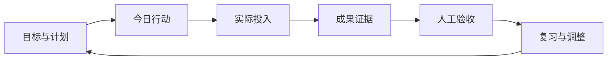

# Logion

[](https://github.com/greatLiverheat605/Logion/actions/workflows/main.yml)
[](LICENSE)

**把目标、行动、证据与复习连接起来的自托管学习和研究工作空间。**

Logion 面向个人与最多 10 人的小组。你可以安排学习目标和任务、记录实际投入、整理笔记与资料，再用证据、人工验收和复习持续检查成果。AI 是可选的草稿工具，核心学习流程可以独立使用。

[操作手册](docs/user-guide.md) · [功能总览](docs/product/PROJECT_FUNCTION_MAP.md) · [部署与运维](docs/operations/README.md) · [开发指南](CONTRIBUTING.md) · [更新日志](CHANGELOG.md)

> 项目持续开发中。请从 [Releases](https://github.com/greatLiverheat605/Logion/releases) 核对发布标签和制品；`main`、CI 候选以及包清单版本不代表某个部署环境已经完成生产验收。

## 功能

| 场景         | 可以做什么                                                          |
| ------------ | ------------------------------------------------------------------- |
| 日常学习     | 目标、阶段、任务、专注会话、成果证据和人工验收                      |
| 知识积累     | Markdown 笔记、链接资料、PDF 定位元数据、知识点与先修关系           |
| 复习与备考   | 主动回忆、掌握度确认、错因、复习安排、考试大纲与模考记录            |
| 自学与研究   | 收件箱、学习路线、项目里程碑、研究问题、声明与支持/反驳证据         |
| 小组协作     | 工作区、私有/共享空间、成员邀请、Rubric、审阅反馈和报告快照         |
| 数据与互操作 | 加密本地资料、离线队列、冲突处理、预览后导入、可校验导出、日历订阅  |
| 可选 AI      | 兼容 Provider、模型发现、路由与预算、发送前确认、运行记录和草稿审查 |

“考、学、研、导”四种画像帮助组织导航；画像不会改变工作区角色或空间权限。详细入口与前置条件见[功能总览](docs/product/PROJECT_FUNCTION_MAP.md)。

## 工作方式



结束计时、提交证据和验收通过是不同状态。AI 草稿的批准也不会自动覆盖正式记录。私有资料只有在你明确选择共享或外部发送范围后才进入相应流程。

## 本地体验

以下步骤用于单机开发体验。生产环境请使用[部署与运维手册](docs/operations/README.md)，配置独立密钥、HTTPS、邮件和备份。

### 环境要求

- Git、Docker Engine 和 Docker Compose v2
- Node.js 24.14+（下面用于生成本地备份密钥）
- 建议至少 4 GB 可用内存

### 1. 获取代码

```bash
git clone https://github.com/greatLiverheat605/Logion.git
cd Logion
cp .env.example .env
mkdir -p secrets
node -e "require('fs').writeFileSync('secrets/backup.key', require('crypto').randomBytes(32).toString('base64url'), {encoding:'utf8', mode:0o600, flag:'wx'})"
```

PowerShell 中用 `Copy-Item .env.example .env` 和 `New-Item -ItemType Directory -Force secrets` 替代复制与创建目录命令；其余命令相同。密钥生成命令会拒绝覆盖已有文件。

Linux/WSL 上还需使备份容器的专用组可读，仅调整这个密钥文件：

```bash
sudo chown 0:10001 secrets/backup.key
sudo chmod 0640 secrets/backup.key
```

Docker Desktop 的文件共享权限由宿主机管理；启动前用下面的容器读取检查确认挂载可用。详细权限要求见[备份手册](infra/runbooks/backup-restore.md#配置)。

### 2. 配置本地访问

编辑 `.env` 中的以下值：

```dotenv
LOGION_ALLOWED_ORIGINS=["http://localhost:8080"]
LOGION_WEBAUTHN_ORIGINS=["http://localhost:8080"]
LOGION_EMAIL_PUBLIC_BASE_URL=http://localhost:8080
LOGION_REGISTRATION_MODE=open
LOGION_LEGACY_REGISTRATION_ENABLED=true
```

这是仅限本机的兼容注册配置，默认邮件适配器为关闭。生产环境使用受邀注册和实际邮件服务，并拒绝开放注册与开发密钥。`.env.example` 中的示例密码和密钥不能用于长期环境。

### 3. 构建、迁移并启动

```bash
docker compose config --quiet
docker compose build
docker compose run --rm --no-deps --entrypoint sh backup -c "test -r /run/secrets/logion_backup_key"
docker compose up -d --wait postgres redis
docker compose run --rm --no-deps api alembic -c apps/api/alembic.ini upgrade head
docker compose up -d --wait
```

### 4. 创建本地体验账号

网页注册使用邮箱确认流程。默认未配置邮件时，在本地终端通过兼容接口创建体验账号；此接口仅在上面的开发配置下开放：

```bash
docker compose exec api python -c '
import getpass, json, urllib.request
data = json.dumps({
    "email": input("Email: "),
    "password": getpass.getpass("Password (12-128 characters): "),
    "device_name": "Local setup",
    "platform": "web"
}).encode("utf-8")
request = urllib.request.Request(
    "http://127.0.0.1:8000/api/v1/auth/register", data=data,
    headers={"Content-Type": "application/json", "Origin": "http://localhost:8080"}
)
with urllib.request.urlopen(request, timeout=30) as response:
    print("Account created:", response.status == 201)
'
```

输入仅用于本机的邮箱（例如 `local@example.com`）和独立密码；密码不会写入命令历史或回显。然后打开 <http://localhost:8080/auth/login>，用该账号登录并完成首次使用引导。已有账号直接登录，无需重复建号。

健康入口为 <http://localhost:8080/healthz>，业务流程见[操作手册](docs/user-guide.md)。

停止服务使用 `docker compose down`，保留数据卷。加上 `--volumes` 会删除持久数据，只应用于可以丢弃的测试环境。

## 架构与源码

```text
apps/web       Next.js + React Web/PWA
apps/api       FastAPI、认证权限、领域 API 与 Alembic
apps/worker    邮件、导入导出、AI 与账户删除任务
apps/mobile    Android、iOS 与 HarmonyOS 薄壳资料
packages/      OpenAPI/sync-v1 契约、离线库与共享配置
infra/         Compose、Nginx、备份恢复与部署
scripts/       开发、质量、发布与运维工具
tests/         浏览器、容量、安全和发布测试
docs/          操作手册、架构、安全、协议与开发文档
```

Web 通过 Nginx 访问 FastAPI；PostgreSQL 保存业务数据，Redis 支持限流和任务协调。浏览器使用 IndexedDB、加密 Vault 和 Outbox 保存受支持的离线内容。服务端始终重新校验工作区和空间权限。

## 本地开发

工具链还需要 Python 3.12、[uv](https://docs.astral.sh/uv/) 和 pnpm 11.9+：

```bash
pnpm install --frozen-lockfile
uv sync --all-packages --group dev --frozen
pnpm ci:fast
```

分进程启动、集成测试和浏览器验证见[开发指南](docs/development/README.md)。API 变更需要更新并验证 OpenAPI 契约；数据库变更需要迁移和恢复说明。

## 边界与限制

- 受保护页面尚不支持完整离线冷启动；新知识空间接口与部分敏感能力有独立开关。
- 邮件、AI、附件扫描、HTTPS、异机备份与告警需要部署者配置；界面存在不代表功能已启用。
- AI 草稿批准仅保存审查决定，正式知识写入具有独立权限和接受事务。
- 手机浏览器与 PWA 可用；薄壳安装包的签名、分发和实体设备验收需要单独完成。
- 暂不提供第三方账号连接、Webhook、通用 API Token 或自动化规则。
- 项目不包含计费、套餐或 SaaS 运营后台；参考 Compose 拓扑不提供高可用承诺。

未来方向见[路线图](docs/roadmap.md)。

## 贡献与安全

欢迎提交可复现的缺陷、文档修正和范围清晰的功能改进。开始前请阅读[贡献指南](CONTRIBUTING.md)和[行为准则](CODE_OF_CONDUCT.md)。

安全漏洞请按[安全政策](SECURITY.md)私密报告。请勿在公开 Issue、日志或测试夹具中提供真实凭据和个人学习数据。

## 许可证

Logion 使用 [MIT License](LICENSE)。第三方依赖与示例内容的许可证应一并遵守。
