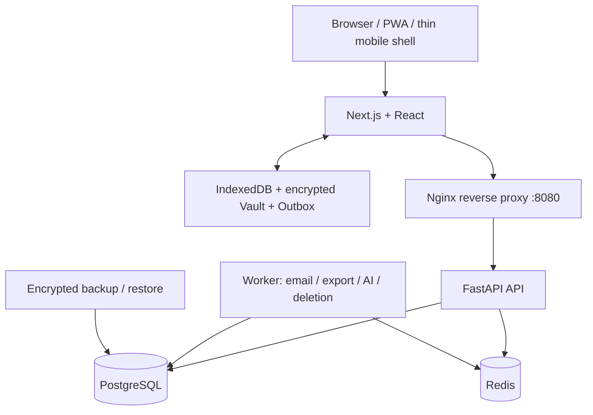

# Logion

[](https://github.com/greatLiverheat605/Logion/actions/workflows/main.yml)
[](LICENSE)

**面向学习、研究与协作的自适应认知作业空间。**

Logion 把目标、计划、任务、专注会话、笔记、证据、人工验收、复习、考试、研究和小组协作连接成可追溯闭环。它面向个人和最多 10 人的小规模自托管使用，不是普通待办应用，也不把 AI 生成内容当作已经确认的学习结果。

> 当前状态：仓库清单版本仍为 `0.1.0`；`v0.2.0-rc6` 已部署到受控 prerelease，尚未进入 Production。I0 Adaptive Desk 已通过 PR #208 合入 `main`，合并后的 Main candidate 已通过；下一门禁是 Full capacity 与新 Release Candidate。真实邮件、实体设备、观察期与生产流量切换仍未完成。

## 为什么是 Logion

许多学习工具只解决“记录了什么”，Logion 关注完整的可验证过程：

```text
目标与计划 → 今日行动 → 实际投入 → 成果证据 → 人工验收
     ↑                                           ↓
     └──── 复习 / 错因 / 研究证据 / 周期审查 ────┘
```

- 完成计时不等于完成任务；提交证据不等于验收通过。
- 掌握度、研究结论和共享结果都需要用户明确确认。
- 私有内容默认留在个人空间；共享与外部发送必须显式选择范围。
- AI 只是可选草稿层，不能绕过正式记录、权限或审计。

## 四类用户画像

画像只优化导航，不改变 Workspace Role 或 Space 权限。用户也可创建 `custom-<uuid>` 自定义画像。

| 画像  | 场景       | 优先工作流                                 |
| ----- | ---------- | ------------------------------------------ |
| 📝 考 | 应试学习   | 考试、大纲、模考、复习、错因和成绩趋势     |
| 📚 学 | 自主学习   | 每日目标、学习路线、项目、记录、规划和模板 |
| 🔬 研 | 学术研究   | 研究问题、声明—证据、论文记录、实验和复查  |
| 👥 导 | 导师与小组 | 空间、成员、Rubric、共享审阅、反馈和审计   |

新账号首次登录进入恒定 7 步引导：选择画像、确认工作区、确认空间、设置本机 Vault 口令、可选模板、创建今日目标、开始使用。

## 已实现能力

### 学习执行与知识闭环

- 目标、版本化计划、阶段、依赖、任务和学习会话
- 今日驾驶舱、下一行动、快速捕获、真实投入与阻塞
- Markdown 笔记、安全预览、链接资料、PDF 元数据和附件
- 成果证据、人工验收、知识点、先修关系、掌握度和复习计划
- 主动回忆题、信心/结果记录、错因模式和周期学习审查

### 备考、自学、研究与协作

- 考试倒计时、科目权重、大纲覆盖、模考、成绩和薄弱项
- 快速收件箱、学习路线、项目、里程碑和成果记录
- 研究问题、声明、支持/反证/不确定证据、实验运行和论文记录
- Workspace、Private/Shared Space、邀请、角色、Rubric、反馈和不可变审阅快照

### 离线、同步与数据主权

- IndexedDB、端侧加密 Vault、加密 Outbox 和附件队列
- `sync-v1` 幂等 Push/Pull、断点 Bootstrap、epoch 重建和显式冲突处理
- 预览后导入、加密导出、SHA-256、manifest 和可恢复账户删除
- PostgreSQL/附件加密备份、验证、异机保存与恢复演练

### AI 与互操作

- OpenAI-compatible Provider、服务端加密凭据、模型发现、路由和预算
- 持久 AI 运行、发送前预检、取消、重试和草稿批准/拒绝
- 互操作中心：Calendar Feed、Markdown/CSV/BibTeX/Logion JSON 导入、可校验导出
- Calendar Token 只显示一次；撤销后旧 ICS 地址立即失效

第三方账号连接、Webhook、MCP/API Token 和自动化规则不在 v1；它们需要独立的凭据、授权、调度、审计与撤销设计。

## 产品界面

- Adaptive Desk 使用五个稳定区域：今天、工作台、知识库、协作空间、系统中心。
- 21 条正式业务 URL 保持可深链和兼容；全局搜索与历史知识原型不扩张一级导航。
- Desktop 使用五区侧边栏、44px 上下文栏、命令面板和按需 Inspector；移动端保持相同五区入口，并将图谱降级为可操作节点列表与详情层。
- Persona 只调整工作台和知识库的默认入口，不改变 Workspace Role、Space 权限或服务端授权。
- 每个页面区分 loading、empty、error、权限、离线和真实就绪状态，不用演示数据伪造成功。
- 支持浅色/深色主题、键盘焦点、reduced-motion 和 320 CSS px 起的响应式布局。

完整功能清单见[项目功能全景](docs/product/PROJECT_FUNCTION_MAP.md)，实际操作见[用户指南](docs/user-guide.md)。

## 架构



仓库是 pnpm + uv monorepo：

```text
apps/web       Next.js Web/PWA、画像化应用壳与离线客户端
apps/api       FastAPI、认证、权限、领域 API、同步与 Alembic
apps/worker    邮件、数据迁移、AI 与账户删除后台任务
apps/mobile    Android TWA、iOS WKWebView 与鸿蒙薄壳边界
packages/      OpenAPI/sync-v1 契约、离线库和共享配置
infra/         Nginx、Compose、备份恢复与部署手册
docs/          ADR、威胁模型、用户指南、产品与同步文档
tests/         浏览器、容量、供应链、恢复与发布门禁
```

当前契约包含 126 条 API 路径和 151 个操作。服务端对每个 Workspace/Space 操作重新授权，不信任客户端画像、路由或同步负载中的权限判断。

## 安全与隐私边界

- Cookie 会话配合可信 Origin、CSRF、刷新令牌复用检测和分层速率限制。
- 支持 Passkey、TOTP、一次性恢复码、设备会话撤销和安全审计。
- TOTP、邮件、AI Provider、导出和备份使用相互独立的版本化密钥。
- 凭据、Cookie、Token、恢复材料、私人正文和 AI 输入/输出不进入普通日志或审计元数据。
- Markdown 以 React 文本节点安全呈现；外链、附件和 Provider 请求具有协议、大小与 SSRF 边界。
- 设备撤销能阻止新的服务端访问，但不能远程擦除设备已经保存的长期离线数据。

安全问题请通过 GitHub Security 的私密报告入口提交，详见[安全政策](SECURITY.md)。不要在公开 Issue 中粘贴漏洞、Token、真实邮箱或个人学习数据。

## 快速开始

### 环境要求

- Git
- Docker Engine + Docker Compose v2
- 至少 4 GB 可用内存

### 1. 获取代码与本地配置

```bash
git clone https://github.com/greatLiverheat605/Logion.git
cd Logion
cp .env.example .env
mkdir -p secrets
node -e "process.stdout.write(require('crypto').randomBytes(32).toString('base64url'))" > secrets/backup.key
```

PowerShell：

```powershell
Copy-Item .env.example .env
New-Item -ItemType Directory -Force secrets | Out-Null
node -e "process.stdout.write(require('crypto').randomBytes(32).toString('base64url'))" |
  Set-Content -NoNewline -Encoding ascii secrets/backup.key
```

`.env.example` 的密码和开发密钥只能用于本机示例。长期环境必须生成独立值，并确保 `.env` 与 `secrets/` 不进入 Git。

### 2. 配置本地 Origin

Compose 统一入口是 `http://localhost:8080`。将 `.env` 中相关 Origin 调整为：

```dotenv
LOGION_ALLOWED_ORIGINS=["http://localhost:8080"]
LOGION_WEBAUTHN_ORIGINS=["http://localhost:8080"]
```

### 3. 启动

```bash
docker compose config
docker compose up --build
```

启动后访问：

- 应用：<http://localhost:8080>
- 组合健康检查：<http://localhost:8080/healthz>
- Web 健康检查：<http://localhost:8080/health>

默认 `LOGION_REGISTRATION_MODE=invite`，适合封闭自托管。首次本地体验可配置 `LOGION_BOOTSTRAP_OWNER_EMAIL` 并接入邮件，或仅在本机临时设置 `LOGION_REGISTRATION_MODE=open`。生产配置会拒绝 open 模式和开发密钥。

停止服务：

```bash
docker compose down
```

`docker compose down --volumes` 会删除本地数据库、Redis 和附件卷；只应在确认数据不再需要时执行。

## 本地开发

工具链：Node.js `>=24.14`、pnpm `>=11.9`、Python `3.12`、[uv](https://docs.astral.sh/uv/) 和 Docker Compose。

```bash
pnpm install --frozen-lockfile
uv sync --all-packages --group dev --frozen
```

分别启动 Web、API 和 worker：

```bash
pnpm dev:web
pnpm dev:api
pnpm dev:worker
```

API/worker 需要 PostgreSQL 与 Redis。数据库迁移命令：

```bash
uv run --package logion-api alembic -c apps/api/alembic.ini upgrade head
```

更多规范见[贡献指南](CONTRIBUTING.md)。

## 测试与质量

提交前的快速门禁：

```bash
pnpm ci:fast
```

它覆盖格式、Lint、类型、单元测试、生产构建和 OpenAPI/sync-v1 契约一致性。

浏览器测试：

```bash
LOGION_E2E_BASE_URL=http://127.0.0.1:3000 pnpm test:browser
```

该命令只运行公共页面、PWA、响应式和可访问性项目，不访问 API。认证真实栈必须使用隔离的回环地址，默认是 8080 Compose 环境；若 8080 被占用，可显式使用其他回环端口，但不能使用远程地址自动建号。先为该测试栈设置 `LOGION_REGISTRATION_MODE=open`、`LOGION_LEGACY_REGISTRATION_ENABLED=true`，并把测试注册及登录限额设置为足够的隔离值（连续运行建议 100），再执行：

```bash
LOGION_E2E_BASE_URL=http://127.0.0.1:8080 \
LOGION_E2E_PROVISION_ACCOUNTS=true \
LOGION_E2E_REQUIRE_AUTHENTICATED=true \
pnpm test:browser
```

认证项目为每个 worker 创建隔离账号和会话，临时状态只保存在 `test-results/.auth` 并在结束时删除；远程地址绝不会自动注册账号。若确需检查远程测试环境，必须显式提供 `LOGION_E2E_EMAIL` 与 `LOGION_E2E_PASSWORD`，并自行确认账号与限流策略仅用于测试。

契约变更：

```bash
pnpm contracts:generate
pnpm contracts:check
```

PR/Release/Nightly 流水线还覆盖 PostgreSQL/Redis 集成、迁移往返、依赖与密钥扫描、浏览器可访问性、候选镜像/SBOM、备份恢复和旧客户端兼容。

## 项目文档

- [项目功能全景](docs/product/PROJECT_FUNCTION_MAP.md)
- [用户指南](docs/user-guide.md)
- [下一版本产品与技术路线](docs/product/NEXT_VERSION_ROADMAP.md)
- [全仓代码审查与问题台账](docs/reviews/PROJECT_CODE_REVIEW_2026-08-01.md)
- [互操作中心 v1](docs/features/interoperability-hub.md)
- [用户画像系统](docs/features/persona-system.md)
- [架构决策记录](docs/adr/README.md)
- [安全设计与威胁模型](docs/security/)
- [离线存储与同步](docs/offline/)、[sync-v1 文档](docs/sync/)
- [移动端状态与架构](docs/mobile/README.md)
- [基础设施与运行手册](infra/README.md)
- [变更日志](CHANGELOG.md)

## 近期方向

当前主线是固定已合入 Adaptive Desk 的最终 `main` SHA：完成同一提交的 Main candidate、Full capacity 与 `0.2.0-rc7` Release Candidate，再依据真实验收结果决定是否更新受控 prerelease。Production 发布和流量切换仍需单独审批。

后续产品迭代优先处理 Today/Review/Sync 大型模块拆分、页面级离线能力说明、实体设备验收和认知工作台的真实用户验证。Connector/Automation v2、共享写入、附件、本地 Worker 和 AI Acceptance 仍需独立设计与生产准入。完整优先级、指标与进入条件见[下一版本路线图](docs/product/NEXT_VERSION_ROADMAP.md)。

## 明确范围与限制

Logion 不包含计费、套餐、entitlement、公共营销站或 SaaS 运营后台。当前还存在以下部署/产品限制：

- 邮件域名、TLS、ECS RAM 角色、异机加密备份和告警由部署者配置与验收；
- 受保护工作台尚不能全部离线冷启动；清理站点数据可能丢失未同步本地记录；
- 移动安装包仍需签名、实体 iPhone/Android/HarmonyOS 和弱网验收；
- 第三方账号、Webhook、MCP/API Token 和自动化规则延期到独立 v2 架构任务；
- Compose 是参考自托管拓扑，不代表对任意云平台的生产承诺。

## 贡献与许可证

欢迎范围清晰、可复现并尊重数据边界的缺陷修复、可访问性、性能、离线/同步、安全和文档改进。请先阅读[贡献指南](CONTRIBUTING.md)与[行为准则](CODE_OF_CONDUCT.md)。

Logion 使用 [MIT License](LICENSE)。第三方依赖和公开示例可能有各自许可证，使用时请保留相应声明。
