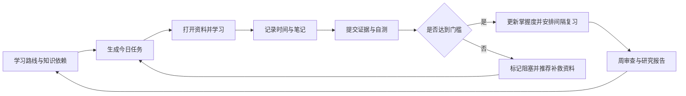
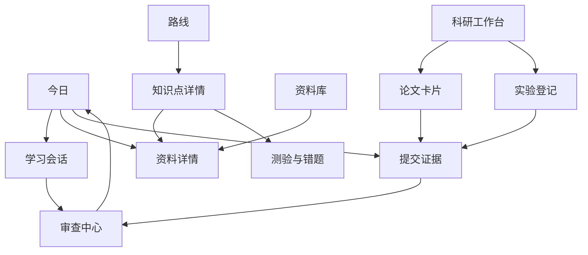
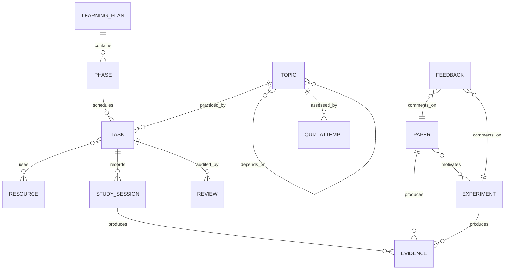

# 个人学习网站设计规划

> 项目暂定名：研途 Lab  
> 当前阶段：需求审查与交互设计，不进入完整开发  
> 核心定位：把现有 47 天计划和长期路线转化为一个“可执行、可留证、可复盘、可审查”的个人科研学习系统。

> 本文为早期设计稿。用户确认多设备、FastAPI 和长期迭代要求后的正式总体方案见：[个人学习网站全面产品与技术规划.md](./个人学习网站全面产品与技术规划.md)。

配套资料：

- [人工智能研究生与 Agent 安全完整学习路线](./AI研究生与Agent安全完整学习路线.md)
- [2026 开学前 47 天个性化学习计划](./2026开学前47天个性化学习计划.md)

---

## 1. 对现有学习方案的审查结论

现有方案已经覆盖知识地图、每日任务、阶段门槛、论文方向和实验规范，但它仍然是一份静态计划。真正执行时还缺少以下闭环。

### 1.1 学习内容层面的遗漏

1. **每日任务没有逐条绑定具体资料**  
   当前只在章节末尾列出主课程，用户每天仍需自己寻找对应章节、视频和练习。

2. **缺少知识前置关系**  
   例如不了解条件概率时不应直接进入最大似然；不会张量形状时不应进入 Attention。网站需要显示依赖关系和解锁条件。

3. **缺少间隔复习计划**  
   目前有每周复盘，但没有 D+1、D+3、D+7、D+14 的记忆复习与重新测试。

4. **缺少题库和错题机制**  
   Python、数学、PyTorch 需要可重复的小测，不能只记录“学过”。

5. **缺少数学公式与代码的双向验证**  
   应把“手推梯度”“代码数值验证”“用语言解释”设为三个不同证据。

6. **缺少资源难度、语言、时长和替代资源信息**  
   同一知识点应有主资料、简明解释、练习和进阶材料，避免主资料卡住后停摆。

7. **缺少论文引用管理工作流**  
   需要记录 DOI/arXiv、BibTeX、代码仓库、相关论文、阅读状态和复现状态，并预留 Zotero 导入/导出。

### 1.2 执行与记录层面的遗漏

1. **计划时间和实际时间无法比较**；
2. **任务完成只有“是/否”，没有掌握度和证据**；
3. **没有统一保存代码提交、笔记、截图、实验结果和录屏链接**；
4. **任务延期后没有自动重排规则**；
5. **没有区分跳过、阻塞、失败、完成、需要复习**；
6. **没有疲劳、睡眠和专注度记录，容易把低效时长当成果**；
7. **没有每日结束审核，无法防止勾选式学习**。

### 1.3 科研与实验层面的遗漏

1. **缺少实验登记表**：假设、数据版本、代码版本、配置、指标和结论应绑定；
2. **缺少复现检查清单**：环境、随机种子、数据切分、基线、公平预算；
3. **缺少失败实验档案**：失败结果不应被删除；
4. **缺少研究问题演化记录**：为什么改变选题、哪条证据导致改变；
5. **缺少导师反馈记录与关闭机制**：反馈要转化为任务并记录是否解决；
6. **缺少数据和安全审查**：Agent 轨迹可能包含凭证、路径、个人信息和内部代码；
7. **缺少论文写作进度**：相关工作矩阵、图表、段落、引用和待验证声明需要管理。

### 1.4 产品与安全层面的遗漏

1. 登录、数据存储位置和多设备同步尚未决定；
2. 学习笔记、论文和 Vigils 数据可能敏感，需要本地优先和可导出；
3. AI 自动总结不能覆盖原始笔记，所有 AI 修改必须可追踪；
4. 外部链接可能失效，需要资源健康检查和替代链接；
5. 需要备份、恢复、Markdown/JSON 导入导出；
6. 如果允许导师查看，需要单独的只读权限和明确共享范围。

---

## 2. 产品目标与非目标

### 产品目标

- 每天打开后立即知道“今天做什么、为什么做、用什么资料、如何验收”；
- 学习结束后能记录实际时间、掌握度、困难、证据和下一次复习；
- 每周自动生成可审查报告，指出计划偏差、薄弱点和虚假完成风险；
- 将课程、论文、代码、实验和 Vigils 研究统一组织；
- 所有重要结论都能追溯到原始记录和证据；
- 支持把现有两份 Markdown 计划直接导入。

### 第一版非目标

- 不做大型在线课程平台；
- 不托管视频；
- 不做社交社区、排行榜或打卡攀比；
- 不替代 Zotero、GitHub、Jupyter 和完整实验平台；
- 不让 AI 自动判定用户已经掌握知识；
- 不在第一版支持多人协作编辑。

---

## 3. 核心使用闭环

核心原则：**任务完成不等于知识掌握；没有证据的完成只能记为“已浏览”。**

---

## 4. 信息架构

### 4.1 一级页面

| 页面 | 解决的问题 | 第一版核心内容 |
|---|---|---|
| 今日 | 今天具体做什么 | 时间预算、任务、资料、验收、快速记录 |
| 路线 | 整体学到哪里 | 47 天时间线、长期路线、知识依赖、阶段门槛 |
| 学习记录 | 实际做了什么 | 学习会话、笔记、错题、证据、时间统计 |
| 审查中心 | 学得是否真实有效 | 每日审核、周审查、延期、薄弱知识、复习队列 |
| 资料库 | 资料在哪里 | 课程、章节、论文、代码、练习、资源健康状态 |
| 科研工作台 | 论文与实验如何推进 | 论文卡片、实验登记、研究问题、导师反馈 |
| 设置 | 数据和规则如何控制 | 导入导出、备份、AI、隐私、评分和提醒规则 |

### 4.2 页面关系

---

## 5. 页面设计手稿说明

### 5.1 今日页

今日页是默认首页，避免展示大量无关统计。

布局：

1. 顶部：日期、当前阶段、计划 6 小时、已完成时间；
2. 中部主区域：按顺序排列今日任务；
3. 每个任务展示：预计时间、知识点、前置条件、主资料、练习、验收证据；
4. 右侧/下方：待复习知识、阻塞项和今日结束审核；
5. 主要操作：开始学习、记录本次学习、提交验收。

任务状态：

- 未开始；
- 学习中；
- 已浏览；
- 已练习；
- 已通过验收；
- 阻塞；
- 待复习。

### 5.2 路线页

- 默认显示 47 天的 7 个阶段；
- 每个阶段显示日期、目标、依赖、完成比例和门槛；
- 可切换知识树视图，查看 Python → NumPy → PyTorch → 推荐模型等依赖；
- 未满足前置知识时给出提示，但不强制禁止学习；
- 允许拖动调整计划，但必须填写调整原因。

### 5.3 学习记录页

一次学习会话至少记录：

- 关联任务和知识点；
- 开始/结束时间或手动时长；
- 使用资料；
- 新理解、疑问和错误；
- 专注度、难度、信心；
- 代码提交/笔记/截图/实验结果；
- 下一步行动。

### 5.4 审查中心

审查不是看“连续打卡天数”，而是发现学习质量问题。

每日审核：

- 实际时间是否明显偏离计划；
- 完成任务是否存在证据；
- 是否只看资料而没有练习；
- 哪个知识点需要进入复习队列；
- 是否存在阻塞超过两天的任务。

每周审核：

- 计划与实际时间；
- 掌握度变化；
- 测验正确率和错题复发；
- 任务延期原因；
- 代码/实验/论文等真实产出；
- 下周减少、增加和保持什么。

### 5.5 资料库

每条资料包含：

- 名称、链接、作者/机构；
- 类型：课程、视频、书籍、论文、文档、练习、代码；
- 对应知识点和任务；
- 难度、语言、预计时长；
- 主资料/补救资料/进阶资料；
- 阅读进度、个人评分和笔记；
- 最近检查时间、链接是否有效；
- 版本或发布日期。

### 5.6 科研工作台

包含四个相互关联的视图：

1. 论文阅读队列；
2. 相关工作对比矩阵；
3. 实验登记与结果；
4. 研究问题和导师反馈。

实验不能只有最终结果，必须保留假设和失败信息。

---

## 6. 关键数据模型

### 6.1 核心实体

| 实体 | 关键字段 |
|---|---|
| LearningPlan | 名称、开始/结束日期、每天预算、目标 |
| Phase | 阶段、日期范围、验收门槛、依赖 |
| Topic | 知识点、父级、前置知识、掌握度、复习时间 |
| Task | 日期、预计时长、状态、优先级、验收标准 |
| Resource | 类型、URL、难度、语言、时长、版本、健康状态 |
| StudySession | 开始、结束、实际时长、专注度、难度、总结 |
| Evidence | 类型、链接/文件、说明、关联任务、创建时间 |
| QuizAttempt | 题目、答案、正确性、错误类型、下次复习 |
| Review | 每日/每周/阶段审查、问题、调整、结论 |
| Paper | 标题、作者、年份、引用、阅读/复现状态 |
| Experiment | 假设、数据版本、代码提交、配置、指标、结论 |
| Feedback | 来源、内容、关联对象、状态、关闭证据 |

### 6.2 关系草图

### 6.3 掌握度规则

掌握度不能由观看时长直接增加。建议使用五级状态：

| 等级 | 含义 | 最低证据 |
|---|---|---|
| 0 未接触 | 不知道概念 | 无 |
| 1 已浏览 | 能识别术语 | 阅读/观看记录 |
| 2 能解释 | 能用自己的话解释 | 笔记或口头摘要 |
| 3 能应用 | 能独立做题或编码 | 练习、代码、测验 |
| 4 能迁移 | 能用于新问题并分析失败 | 项目、实验或论文分析 |

网站可以建议等级，但只有用户确认后更新。AI 不得自行把知识标记为掌握。

---

## 7. 可审查机制设计

### 7.1 事件日志

所有关键变化记录为事件：

- 创建、修改、完成、跳过或延期任务；
- 修改计划日期或验收标准；
- 更新掌握度；
- 添加、替换或删除证据；
- AI 生成或修改摘要；
- 导入、导出和恢复数据。

事件包含时间、操作者、旧值、新值和原因。第一版不需要复杂区块链，但不允许静默覆盖。

### 7.2 防止“虚假完成”

- 任务可标记已完成，但如果没有规定证据，显示“待审查”；
- 阅读型任务要求摘要；
- 编程型任务要求提交、文件或运行结果；
- 数学型任务要求解答或测验；
- 论文型任务要求论文卡片或汇报；
- 实验型任务要求配置、代码版本、指标和结论。

### 7.3 自动审查规则

第一版使用确定性规则，不依赖 AI：

- 实际时长小于预计时长 30% 且任务完成：提醒复核；
- 连续三项任务只有观看记录：提醒增加练习；
- 同一错题再次错误：缩短复习间隔；
- 任务阻塞两天：进入周审查；
- 任务延期三次：要求拆分或删除；
- 实验无代码版本或数据版本：不能标记可复现；
- 论文结论没有关联实验/原文证据：标记待核实。

### 7.4 AI 可做与不可做

AI 可以：

- 将学习记录整理成摘要；
- 根据错题生成相似练习；
- 提取论文卡片初稿；
- 发现计划偏差和可能薄弱点；
- 提议重排任务；
- 生成周报草稿。

AI 不可以：

- 自动删除原始记录；
- 自动确认知识已掌握；
- 自动修改计划而不保留差异；
- 把未运行的代码标记为通过；
- 把模型生成的论文内容当作已核实事实；
- 将 Vigils 敏感数据发送给外部模型，除非用户明确配置和确认。

---

## 8. 资源附着方案

每个每日任务采用统一四件套：

1. **主资料**：完成知识讲解；
2. **补救资料**：主资料难以理解时使用；
3. **练习**：必须动手；
4. **验收**：明确提交什么。

示例：

| 任务 | 主资料 | 补救资料 | 练习 | 验收 |
|---|---|---|---|---|
| NumPy 广播 | NumPy 官方 broadcasting 文档 | D2L 数据操作章节 | 10 个 shape 预测题 | 向量化日志统计 + 测试 |
| 条件概率 | 概率基础课程对应章节 | StatQuest/可汗学院 | 贝叶斯告警计算 | 5 题 ≥80% + 一页解释 |
| PyTorch Autograd | PyTorch 官方教程 | D2L 自动微分 | 手算梯度与框架对照 | 可运行 Notebook |
| BPR | 原论文 + RecBole 文档 | 推荐系统讲义 | 实现负采样和 loss | 结果表 + 公式笔记 |
| Agentic 风险 | OWASP Agentic 指南 | MITRE ATLAS 案例 | 风险映射 | Vigils 风险矩阵 |

第一版内容库应优先把 47 天计划的 47 个日期、约 200 个子任务和对应资料录入，而不是建设通用课程市场。

---

## 9. 推荐技术方案

以下是“单用户、本地优先、以后可同步”的默认方案，仍需用户确认。

### 前端

- Next.js + TypeScript；
- Tailwind CSS 或轻量设计系统；
- 响应式桌面/平板/手机布局；
- Markdown 编辑与渲染；
- 图表使用 Recharts，知识依赖图可用 React Flow。

### 数据与后端

- 第一版：SQLite；
- ORM：Drizzle ORM；
- 服务端：Next.js Server Actions/API；
- 附件：本地文件目录，数据库只存元数据和校验值；
- 定期导出 Markdown + JSON + SQLite 备份。

### 认证与部署

- 如果只在个人电脑使用：第一版可无账户，仅绑定本地数据目录；
- 如果需要手机/多设备：增加登录和远端数据库；
- 如果需要导师只读查看：单独实现分享快照，而不是直接开放全部账户数据。

### AI 集成

- 建立可替换的模型适配层；
- 默认只发送用户选中的文本；
- 每次 AI 生成保留模型、时间、输入范围和生成版本；
- 敏感标签内容默认禁止发送外部模型；
- 无 AI 时所有核心记录和审查功能仍可运行。

---

## 10. 开发阶段规划

### 阶段 0：确认需求与原型（当前）

产出：

- 遗漏审查；
- 信息架构；
- 今日页交互手稿；
- 数据模型；
- 技术方案和待确认问题。

完成标准：用户确认使用场景、部署方式、技术栈和 AI 边界。

### 阶段 1：可运行 MVP

范围：

- 导入两份 Markdown 计划；
- 今日任务；
- 任务状态；
- 学习会话和实际时间；
- 资料链接；
- 证据链接；
- 每日审核；
- SQLite 本地持久化；
- Markdown/JSON 导出。

不含：复杂 AI、知识图谱、多用户和完整论文管理。

### 阶段 2：审查与复习闭环

- D+1/D+3/D+7/D+14 复习队列；
- 测验、错题和掌握度；
- 周审查报告；
- 延期和计划重排；
- 事件日志；
- 资源失效检查。

### 阶段 3：科研工作台

- 论文卡片；
- BibTeX/Zotero 导入导出；
- 相关工作矩阵；
- 实验登记；
- Git 提交、配置和结果关联；
- 导师反馈任务化。

### 阶段 4：受控 AI 助手

- 学习摘要；
- 错题生成；
- 周报草稿；
- 论文卡片草稿；
- 基于规则和证据的计划建议；
- 所有 AI 修改使用差异确认。

### 阶段 5：同步与分享（按需）

- 多设备同步；
- 只读报告分享；
- 移动端快速记录；
- 加密备份与恢复演练。

---

## 11. MVP 验收标准

第一版必须通过以下场景：

1. 能看到 2026-07-20 当日全部任务和对应资料；
2. 能开始/结束一次学习并记录实际时长；
3. 能写笔记并附 Git 提交或文件证据；
4. 无证据的任务不会显示为“已通过验收”；
5. 能在日末完成五项审核并生成次日复习任务；
6. 修改计划时保留旧值和修改原因；
7. 关闭并重新打开后数据仍存在；
8. 能导出人类可读 Markdown 和机器可读 JSON；
9. 不联网也能完成核心流程；
10. 能恢复一次备份且记录不丢失。

---

## 12. 需要确认的关键问题

以下问题会实质改变架构，开发前需要确认：

1. **使用范围**：仅你个人使用，还是未来会让导师/同学查看或共同使用？
2. **设备与部署**：只在 Windows 电脑本地使用，还是必须手机和多设备同步？
3. **技术栈偏好**：是否接受 Next.js + TypeScript + SQLite，还是希望使用 Python 后端（如 FastAPI）？
4. **AI 模型**：需要接入哪些模型/API？是否要求支持本地模型和完全离线模式？
5. **“审查”的含义**：主要是系统自动检查你的学习证据，还是还需要导师人工审阅和批注？
6. **资料内容**：网站只保存链接和个人笔记，还是希望把课程正文/PDF/视频字幕也导入本地？后者涉及存储、版权和检索方案。
7. **Vigils 集成**：第一版是否要读取 Vigils Git 仓库、提交和测试结果，还是先只允许手动附链接？

默认建议：先做个人、本地优先、可离线的 MVP；保留多设备和导师只读分享的扩展能力。
