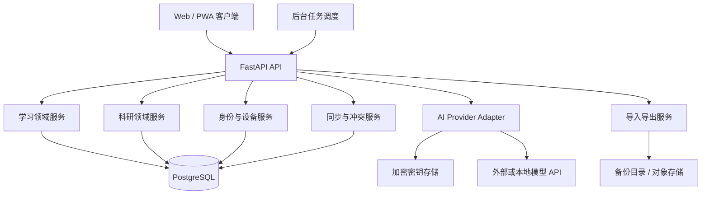

# 个人学习网站全面产品与技术规划

> 项目暂定名：研途 Lab  
> 文档版本：v1.0  
> 规划日期：2026-07-19  
> 当前阶段：产品与技术架构规划  
> 本文不包含具体视觉界面设计

---

## 1. 已确认的项目约束

| 项目 | 已确认方案 |
|---|---|
| 用户范围 | 仅个人使用，不建设公共社区或多人协作平台 |
| 使用周期 | 长期使用，覆盖开学前、研究生阶段及后续持续学习 |
| 多设备 | 第一版必须支持电脑、手机等多设备同步 |
| 离线能力 | 第一版要求任务、资料和笔记均可完整离线编辑，并在联网后同步 |
| 后端 | Python + FastAPI |
| AI 接入 | 提供类似 NewAPI 的供应商、API 地址、密钥和模型配置能力 |
| Git/Vigils 集成 | 暂缓自动读取，第一版预留接口和数据结构 |
| 资料库 | 第一版保存链接、个人笔记和 PDF 索引，不托管课程正文与视频 |
| 附件 | 第一版允许少量截图、实验结果和小型文件，支持离线暂存与联网上传 |
| 部署 | 云平台个人实例 |
| 备份 | 保存在服务器备份目录/独立数据卷，并支持手动下载 |
| 登录 | 第一版使用 Passkey 主登录，并提供密码 + TOTP 与恢复码 |
| 界面设计 | 交由其他人员完成，本规划只定义产品、数据、接口与工程边界 |
| 学习重点 | 科研优先，兼顾推荐系统、Agent 安全和 Vigils 实践 |

---

## 2. 产品定位

本项目不是普通待办事项工具，也不是在线课程平台。它应当成为一个长期运行的个人学习与科研操作系统，负责组织：

- 学习目标；
- 知识体系；
- 每日任务；
- 学习资料；
- 实际学习记录；
- 练习、错题和复习；
- 代码、笔记与验收证据；
- 论文阅读；
- 实验与研究问题；
- AI 辅助；
- 周期性审查；
- 长期数据归档与迁移。

产品的核心价值不是让用户“记录自己很努力”，而是持续回答五个问题：

1. 现在最应该学什么？
2. 为什么要学它，它依赖什么？
3. 实际学了多少，产生了什么证据？
4. 是否真正掌握，什么时候需要复习？
5. 学习活动是否正在推动论文、实验或项目目标？

---

## 3. 长期设计原则

### 3.1 数据寿命高于界面寿命

界面和前端框架未来可以更换，但学习记录、论文卡片、实验和笔记必须长期可读。因此：

- 核心数据保存在结构化数据库；
- 长文本采用 Markdown；
- 所有数据可导出为开放格式；
- 数据表和 API 使用稳定 ID；
- 不把重要内容只保存在前端状态或第三方平台；
- 数据库变更必须经过版本化迁移。

### 3.2 核心功能不依赖 AI

即使所有 AI API 均不可用，以下能力仍必须正常工作：

- 查看计划；
- 完成任务；
- 记录时间和笔记；
- 上传或关联证据；
- 复习调度；
- 论文与实验管理；
- 审查报告；
- 导入、导出、备份和恢复。

AI 是可替换增强层，不是数据层或业务规则层。

### 3.3 证据优先

- “阅读完成”不等于“掌握”；
- “代码写完”不等于“可运行”；
- “实验运行”不等于“结论成立”；
- “AI 总结”不等于“事实已核验”。

系统必须明确区分活动、产出、验收和掌握度。

### 3.4 离线优先、本地可控与服务器同步并存

多设备同步要求存在服务端权威数据源，但用户仍应能够：

- 导出全部个人数据；
- 下载完整备份；
- 自行部署服务；
- 更换 AI 供应商；
- 在供应商不可用时继续学习；
- 清楚知道哪些数据被发送给 AI。

第一版客户端同时保存完整可编辑工作副本。任务、资料、笔记、学习记录和复习在断网时仍可使用；联网后通过 Outbox、服务端变更日志和冲突策略同步。详细方案见：[离线优先同步部署与认证专项规划.md](./离线优先同步部署与认证专项规划.md)。

### 3.5 可追溯、可恢复、可迁移

所有重要修改必须可追溯；所有长期数据必须可备份；所有核心内容必须可迁移到其他工具。

### 3.6 小核心、模块化扩展

系统核心只包含身份、同步、学习计划、记录、证据、复习和审查。论文、实验、AI、Git、Vigils 等作为独立模块接入，避免形成无法维护的单体业务代码。

---

## 4. 产品边界

### 4.1 第一版必须实现

- 单用户账户与安全登录；
- 多设备同步；
- 学习计划、阶段、知识点和每日任务；
- 导入现有 47 天计划；
- 任务与具体学习资料绑定；
- 学习计时与手动时长记录；
- Markdown 笔记；
- 证据链接和文件索引；
- 任务验收；
- 掌握度；
- 间隔复习；
- 每日和每周审查；
- 资料库：链接、笔记、PDF 索引；
- AI 供应商和模型配置；
- AI 使用记录和成本统计基础；
- 数据导入、导出、备份和恢复；
- 审计事件；
- 响应式 Web/PWA 接口支持。
- 完整离线编辑与恢复联网后的增量同步；
- Passkey、TOTP、恢复码与离线本地解锁；
- 少量附件的离线暂存、校验和上传。

### 4.2 第一版明确暂缓

- 自动读取 Vigils 仓库；
- 自动读取 Git 提交和测试结果；
- 导师账户和批注；
- 公共社区与分享市场；
- 视频、课程正文和大型 PDF 文件托管；
- 全文向量数据库；
- 自动生成完整课程；
- 复杂知识图谱可视化；
- 原生 Android/iOS 应用；
- 多用户组织权限；
- 游戏化排行榜。

### 4.3 必须预留但不提前实现

- Git Provider 接口；
- Vigils 数据连接器；
- Zotero/BibTeX 同步；
- 对象存储；
- 向量检索；
- 本地模型；
- 导师只读快照；
- Webhook 与插件机制；
- 原生移动端客户端。

---

## 5. 核心业务模块

### 5.1 身份与设备模块

职责：

- 单用户账户初始化；
- 登录、退出和会话管理；
- 设备列表；
- 撤销指定设备；
- 密码修改；
- 可选二次验证；
- 同步状态；
- 最近登录和安全事件。

虽然只有一个用户，也不能完全取消认证，因为服务会暴露给多个设备和网络。

### 5.2 学习路线模块

层级：

```text
学习空间 Workspace
└── 学习路线 LearningPlan
    ├── 阶段 Phase
    │   ├── 里程碑 Milestone
    │   └── 任务 Task
    └── 知识点 Topic
        ├── 前置知识 TopicDependency
        ├── 资料 Resource
        └── 掌握状态 Mastery
```

必须支持：

- 短期计划和长期路线并存；
- 计划版本化；
- 阶段门槛；
- 知识前置关系；
- 任务模板；
- 任务拆分；
- 延期、跳过、取消和重新安排；
- 所有重排保留原因和历史。

### 5.3 今日任务模块

今日任务来自：

1. 原计划任务；
2. 到期复习；
3. 延期任务；
4. 阶段门槛补救任务；
5. 用户临时新增任务；
6. AI 建议且经用户确认的任务。

任务状态建议：

```text
draft          草稿
scheduled      已安排
in_progress    进行中
viewed         已浏览
practiced      已练习
submitted      已提交证据
verified       已通过验收
blocked        阻塞
deferred       已延期
skipped        已跳过
cancelled      已取消
```

`verified` 必须与验收记录绑定，不能仅通过勾选产生。

### 5.4 学习会话模块

一次学习会话可以关联一个或多个任务，但建议第一版默认一个会话关联一个主任务。

记录：

- 开始与结束时间；
- 暂停时间；
- 实际有效时长；
- 使用设备；
- 使用资料；
- 专注度；
- 主观难度；
- 学习前/后信心；
- 理解；
- 疑问；
- 错误；
- 下一步；
- AI 是否参与。

服务端必须保留原始开始/结束事件，不能只存总时长，以便发现跨设备重复计时和异常记录。

### 5.5 资料库模块

第一版资源类型：

- 网页；
- 在线课程；
- 视频链接；
- 书籍；
- 论文；
- 官方文档；
- 练习；
- 代码仓库；
- PDF 索引；
- 本地文件索引。

PDF 第一版只保存：

- 标题；
- 作者；
- 年份；
- DOI/arXiv；
- 原始 URL；
- 本地路径或外部存储引用；
- 校验值；
- 页数；
- 标签；
- 个人笔记；
- 阅读状态。

服务器不默认上传 PDF 正文。不同设备无法访问同一本地路径时，显示“索引存在、文件不可用”，并允许重新定位。

### 5.6 笔记模块

笔记必须独立于任务存在，同时可以关联：

- 知识点；
- 任务；
- 资料；
- 论文；
- 实验；
- 学习会话。

格式采用 Markdown。必须具有：

- 自动保存；
- 版本历史；
- 冲突副本；
- 双向关联；
- 标签；
- 固定链接；
- 导出。

### 5.7 证据与验收模块

证据类型：

- Markdown 笔记；
- 代码提交链接；
- 文件索引；
- 图片/截图引用；
- 测验结果；
- 实验结果；
- 录音/视频引用；
- 外部 URL；
- 人工文字说明。

验收记录包含：

- 验收标准；
- 提交证据；
- 用户自评；
- 确定性规则检查结果；
- AI 建议结果；
- 最终确认；
- 失败原因；
- 补救任务。

### 5.8 掌握度与复习模块

掌握度采用五级状态：

```text
0 未接触
1 已浏览
2 能解释
3 能应用
4 能迁移
```

掌握度不是连续进度条，也不能由累计时长直接换算。

第一版复习算法可使用简化 SM-2，并增加业务约束：

- 新知识默认 D+1、D+3、D+7、D+14；
- 测验错误立即缩短间隔；
- 同类错误复发时生成补救任务；
- 长时间未应用时降低“信心”，但不自动删除历史最高掌握证据；
- 重要基础知识可设置永久复习；
- 论文和实验技能可按“应用事件”刷新复习时间。

### 5.9 审查模块

审查分四级：

1. **每日审查**：任务、时间、证据、疑问、次日复习；
2. **每周审查**：计划偏差、掌握度、错题、产出和下周调整；
3. **阶段审查**：是否达到门槛、是否允许进入下一阶段；
4. **长期审查**：季度/学期目标、论文和研究方向变化。

自动规则必须可配置并显示触发原因，不能给出不可解释的综合分数。

### 5.10 论文与科研模块

考虑到研一优先论文，科研模块属于长期核心，但可在第一版后半段逐步完善。

论文卡片：

- 元数据；
- 阅读状态；
- 问题；
- 假设；
- 方法；
- 关键公式；
- 数据与实验；
- 结论；
- 局限；
- 复现状态；
- 相关论文；
- 引用；
- 可用于自己研究的想法。

实验登记：

- 研究问题；
- 可证伪假设；
- 数据版本；
- 代码版本；
- 环境；
- 配置；
- 随机种子；
- 指标；
- 原始结果索引；
- 图表索引；
- 结论；
- 失败原因；
- 下一实验。

研究问题：

- 当前描述；
- 产生原因；
- 支持证据；
- 反对证据；
- 修改历史；
- 状态；
- 关联论文和实验。

### 5.11 AI 配置与调用模块

目标是提供类似 NewAPI 的可配置模型接入体验，但只服务于本系统，不建设公共模型中转平台。

第一版支持：

- 多个 AI Provider；
- 自定义名称；
- Base URL；
- API Key；
- API 类型；
- 模型列表；
- 手动添加模型；
- 从 `/v1/models` 探测模型；
- 连接测试；
- 默认模型；
- 任务级模型路由；
- 超时与重试；
- 温度、最大 token 等参数；
- 使用量和估算成本；
- 启用/停用 Provider；
- 敏感内容发送策略。

第一版适配优先级：

1. OpenAI-compatible API；
2. 自定义 OpenAI-compatible 网关；
3. Anthropic 原生 API；
4. 本地模型服务（Ollama/vLLM 等）作为后续适配器。

任务级模型配置示例：

| AI 任务 | 默认能力要求 |
|---|---|
| 学习记录摘要 | 低成本、长中文文本 |
| 错题生成 | 结构化输出、稳定指令遵循 |
| 论文卡片草稿 | 长上下文、引用定位 |
| 周审查 | 结构化分析、低幻觉 |
| 代码解释 | 代码能力 |
| 计划调整建议 | 结构化输出、原因说明 |

任何 AI 输出先保存为 `draft`，用户确认后才写入正式业务字段。

---

## 6. 总体技术架构

### 6.1 推荐架构



### 6.2 技术栈建议

#### 后端

- Python 3.12+；
- FastAPI；
- Pydantic v2；
- SQLAlchemy 2；
- Alembic；
- PostgreSQL；
- HTTPX；
- pytest；
- Ruff；
- mypy 或 Pyright；
- structlog 或标准 logging 的结构化配置。

#### 前端接口约束

界面由其他人员设计，但技术上建议：

- TypeScript；
- React/Next.js 或其他成熟 PWA 框架；
- 通过 OpenAPI 生成客户端；
- 客户端不得直接访问数据库或 AI Provider；
- API Key 永不下发到浏览器；
- 使用本地缓存支持弱网络和离线草稿。

#### 数据库

多设备第一版直接采用 PostgreSQL，不以 SQLite 作为服务端主库。原因：

- 并发与事务更稳健；
- 长期迁移工具成熟；
- 支持 JSONB、全文检索和复杂查询；
- 以后增加任务队列、搜索和科研数据更容易；
- 采用云平台个人实例部署，数据库使用云服务器持久卷或托管 PostgreSQL；具体云服务商可在实施阶段确定。

SQLite 可用于：

- 测试；
- 本地开发；
- 导出快照；
- 未来桌面离线客户端缓存。

#### 后台任务

第一版任务数量很小，不必立即引入复杂队列。建议定义统一 `JobRunner` 接口：

- 第一版：应用内调度器或系统 cron；
- 后续：Redis + ARQ/Dramatiq/Celery；
- 任务包括复习生成、周报、链接健康检查、备份和 AI 异步处理。

### 6.3 模块组织建议

```text
backend/
├── app/
│   ├── api/                 # HTTP 路由与依赖
│   ├── core/                # 配置、安全、日志、错误
│   ├── db/                  # 会话、模型基类、迁移辅助
│   ├── domains/
│   │   ├── identity/
│   │   ├── learning/
│   │   ├── review/
│   │   ├── resources/
│   │   ├── research/
│   │   ├── ai_providers/
│   │   ├── sync/
│   │   └── audit/
│   ├── integrations/
│   │   ├── ai/
│   │   ├── git/             # 暂置接口
│   │   └── vigils/          # 暂置接口
│   ├── jobs/
│   └── main.py
├── migrations/
├── tests/
└── pyproject.toml
```

每个领域模块内部建议包含：

```text
models.py       数据库模型
schemas.py      API 输入输出
repository.py   数据访问
service.py      业务规则
routes.py       HTTP 路由
events.py       领域事件
tests/          领域测试
```

---

## 7. 多设备同步设计

### 7.1 基本原则

- PostgreSQL 服务端为权威数据源；
- 客户端使用本地缓存提高体验；
- 所有可修改实体具有 `version`；
- 修改请求携带客户端已知版本；
- 版本不一致返回 HTTP 409；
- 客户端展示冲突，不静默覆盖；
- 删除采用软删除或墓碑记录，以便其他设备同步。

### 7.2 同步数据字段

所有主要实体包含：

```text
id             UUIDv7 或 UUID
created_at     创建时间
updated_at     更新时间
version        乐观锁版本
deleted_at     软删除时间
device_id      最近修改设备
```

### 7.3 冲突策略

| 数据类型 | 冲突策略 |
|---|---|
| 笔记正文 | 保留双方版本，生成冲突副本，用户合并 |
| 任务状态 | 版本冲突后重新获取，由用户确认 |
| 学习会话 | 以追加事件为主，检测时间重叠 |
| 证据 | 追加，不覆盖原文件/链接 |
| 标签 | 集合合并，但保留删除事件 |
| AI 配置 | 服务端编辑锁或强制版本检查 |
| 计划重排 | 不自动合并，必须明确选择版本 |

### 7.4 第一版离线边界

第一版要求任务、资料、笔记、学习记录、测验、复习和审查完整离线读写。客户端采用 IndexedDB 保存工作副本，写操作进入 Outbox；笔记正文使用 CRDT 合并，结构化实体使用版本控制与显式冲突。账户安全设置、AI Provider 配置、远端 AI 调用和备份恢复仍要求在线。

---

## 8. 数据模型规划

### 8.1 身份与同步

- `users`
- `devices`
- `sessions`
- `refresh_tokens`
- `sync_events`
- `audit_events`

### 8.2 学习领域

- `workspaces`
- `learning_plans`
- `plan_versions`
- `phases`
- `milestones`
- `topics`
- `topic_dependencies`
- `tasks`
- `task_dependencies`
- `task_status_events`
- `study_sessions`
- `session_events`
- `notes`
- `note_versions`
- `evidence_items`
- `verification_records`
- `mastery_records`
- `review_schedules`
- `reviews`
- `review_findings`
- `quiz_items`
- `quiz_attempts`
- `error_patterns`

### 8.3 资料领域

- `resources`
- `resource_links`
- `resource_topic_links`
- `resource_task_links`
- `resource_health_checks`
- `pdf_indexes`
- `tags`
- `tag_links`

### 8.4 科研领域

- `papers`
- `paper_relations`
- `paper_notes`
- `research_questions`
- `research_question_versions`
- `experiments`
- `experiment_runs`
- `experiment_metrics`
- `experiment_artifacts`
- `feedback_items`

### 8.5 AI 领域

- `ai_providers`
- `ai_models`
- `ai_task_routes`
- `ai_prompts`
- `ai_prompt_versions`
- `ai_runs`
- `ai_usage_records`
- `ai_output_drafts`

### 8.6 集成预留

- `integration_connections`
- `external_references`
- `git_repositories`
- `git_commits`
- `ci_test_runs`
- `vigils_events`

预留表不代表第一版立即创建全部字段。第一版只建立必要实体和稳定扩展点，避免空表泛滥。

---

## 9. API 规划

API 使用 `/api/v1` 前缀。所有接口由 OpenAPI 自动生成文档，但公开环境应限制文档访问。

### 9.1 认证与设备

```text
POST   /api/v1/auth/bootstrap
POST   /api/v1/auth/login
POST   /api/v1/auth/refresh
POST   /api/v1/auth/logout
GET    /api/v1/devices
DELETE /api/v1/devices/{device_id}
```

### 9.2 路线、知识点和任务

```text
GET/POST    /api/v1/plans
GET/PATCH   /api/v1/plans/{id}
POST        /api/v1/plans/{id}/versions
GET/POST    /api/v1/topics
GET/PATCH   /api/v1/topics/{id}
GET/POST    /api/v1/tasks
GET/PATCH   /api/v1/tasks/{id}
POST        /api/v1/tasks/{id}/status-events
POST        /api/v1/tasks/{id}/reschedule
GET         /api/v1/today
```

### 9.3 学习记录与证据

```text
POST        /api/v1/study-sessions
POST        /api/v1/study-sessions/{id}/events
PATCH       /api/v1/study-sessions/{id}
GET/POST    /api/v1/notes
GET/PATCH   /api/v1/notes/{id}
GET         /api/v1/notes/{id}/versions
GET/POST    /api/v1/evidence
POST        /api/v1/tasks/{id}/verify
```

### 9.4 复习和审查

```text
GET         /api/v1/reviews/due
POST        /api/v1/reviews/{id}/complete
GET         /api/v1/audits/daily
POST        /api/v1/audits/daily
GET         /api/v1/audits/weekly
POST        /api/v1/audits/weekly
GET         /api/v1/review-findings
```

### 9.5 资料库

```text
GET/POST    /api/v1/resources
GET/PATCH   /api/v1/resources/{id}
POST        /api/v1/resources/{id}/health-check
GET/POST    /api/v1/pdf-indexes
```

### 9.6 论文和实验

```text
GET/POST    /api/v1/papers
GET/PATCH   /api/v1/papers/{id}
GET/POST    /api/v1/research-questions
GET/POST    /api/v1/experiments
POST        /api/v1/experiments/{id}/runs
POST        /api/v1/experiment-runs/{id}/metrics
```

### 9.7 AI 配置与调用

```text
GET/POST    /api/v1/ai/providers
PATCH       /api/v1/ai/providers/{id}
POST        /api/v1/ai/providers/{id}/test
POST        /api/v1/ai/providers/{id}/discover-models
GET/POST    /api/v1/ai/models
GET/PUT     /api/v1/ai/routes
POST        /api/v1/ai/tasks/{task_type}/run
GET         /api/v1/ai/runs
GET         /api/v1/ai/usage
```

### 9.8 同步与导入导出

```text
GET         /api/v1/sync/changes?after={cursor}
POST        /api/v1/sync/batch
POST        /api/v1/import/markdown-plan
POST        /api/v1/import/json
GET         /api/v1/export/markdown
GET         /api/v1/export/json
POST        /api/v1/backups
GET         /api/v1/backups
POST        /api/v1/backups/{id}/restore
```

---

## 10. AI Provider 适配层设计

### 10.1 配置结构

每个 Provider 建议包含：

```text
name
provider_type
base_url
encrypted_api_key
enabled
timeout_seconds
max_retries
default_headers
organization_id
project_id
proxy_settings
tls_verify
created_at
updated_at
```

模型配置：

```text
provider_id
model_id
display_name
enabled
context_window
supports_json
supports_tools
supports_vision
supports_streaming
input_price
output_price
custom_parameters
```

### 10.2 Provider 接口

```python
class AIProviderAdapter(Protocol):
    async def health_check(self) -> HealthResult: ...
    async def list_models(self) -> list[ModelInfo]: ...
    async def generate(self, request: AIRequest) -> AIResponse: ...
    async def stream(self, request: AIRequest) -> AsyncIterator[AIChunk]: ...
```

业务模块不能直接调用 OpenAI、Anthropic 或其他 SDK，只能调用统一 AI Gateway。

### 10.3 路由规则

每种任务可指定：

- 首选模型；
- 备用模型；
- 最大成本；
- 最大 token；
- 是否允许外部模型；
- 是否允许发送敏感标签内容；
- 是否必须支持 JSON Schema；
- 失败时是否允许降级。

### 10.4 安全要求

- API Key 只保存在服务端；
- 使用应用主密钥加密；
- 日志仅显示 Key 指纹；
- 连接测试不得返回密钥；
- AI 请求默认进行敏感信息扫描；
- 保存发送范围，而非默认保存完整敏感请求；
- 提供按 Provider 统计的调用量、错误率和费用；
- 删除 Provider 时先检查是否存在依赖路由。

---

## 11. 安全设计

### 11.1 认证

第一版确定采用：

- 单用户初始化时创建管理员账户；
- Argon2id 密码哈希；
- 短期 Access Token；
- 旋转 Refresh Token；
- Refresh Token 按设备保存并可撤销；
- Cookie 模式优先使用 HttpOnly、Secure、SameSite；
- 公网部署强制 HTTPS；
- Passkey 作为推荐主登录；
- 密码 + TOTP 作为恢复登录；
- 一次性恢复码；
- 已在线登录设备可在断网时解锁本地加密工作副本。

### 11.2 授权

虽然只有一个用户，仍应在服务端验证所有资源属于当前账户，避免以后增加功能时出现越权问题。

### 11.3 数据保护

- AI API Key 加密；
- 备份加密；
- 日志中禁止记录密码、Token 和完整 API Key；
- 笔记和 PDF 索引可标记敏感级别；
- 敏感内容默认禁止发送外部 AI；
- 删除账户/数据需要二次确认；
- 恢复备份前自动创建当前快照。

### 11.4 Web 安全

- 防止 XSS，Markdown 使用安全渲染；
- 严格 CORS；
- CSRF 防护；
- 登录和 AI 测试接口限流；
- URL 抓取/健康检查防止 SSRF；
- PDF/本地路径只作为索引，禁止任意文件读取；
- 数据导入限制大小并验证 schema；
- AI Base URL 配置需要限制访问内网敏感地址，或明确标注自托管信任风险。

### 11.5 审计

审计以下事件：

- 登录失败和设备撤销；
- AI Provider 创建、修改和删除；
- 计划版本和阶段门槛修改；
- 掌握度修改；
- 证据删除；
- 数据导入、导出、备份和恢复；
- AI 自动生成内容被接受或拒绝；
- 敏感内容发送确认。

---

## 12. 导入现有学习计划

第一版开发时应将现有两个 Markdown 文件转化为种子数据，而不是只把全文显示在网页中。

### 12.1 解析目标

从 `2026开学前47天个性化学习计划.md` 提取：

- 学习计划；
- 7 个阶段；
- 47 个日期；
- 每日主题；
- 每日子任务；
- 阶段门槛；
- 主课程；
- 验收目标。

从总路线提取：

- 长期知识分类；
- 知识点；
- 学习优先级；
- 课程资源；
- 论文方向；
- 12 个月路线；
- 科研与安全评测规范。

### 12.2 内容补全

导入后需要人工或内容脚本补齐：

- 每个任务预计时间；
- 任务类型；
- 关联知识点；
- 主资料；
- 补救资料；
- 练习；
- 验收证据类型；
- 前置知识；
- 复习规则。

### 12.3 计划版本

导入后的原计划保存为 `v1`，之后任何自动重排或人工修改生成新版本或变更事件。原文始终可追溯。

---

## 13. 数据导出、备份和恢复

### 13.1 导出格式

至少支持：

- Markdown：人类可读；
- JSON：完整机器可读；
- CSV：任务、学习时间、测验和实验指标；
- BibTeX：论文；
- 数据库备份：完整恢复。

### 13.2 备份策略

建议默认：

- 每日增量或数据库级备份；
- 每周完整备份；
- 保留最近 7 个日备份、8 个周备份、12 个月备份；
- 备份加密；
- 提供手动下载；
- 每季度进行一次恢复演练。

### 13.3 删除策略

- 普通业务数据先软删除；
- 垃圾箱保留 30 天；
- 证据和实验结果删除保留审计记录；
- AI Key 删除后不可恢复；
- 永久删除必须明确列出影响范围。

---

## 14. 可观测性与运维

### 14.1 日志

- 结构化 JSON 日志；
- request_id；
- user_id/device_id 使用不可逆或内部 ID；
- 错误分类；
- AI Provider、模型、延迟和状态码；
- 不记录敏感正文和密钥。

### 14.2 指标

系统指标：

- API 延迟；
- 错误率；
- 数据库连接；
- 后台任务失败；
- 同步冲突；
- 备份状态；
- AI Provider 可用性。

产品指标只用于个人审查：

- 计划/实际学习时间；
- 通过验收的任务比例；
- 复习到期和完成；
- 错题复发；
- 阻塞时长；
- 论文和实验产出。

避免使用连续打卡天数作为主要成功指标。

### 14.3 部署建议

第一版推荐 Docker Compose：

```text
reverse-proxy
frontend
fastapi-backend
postgresql
backup-job
```

可选增加：

- Redis；
- 对象存储；
- 监控系统；
- 本地模型服务。

部署位置已确定为云平台个人实例。公网访问必须使用 HTTPS，并限制数据库、附件目录和备份目录不直接暴露公网。

---

## 15. 测试策略

### 15.1 单元测试

重点覆盖：

- 任务状态机；
- 验收规则；
- 复习算法；
- 掌握度变化；
- 计划重排；
- AI 路由；
- 密钥加密；
- 同步版本冲突。

### 15.2 集成测试

- FastAPI + PostgreSQL；
- 登录和 Token 旋转；
- Markdown 导入；
- 导出/恢复；
- AI Provider 模拟服务；
- 多设备同时修改；
- 后台复习任务。

### 15.3 端到端场景

1. 新设备登录并同步计划；
2. 手机开始学习，电脑结束并补笔记；
3. 两台设备同时修改笔记并产生冲突副本；
4. 完成任务但无证据，系统保持待审查；
5. 错题触发 D+1 复习；
6. AI Provider 失败后切换备用模型；
7. API Key 不出现在日志和前端响应；
8. 导出数据并在空数据库恢复；
9. 计划延期保留旧值和原因；
10. PDF 索引在另一设备显示文件不可用但元数据完整。

### 15.4 质量门槛

- 业务核心测试覆盖率建议不低于 85%；
- 数据迁移必须有升级和必要的回退/恢复测试；
- 每个严重缺陷必须补回归测试；
- 依赖升级由自动化检查发现，但人工确认后合并；
- 发布前必须完成备份恢复演练。

---

## 16. 版本与迭代治理

### 16.1 版本策略

- 应用使用语义化版本；
- API 第一版使用 `/api/v1`；
- 数据库迁移不可随意重写已经发布的历史；
- Prompt 也需要版本号；
- 学习计划和研究问题具有独立版本历史。

### 16.2 功能开关

对以下功能使用 feature flags：

- AI 自动摘要；
- AI 计划建议；
- 离线写入；
- Git 集成；
- Vigils 集成；
- 向量检索；
- 新复习算法。

这样可以逐步发布并在出现问题时关闭模块，而不影响核心记录。

### 16.3 架构决策记录

重要技术选择应建立 ADR，例如：

- 为什么使用 PostgreSQL 而不是 SQLite；
- 为什么采用服务端权威同步；
- 为什么 AI 输出只能进入草稿；
- 为什么第一版不托管 PDF；
- 为什么 Git/Vigils 集成暂缓。

### 16.4 数据迁移原则

- 新字段优先可空或提供默认值；
- 删除字段分两次版本完成；
- 大规模转换先生成备份；
- 导入导出 schema 带版本；
- 旧客户端收到不兼容响应时提示升级。

---

## 17. 分阶段开发路线

### 阶段 A：规格冻结与工程骨架

目标：建立不会轻易推倒重来的基础。

产出：

- 产品需求文档；
- 数据字典；
- OpenAPI 草案；
- 架构决策记录；
- FastAPI 工程；
- PostgreSQL 与 Alembic；
- 测试、格式化、类型检查；
- Docker Compose；
- CI。

验收：服务可部署、数据库可迁移、测试可运行。

### 阶段 B：账户、设备和同步核心

产出：

- 单用户初始化；
- 登录和设备管理；
- 服务端权威同步；
- 实体 version；
- 审计事件；
- 客户端本地缓存接口。

验收：两台设备能安全登录、同步和处理冲突。

### 阶段 C：学习核心 MVP

产出：

- 计划、阶段、知识点和任务；
- 导入 47 天计划；
- 今日任务；
- 学习会话；
- Markdown 笔记；
- 资料绑定；
- 证据和验收。

验收：能完整执行某一天计划并在另一设备查看结果。

### 阶段 D：复习与审查

产出：

- 掌握度；
- 复习调度；
- 测验与错题；
- 每日、每周和阶段审查；
- 自动规则发现；
- 计划调整记录。

验收：错误能生成复习，延期和无证据任务能被审查发现。

### 阶段 E：资料与科研基础

产出：

- 资料库；
- PDF 索引；
- 论文卡片；
- 研究问题；
- 实验登记；
- Markdown/JSON/CSV/BibTeX 导出。

验收：一篇导师论文和一个推荐实验可完整登记、关联和导出。

### 阶段 F：AI 配置中心

产出：

- Provider 管理；
- OpenAI-compatible 适配；
- 模型发现；
- 连接测试；
- 任务路由；
- AI 草稿；
- 用量记录；
- 敏感发送策略。

验收：可配置两个不同 Provider，首选失败时按规则降级，密钥不泄露。

### 阶段 G：第一版发布加固

产出：

- 备份与恢复；
- 安全检查；
- 端到端测试；
- 性能检查；
- 安装和升级文档；
- 数据导出验证；
- 监控和故障手册。

验收：可以开始长期记录真实学习数据。

### 后续迭代

建议优先级：

1. Zotero/BibTeX 同步；
2. Git 提交与测试结果自动关联；
3. Vigils 安全事件和实验数据接入；
4. AI 周报和论文卡片辅助；
5. 全文搜索与本地向量检索；
6. 更完整的离线编辑；
7. 导师只读快照；
8. 原生移动端。

---

## 18. 第一版发布验收标准

### 业务

- 成功导入完整 47 天计划；
- 每项任务可关联资料、练习和验收；
- 可记录学习时间、笔记、疑问和证据；
- 无证据任务不能自动进入已验收状态；
- 可生成复习任务和每日/每周审查；
- 可记录论文和实验基础信息。

### 多设备

- 至少两个设备同步；
- 弱网不丢失临时记录；
- 笔记冲突保留双方版本；
- 可撤销丢失设备；
- 同步状态和错误对用户可见。

### AI

- 可配置自定义 Base URL 和 API Key；
- 可探测或手动配置模型；
- 可测试连接；
- 可为任务选择模型；
- AI 输出以草稿形式保存；
- API Key 不出现在浏览器、日志和导出文件中。

### 数据

- 支持 Markdown、JSON 和 CSV 导出；
- 论文支持 BibTeX 导出；
- 自动备份；
- 完整恢复测试通过；
- 升级数据库后历史记录完整。

### 安全

- HTTPS；
- 安全密码哈希；
- Token 可撤销；
- Markdown 无脚本注入；
- URL 健康检查无 SSRF；
- 敏感内容不默认发送 AI；
- 审计记录覆盖关键修改。

---

## 19. 开发前仍需最终决定的事项

云平台、完整离线、附件、服务器备份和 Passkey/TOTP 已经确定。开始编码前还需落定以下实施参数：

1. **云服务商与服务器区域**；
2. **访问域名和 DNS 管理方式**；
3. **前端技术**：由界面开发方确认 React/Next.js 或其他 PWA 技术；
4. **附件限制**：单文件上限和账户总配额，默认建议 20 MB/文件；
5. **离线本地解锁策略**：PIN 超时、失败次数和自动锁定时间；
6. **Passkey 策略**：是否允许同步型 Passkey，并要求至少注册几个恢复方式；
7. **服务器备份卷大小和保留期限**；
8. **首个 AI 协议**：默认建议 OpenAI-compatible，随后增加 Anthropic 和本地模型适配器。

---

## 20. 建议的下一步文档

在开始代码开发前，建议继续按以下顺序产出：

1. `产品需求规格说明书-PRD.md`：逐条用户故事和业务验收；
2. `数据字典.md`：字段、枚举、约束和索引；
3. `OpenAPI接口草案.yaml`：前后端协作契约；
4. `数据库ER设计.md`：核心表和迁移策略；
5. `同步与冲突规范.md`：多设备详细协议；
6. `AI供应商适配规范.md`：Provider、模型路由和密钥安全；
7. `安全威胁模型.md`：资产、攻击面、控制和残余风险；
8. `测试与发布计划.md`：测试矩阵、备份恢复和发布门槛。

完成这些文档后再搭建工程骨架，可以显著降低长期项目在半年后因数据模型和同步逻辑不足而重写的风险。
