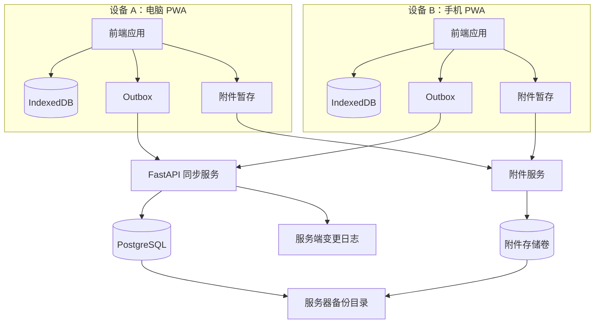

# 离线优先同步、云端部署与认证专项规划

> 本文是《个人学习网站全面产品与技术规划》的专项补充。  
> 适用范围：第一版必须支持云平台部署、完整离线编辑、少量附件、多设备同步、服务器备份以及 Passkey/TOTP 登录。

---

## 1. 最终确认的架构决策

| 决策 | 方案 |
|---|---|
| 部署 | 云平台上的个人实例，优先使用云服务器/VPS + Docker Compose |
| 数据库 | 云端 PostgreSQL 为最终权威数据源 |
| 离线能力 | 任务、资料元数据、笔记、复习、学习记录均可完整离线读写 |
| 客户端存储 | IndexedDB 保存当前账户的完整工作副本 |
| 应用形态 | 响应式 Web + 可安装 PWA + Service Worker |
| 同步 | 本地优先写入、Outbox 变更队列、服务端增量变更日志 |
| 笔记冲突 | 笔记正文采用 CRDT；普通结构化实体采用版本控制和显式冲突 |
| 附件 | 支持少量截图、图表、实验结果和小型文件；离线暂存、联网后上传 |
| 备份 | PostgreSQL、附件和关键配置定期备份到服务器独立备份目录/卷 |
| 登录 | Passkey 作为推荐主登录方式；密码 + TOTP 和恢复码作为恢复路径 |
| AI 密钥 | 仅保存于服务端并加密，离线时不执行需要远端 AI 的任务 |

---

## 2. 为什么必须采用离线优先，而不是增加一个缓存

“完整离线编辑”意味着在断网情况下，用户仍然可以：

- 查看全部已同步的学习路线和任务；
- 新增、修改、完成、延期任务；
- 新增和编辑资料元数据；
- 创建、编辑和关联 Markdown 笔记；
- 开始、暂停和结束学习计时；
- 完成测验和复习；
- 创建论文卡片和实验记录；
- 添加少量附件；
- 完成每日审查；
- 关闭应用并重新打开后继续工作。

因此客户端不能只是 API 页面。它必须拥有：

1. 完整的本地数据模型；
2. 本地事务；
3. 本地变更队列；
4. 冲突检测；
5. 同步状态；
6. 附件上传队列；
7. 数据库迁移；
8. 离线身份解锁机制。

---

## 3. 云端与客户端总体结构



---

## 4. 客户端本地数据架构

### 4.1 技术建议

- PWA；
- Service Worker 缓存应用外壳和静态资源；
- IndexedDB 存储结构化数据；
- Dexie.js 或等价成熟封装管理 IndexedDB；
- Yjs 管理 Markdown 笔记正文的 CRDT 更新；
- Web Crypto API 加密本地敏感数据；
- Background Sync 可用时自动同步，不可用时由应用前台同步；
- 浏览器存储配额检测和持久化存储请求。

前端团队可以更换 React/Next.js，但不能更改以下协议：

- 所有写操作先落本地事务；
- 每次写操作生成同步事件；
- 网络请求失败不能回滚用户已经完成的本地编辑；
- 服务端冲突不能静默覆盖本地内容；
- 用户必须能看到同步状态。

### 4.2 本地数据库建议表

```text
local_entities       结构化实体的本地副本
local_notes          笔记元数据
local_note_updates   Yjs/CRDT 更新
local_attachments    附件 Blob 与上传状态
outbox_operations    待推送操作
sync_state           每个工作区的同步游标
conflicts            待用户解决的冲突
local_settings       设备级设置
offline_session      离线解锁信息
```

实际开发中可以按业务实体拆分 IndexedDB 表，但必须统一维护同步元数据。

### 4.3 本地实体通用字段

```text
id                客户端生成的 UUIDv7
entity_type       实体类型
server_version    最近一次已知服务端版本
local_version     本地变更次数
sync_status       synced / pending / conflict / failed
created_at
updated_at
deleted_at
origin_device_id
```

UUID 必须由客户端生成，否则离线新建内容时无法稳定建立关联。

---

## 5. 同步协议

### 5.1 同步模型

采用“操作推送 + 增量拉取”的同步方式：

```text
1. 用户离线修改数据
2. 本地数据库事务成功
3. 生成 OutboxOperation
4. 网络恢复
5. 客户端批量 push 操作
6. 服务端验证、应用并返回版本
7. 客户端使用 cursor 拉取其他设备产生的变更
8. 合并或生成冲突
9. 更新本地游标和同步状态
```

### 5.2 Outbox 操作结构

```json
{
  "operation_id": "uuid",
  "device_id": "uuid",
  "entity_type": "task",
  "entity_id": "uuid",
  "operation": "update",
  "base_version": 12,
  "client_timestamp": "...",
  "payload": {},
  "idempotency_key": "uuid"
}
```

### 5.3 幂等性

- 每个操作拥有唯一 `idempotency_key`；
- 服务端保存已处理操作的结果；
- 网络重试不会重复创建任务、证据或学习会话；
- 批量同步允许部分成功，但必须逐项返回结果；
- 客户端只有收到明确成功结果后才能移除 Outbox 操作。

### 5.4 服务端变更日志

每次服务端业务变更生成单调递增 `change_seq`：

```text
change_seq
workspace_id
entity_type
entity_id
operation
entity_version
changed_at
origin_device_id
```

客户端记录最后成功拉取的 `cursor`，下一次只请求增量变化。

### 5.5 数据压缩与批量

- 首次同步使用分页快照；
- 后续使用增量变更；
- 单批操作设置数量和体积上限；
- 大量 CRDT 更新可在本地合并后再上传；
- 已删除实体使用 tombstone，不能立即从变更日志消失。

---

## 6. 不同数据类型的冲突策略

### 6.1 Markdown 笔记

笔记正文采用 Yjs 等 CRDT：

- 设备离线编辑产生更新块；
- 服务端存储更新或压缩后的状态；
- 多设备更新可以自动合并；
- 笔记标题、标签等元数据仍使用版本控制；
- 定期创建 Markdown 快照，便于导出和恢复；
- 保留用户可读的历史版本，不能只保存 CRDT 二进制状态。

选择 CRDT 的原因：笔记是最可能长时间离线并在不同设备编辑的数据，简单的最后写入覆盖会造成严重丢失。

### 6.2 结构化实体

任务、资料、计划、论文和实验使用乐观并发控制：

- 若 `base_version` 等于服务端版本，正常应用；
- 若版本不同，按字段和实体类型处理；
- 无法安全合并时创建冲突记录；
- 用户选择本地版本、服务端版本或手动合并；
- 任何冲突选择都生成审计事件。

### 6.3 可以自动合并的字段

- 标签集合：集合合并；
- 新增证据：追加；
- 学习会话事件：追加；
- 不同字段的非冲突修改：字段级合并；
- 复习完成记录：追加。

### 6.4 不允许自动合并的字段

- 计划日期范围；
- 阶段门槛；
- 任务验收状态；
- 实验结论；
- AI Provider 配置；
- API Base URL；
- 掌握度人工确认；
- 永久删除。

---

## 7. 完整离线工作流

### 7.1 首次使用

首次使用必须在线：

1. 登录云端账户；
2. 注册当前设备；
3. 下载工作区快照；
4. 初始化 IndexedDB；
5. 生成或解封本地加密密钥；
6. 缓存应用外壳；
7. 明确显示离线数据准备完成。

### 7.2 日常离线

断网后：

- 应用从 IndexedDB 读取数据；
- 所有修改先写入本地；
- 顶部显示离线状态和未同步操作数量；
- AI 请求、链接健康检查和远端备份不可用；
- 用户仍能完成核心学习流程；
- 附件进入本地等待上传状态。

### 7.3 网络恢复

- 先刷新认证；
- 推送 Outbox；
- 上传附件；
- 拉取增量变更；
- 合并 CRDT；
- 展示冲突；
- 更新同步时间；
- 同步失败不能删除本地内容。

### 7.4 清除浏览器数据风险

浏览器存储可能被用户或系统清除。因此：

- 云端仍是最终权威存储；
- 未同步数据需要明显提示；
- 关闭账户或清除本地数据前显示待同步数量；
- 支持手动导出本地未同步内容；
- 请求浏览器授予 persistent storage；
- 附件上传完成后才允许用户安全清理本地副本。

---

## 8. 离线身份与本地数据解锁

### 8.1 服务端登录

第一版采用：

- Passkey/WebAuthn：推荐主登录方式；
- 密码 + TOTP：设备丢失或 Passkey 不可用时的恢复登录；
- 一次性恢复码：最后恢复手段；
- 可撤销设备会话。

不建议只实现 Passkey，因为用户可能丢失所有已注册设备；也不建议只实现 TOTP，因为 Passkey 对钓鱼攻击更有抵抗力。

### 8.2 离线解锁不是服务端登录

在断网时，服务端无法验证新登录。第一版应区分：

- **服务端认证**：获得同步和 API 权限；
- **本地离线解锁**：只允许访问当前设备已经缓存的数据。

### 8.3 离线解锁方案

建议：

- 首次在线登录后创建设备本地加密密钥；
- 本地数据库中的敏感字段使用 Web Crypto 加密；
- 密钥由设备级解锁凭据包裹；
- PWA 提供本地 PIN/设备凭据解锁；
- 离线解锁具有有效期和失败次数限制；
- 离线状态不允许修改账户、AI Provider 和安全设置；
- 设备被服务端撤销后，下次联网时清除同步凭据并锁定本地数据。

Web 环境下无法保证达到原生安全硬件的所有能力，因此应在文档中明确其保护边界。

### 8.4 Passkey、TOTP 与恢复码

注册流程：

1. 设置高强度恢复密码；
2. 注册至少一个 Passkey；
3. 绑定 TOTP；
4. 下载恢复码；
5. 建议在第二台设备注册另一个 Passkey；
6. 完成恢复流程测试。

安全要求：

- TOTP secret 加密保存；
- 恢复码只存哈希；
- 恢复码使用一次即失效；
- 新增 Passkey 需要最近认证；
- 删除最后一个恢复方式时拒绝操作；
- 认证和恢复事件全部审计。

---

## 9. 附件设计

### 9.1 第一版允许的附件

- 截图；
- 实验图表；
- CSV/JSON 小型结果；
- 文本日志；
- 小型压缩包；
- 汇报文件索引或小型文档。

PDF 学习资料仍以索引为主，不默认上传完整文件。

### 9.2 限制建议

- 单文件默认上限 20 MB；
- 账户总附件配额可配置；
- 文件名、MIME 和扩展名一致性检查；
- 服务端重新生成安全文件名；
- 图片移除不必要的 EXIF；
- 禁止浏览器直接执行上传内容；
- 上传后计算 SHA-256；
- 重复附件可按校验值去重。

### 9.3 离线上传流程

```text
1. 用户选择附件
2. Blob 写入 IndexedDB
3. 创建附件元数据和本地占位 ID
4. 生成 Outbox 操作
5. 网络恢复
6. 服务端创建上传会话
7. 上传文件
8. 服务端校验大小、类型和 SHA-256
9. 返回正式附件 ID
10. 更新关联证据
11. 在确认已同步后清理本地 Blob
```

### 9.4 存储位置

第一版可使用服务器挂载的数据卷：

```text
/data/attachments/
/data/backups/
```

数据库只保存元数据和路径，不保存大型二进制。必须通过应用权限访问附件，不能直接暴露真实服务器路径。

为了未来迁移，附件服务内部使用对象存储风格接口，即使第一版底层是本地卷，也不要让业务模块直接拼接文件路径。

---

## 10. 服务器备份方案

### 10.1 备份内容

- PostgreSQL；
- 附件目录；
- 加密后的应用配置；
- AI Provider 元数据，但不在普通导出中包含明文密钥；
- 部署版本和数据库迁移版本；
- 恢复说明。

### 10.2 服务器内备份

建议备份到独立挂载卷，而不是与数据库使用同一目录：

```text
/var/lib/postgresql/     在线数据库
/data/attachments/       在线附件
/backup/daily/           每日备份
/backup/weekly/          每周备份
/backup/monthly/         每月备份
```

备份文件加密，保存校验值并定期验证可读性。

### 10.3 保留策略

- 最近 7 个每日备份；
- 最近 8 个每周备份；
- 最近 12 个每月备份；
- 升级前额外备份；
- 恢复前额外备份当前状态。

### 10.4 风险说明

只保存在同一台云服务器的备份不能防止服务器整体丢失、账户被删除或云盘损坏。第一版按用户要求保存在服务器，但系统必须保留：

- 手动下载加密备份；
- 未来增加异地备份的接口；
- 明确的备份健康状态；
- 恢复演练记录。

建议稳定使用后尽快增加第二备份位置。

---

## 11. 云平台部署方案

### 11.1 推荐第一版拓扑

```text
Cloud VPS
├── Reverse Proxy / HTTPS
├── Frontend PWA
├── FastAPI Backend
├── PostgreSQL
├── Scheduler / Backup Job
├── Attachment Volume
└── Backup Volume
```

### 11.2 Docker Compose 服务

```text
proxy
frontend
backend
postgres
worker-or-scheduler
backup
```

第一版不需要 Kubernetes。

### 11.3 域名和 HTTPS

- 使用独立域名或子域名；
- 自动签发和更新 TLS 证书；
- HSTS 在验证部署稳定后启用；
- 数据库、附件目录和备份目录不直接暴露公网；
- FastAPI 文档默认只对认证用户或开发环境开放。

### 11.4 资源建议

个人使用初期通常不需要高配置：

- 2 vCPU；
- 4 GB 内存；
- 40–80 GB SSD，依据附件与备份调整；
- PostgreSQL 独立持久卷；
- 每日数据库和附件备份。

如果未来在同机部署本地大模型，应单独评估算力，不能与学习系统服务混合估算。

---

## 12. API 补充

### 12.1 同步

```text
GET   /api/v1/sync/bootstrap
POST  /api/v1/sync/push
GET   /api/v1/sync/pull?cursor={cursor}
POST  /api/v1/sync/ack
GET   /api/v1/sync/status
GET   /api/v1/sync/conflicts
POST  /api/v1/sync/conflicts/{id}/resolve
```

### 12.2 CRDT 笔记

```text
GET   /api/v1/notes/{id}/snapshot
POST  /api/v1/notes/{id}/updates
GET   /api/v1/notes/{id}/updates?after={clock}
POST  /api/v1/notes/{id}/compact
```

压缩接口通常由后台任务调用，不应允许普通客户端任意破坏历史。

### 12.3 附件

```text
POST  /api/v1/attachments/init
PUT   /api/v1/attachments/{id}/content
POST  /api/v1/attachments/{id}/complete
GET   /api/v1/attachments/{id}
DELETE /api/v1/attachments/{id}
```

### 12.4 Passkey/TOTP

```text
POST  /api/v1/auth/passkeys/register/options
POST  /api/v1/auth/passkeys/register/verify
POST  /api/v1/auth/passkeys/login/options
POST  /api/v1/auth/passkeys/login/verify
POST  /api/v1/auth/totp/setup
POST  /api/v1/auth/totp/verify
POST  /api/v1/auth/recovery-codes/regenerate
GET   /api/v1/auth/security-methods
```

---

## 13. 第一版专项验收标准

### 完整离线

- 断网后可查看全部已同步任务、资料和笔记；
- 断网后可新增、编辑、完成和延期任务；
- 断网后可创建和编辑 Markdown 笔记；
- 断网后可完成学习计时、测验、复习和每日审查；
- 关闭 PWA 并重新打开后离线内容仍存在；
- 网络恢复后自动或手动完成同步；
- 同步失败不会丢失本地编辑。

### 多设备

- 两台设备离线编辑不同任务后能够合并；
- 两台设备同时编辑同一笔记正文时 CRDT 合并成功；
- 两台设备冲突修改任务验收状态时不会静默覆盖；
- 删除在另一设备同步为 tombstone；
- 设备撤销后不能继续同步。

### 附件

- 离线可添加截图并形成待上传记录；
- 网络恢复后自动上传并绑定原任务；
- 重试不会重复创建附件；
- 上传完成前不会错误显示“已云端保存”；
- 附件可随备份恢复。

### 认证

- Passkey 注册和登录成功；
- 密码 + TOTP 恢复登录成功；
- 恢复码只能使用一次；
- 可撤销指定设备；
- 离线解锁只能访问本地缓存，不能伪造服务端认证；
- API Key、TOTP secret 和恢复码不出现在日志中。

### 备份

- 每日自动备份成功；
- 备份包含数据库与附件；
- 备份具有校验值和状态；
- 可在空环境恢复；
- 恢复后同步游标、笔记和附件关系完整。

---

## 14. 开发顺序调整

完整离线属于第一版刚需后，开发顺序必须调整：

1. 先完成实体 ID、版本、事件和同步协议；
2. 再开发学习业务模块；
3. 每个业务模块同时实现本地模型和服务端模型；
4. 笔记模块从一开始使用 CRDT，不能上线后再迁移；
5. 附件从一开始使用上传状态机；
6. Passkey/TOTP 和设备管理在真实数据录入前完成；
7. AI 配置在核心同步稳定后实现；
8. 第一版发布前完成离线、多设备和恢复测试。

不能先做一个纯在线版本再“补离线”，否则数据 ID、状态机、冲突和附件模型大概率需要重写。

---

## 15. 仍待确定的实施信息

开始云端部署前，还需要确定：

1. 使用哪家云服务或 VPS；
2. 是否已有域名；
3. 前端团队最终采用的 PWA 技术；
4. 本地附件最大总配额；
5. 离线本地 PIN 的超时和失败策略；
6. Passkey 是否允许跨设备同步凭据；
7. 服务器备份卷容量和保留期限是否采用本文默认值。
