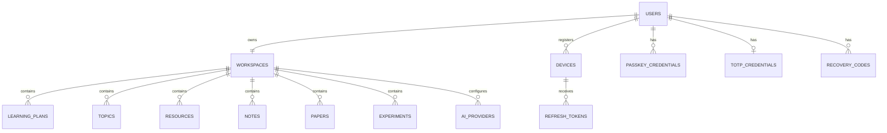
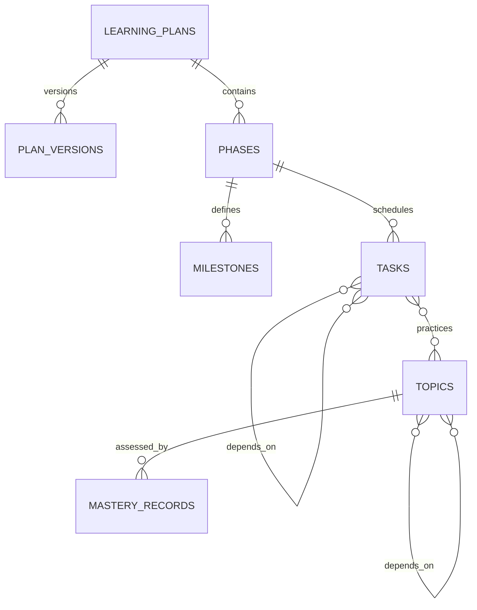
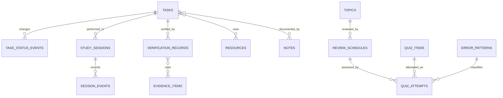
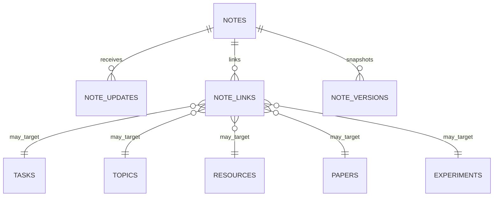
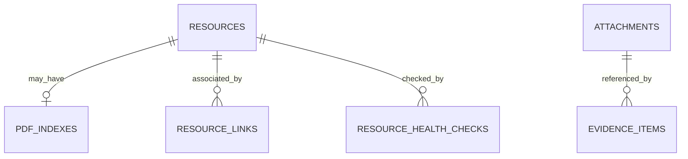
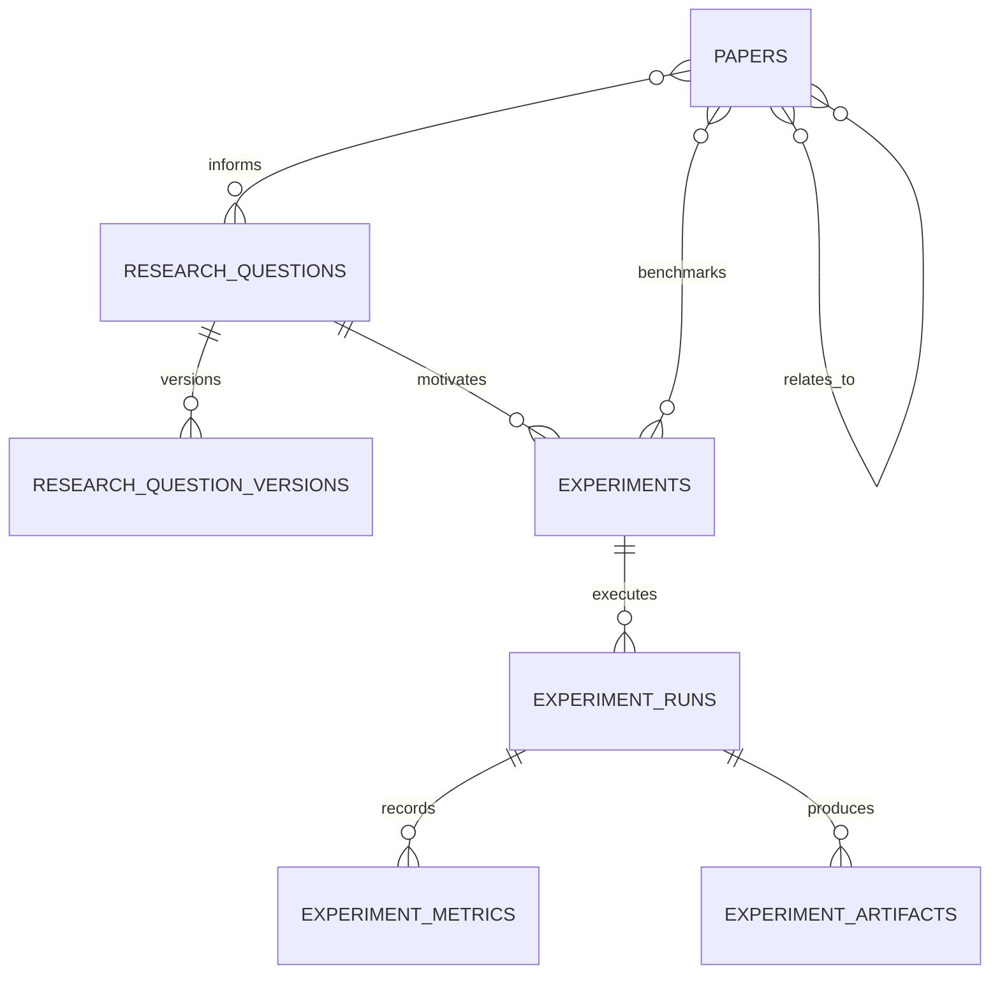
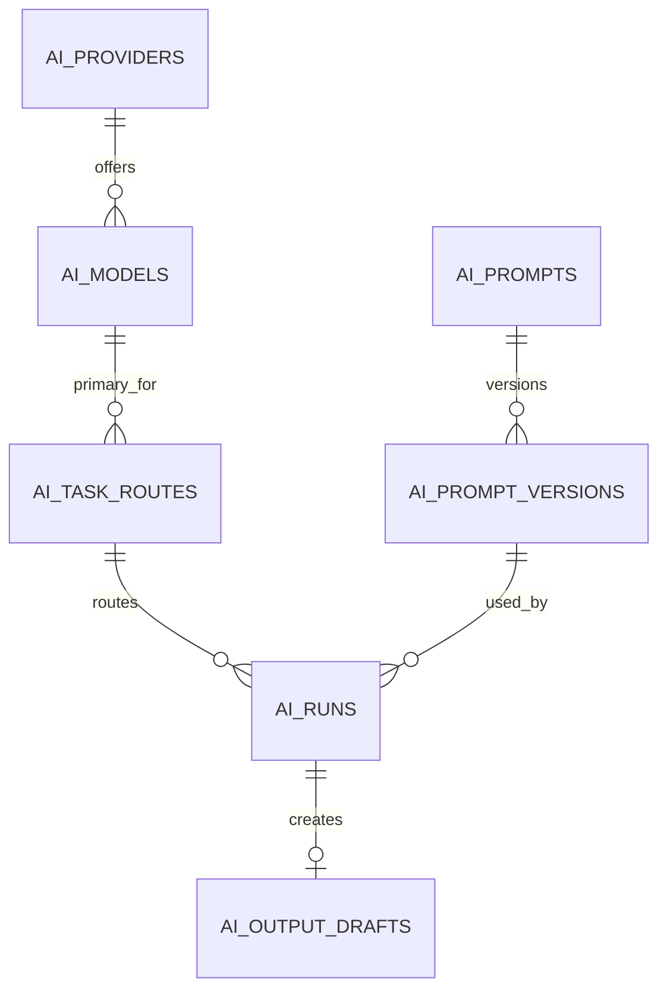
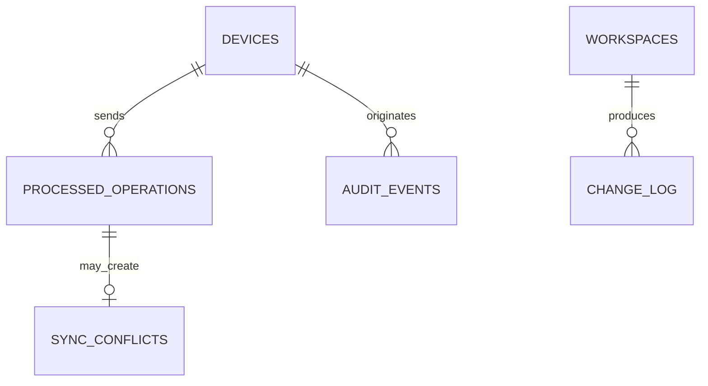

# 研途 Lab 数据库 ER 设计

> 本文说明核心关系、约束、索引和长期扩展策略。字段细节见《02-数据字典与枚举》。

---

## 1. 顶级关系

第一版虽为单用户，所有业务数据仍带 `workspace_id`，便于隔离、导出以及未来增加只读快照，不直接把业务表绑定到用户 ID。

---

## 2. 学习路线关系

### 2.1 约束

- `plan_versions(plan_id, version_number)` 唯一；
- `topic_dependencies(topic_id, prerequisite_topic_id)` 唯一；
- `task_dependencies(task_id, prerequisite_task_id)` 唯一；
- 禁止知识点和任务自依赖；
- 应用服务写入依赖关系前执行有向环检测；
- `phase.plan_id` 与 `task.plan_id/phase_id` 必须属于同一 workspace；
- `mastery_records` 为追加历史，不更新旧记录。

### 2.2 顺序字段

阶段、任务和资料关联使用 `numeric(20,8)` 位置值，允许在两个元素之间插入。位置过密时由后台任务重新编号并生成计划变更事件。

---

## 3. 任务执行、证据与复习

### 3.1 状态一致性

- `tasks.status` 是查询优化快照；
- `task_status_events` 是历史事实；
- 更新状态时在同一事务内写事件并更新快照；
- `verified` 状态必须存在通过或豁免的 `verification_record`；
- 删除验收证据时必须重新评估任务状态。

### 3.2 学习时长

- `session_events` 保存原始计时事件；
- `study_sessions.effective_seconds` 是可重算物化值；
- 跨设备重叠会话产生审查发现，不直接删除；
- 手工调整必须保存原因和差值。

---

## 4. 笔记与 CRDT

`note_links` 是多态关联，数据库不能通过普通外键同时约束多种目标。应用服务必须验证目标存在且属于同一 workspace。定期一致性任务检查悬空链接。

### 4.1 CRDT 存储策略

- `note_updates` 保存增量更新；
- `notes.crdt_state` 保存最近压缩状态；
- `notes.current_snapshot_md` 保存人类可读快照；
- `note_versions` 保存重要时间点快照和来源；
- 压缩完成后旧更新不能立即删除，需等待所有活跃设备超过压缩游标并完成备份。

### 4.2 `note_versions` 补充表

| 字段 | 类型 | 说明 |
|---|---|---|
| id | uuid | PK |
| note_id | uuid | FK |
| version_number | bigint | note 内 unique |
| snapshot_md | text | |
| state_vector | bytea | CRDT 状态向量 |
| source | varchar(30) | periodic/manual/import/conflict |
| created_at | timestamptz | |

---

## 5. 资料、附件与 PDF 索引

### 5.1 附件完整性

- 附件元数据写入后状态为 `queued`；
- 文件写入临时区域；
- 校验 MIME、大小和 SHA-256；
- 原子移动到正式 storage key；
- 状态更新为 `verified`；
- 证据只能把 `verified` 附件视为云端可用；
- 临时文件由清理任务处理。

### 5.2 `resource_health_checks`

| 字段 | 类型 | 说明 |
|---|---|---|
| id | uuid | PK |
| resource_id | uuid | FK |
| checked_at | timestamptz | |
| status | varchar(30) | available/redirect/broken/restricted/blocked |
| http_status | integer | nullable |
| final_url | text | nullable |
| latency_ms | integer | nullable |
| error_code | varchar(80) | nullable |

健康检查服务必须先经过 URL 安全验证，禁止访问云元数据和私有网络地址。

---

## 6. 科研关系

### 6.1 多态研究关联

建议使用通用 `research_links`：

| 字段 | 类型 |
|---|---|
| id | uuid |
| workspace_id | uuid |
| source_type | varchar(30) |
| source_id | uuid |
| target_type | varchar(30) |
| target_id | uuid |
| relation_type | varchar(40) |
| note_md | text |

第一版可先使用明确关联表，等关系类型稳定后再引入通用表，避免过早多态化。

---

## 7. AI 关系

备用模型的有序列表初期可用 JSONB，后续若需要复杂统计改为 `ai_route_fallbacks(route_id, model_id, position)`。

---

## 8. 同步与审计关系

### 8.1 操作原子性

应用同步操作时，在一个数据库事务中完成：

1. 检查 `processed_operations`；
2. 检查实体版本；
3. 写业务数据；
4. 写领域/状态事件；
5. 写 `change_log`；
6. 写 `audit_events`（若属于审计范围）；
7. 写 `processed_operations` 结果。

任一步失败则全部回滚。

---

## 9. 关键索引

### 身份

- `users(email)` unique；
- `passkey_credentials(credential_id)` unique；
- `refresh_tokens(token_hash)` unique；
- `refresh_tokens(user_id, device_id, revoked_at)`；
- `devices(user_id, revoked_at)`。

### 今日任务与计划

- `tasks(workspace_id, scheduled_date, status)` where deleted_at is null；
- `tasks(phase_id, position)`；
- `tasks(plan_id, scheduled_date)`；
- `task_status_events(task_id, occurred_at desc)`；
- `phases(plan_id, position)`。

### 复习

- `review_schedules(workspace_id, status, due_at)`；
- `quiz_attempts(quiz_item_id, attempted_at desc)`；
- `mastery_records(topic_id, effective_at desc)`。

### 笔记和资料

- `notes(workspace_id, updated_at desc)` where deleted_at is null；
- PostgreSQL FTS/GiST 或 GIN 索引用于标题和快照文本；
- `note_updates(note_id, client_id, client_clock)` unique；
- `resources(workspace_id, resource_type, updated_at)`；
- `attachments(workspace_id, sha256)`。

### 科研

- `papers(workspace_id, status, publication_year desc)`；
- `papers(workspace_id, doi)` partial unique where doi is not null；
- `experiment_runs(experiment_id, run_number)` unique；
- `experiment_metrics(experiment_run_id, metric_name, split, step)`。

### 同步

- `change_log(workspace_id, sequence)`；
- `processed_operations(operation_id)` PK；
- `sync_conflicts(workspace_id, status, created_at)`。

---

## 10. 分区与归档

个人使用初期不需要表分区。达到以下规模后再评估：

- `change_log` 超过 500 万行；
- `audit_events` 超过 500 万行；
- `session_events` 超过 1000 万行；
- `ai_runs` 超过 100 万行。

即使归档，用户可见历史和导出能力不能丢失。可按年份分区事件表，但不要按“已完成”删除学习历史。

---

## 11. 数据删除顺序

- Workspace 删除是高风险操作，第一版不提供直接永久删除；
- Plan 软删除不级联删除任务；任务保留并标记原计划已归档；
- Topic 删除前检查任务、掌握度和复习；
- Note 软删除保留 CRDT 更新直到垃圾箱期限结束；
- Attachment 删除前检查证据引用；
- AI Provider 删除前检查路由；
- Device 撤销不删除其历史事件。

永久清理由受控后台任务执行，并先生成备份和审计事件。
