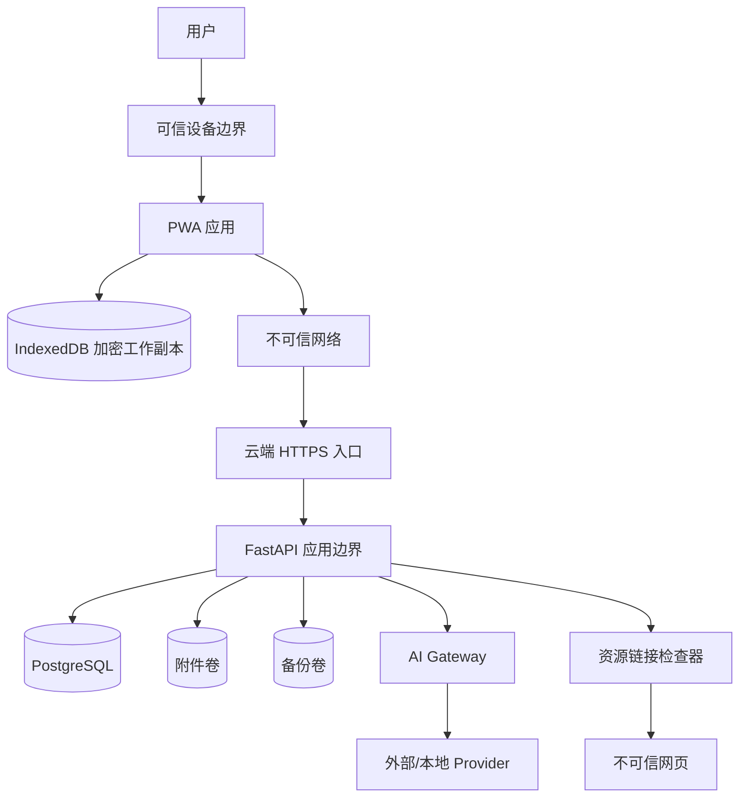

# 研途 Lab 安全威胁模型

> 版本：1.0  
> 方法：资产与信任边界分析 + STRIDE + 滥用场景  
> 范围：云平台、PWA、离线数据库、同步、附件、AI Provider、备份和认证

---

## 1. 安全目标

### 1.1 机密性

- 未授权者不能访问学习记录、论文、实验和附件；
- AI API Key、TOTP secret、恢复码和 Token 不得泄露；
- 标记为敏感或受限的内容不得未经授权发送外部 AI；
- 备份和本地离线副本应受到合理保护。

### 1.2 完整性

- 多设备同步不能静默覆盖数据；
- 攻击者不能伪造已完成任务、掌握度、验收和实验结果；
- AI 输出不能绕过用户确认进入正式数据；
- 备份和附件可验证未被篡改；
- 审计记录能追踪关键变更。

### 1.3 可用性

- 断网时核心学习功能可用；
- AI Provider 不可用不影响核心数据；
- 网络重试不造成重复操作；
- 数据库或应用升级失败可以恢复；
- 单个异常附件、笔记或同步操作不能阻塞全部系统。

### 1.4 隐私与控制

- 用户知道哪些数据发送给哪个模型；
- 用户可以导出和删除个人数据；
- 不进行不必要的设备指纹和行为追踪；
- 服务器日志遵循数据最小化。

---

## 2. 保护资产

| 资产 | 敏感性 | 主要风险 |
|---|---|---|
| 账户认证信息 | 极高 | 账户接管 |
| Passkey 公钥和凭据元数据 | 高 | 身份伪造、隐私 |
| TOTP secret、恢复码 | 极高 | 绕过二次验证 |
| Refresh Token | 极高 | 长期会话劫持 |
| AI API Key | 极高 | 费用损失、数据访问 |
| 学习笔记和记录 | 中到高 | 隐私泄漏、丢失 |
| 论文与研究想法 | 高 | 未公开研究泄漏 |
| 实验配置与结果 | 高 | 篡改、错误结论 |
| Vigils 相关资料 | 高/受限 | 项目和安全信息泄漏 |
| 附件 | 中到高 | 恶意文件、隐私泄漏 |
| 本地 IndexedDB | 高 | 设备本地窃取 |
| 同步操作与变更日志 | 高 | 重放、篡改、覆盖 |
| 备份 | 极高 | 全量数据泄漏或不可恢复 |
| 审计日志 | 高 | 删除证据、隐私泄漏 |

---

## 3. 威胁主体

### 外部攻击者

- 扫描公网服务；
- 尝试撞库、钓鱼和会话窃取；
- 利用 Web、API、附件或 URL 检查漏洞；
- 获取云服务器控制权。

### 恶意或被入侵的第三方服务

- AI Provider 记录或滥用输入；
- 外部学习链接返回恶意内容；
- DNS 或网络重定向到恶意服务；
- 云平台或依赖供应链受损。

### 丢失或受感染设备

- 浏览器缓存和离线数据库被读取；
- Refresh Token 被盗；
- 未同步笔记泄漏；
- 恶意扩展读取页面内容。

### 用户误操作

- 错误删除计划或证据；
- 配置恶意 Base URL；
- 将敏感研究发送外部模型；
- 丢失所有 Passkey/TOTP；
- 误以为同机备份可以防止服务器整体丢失。

### AI 模型

AI 不是可信操作者。风险包括：

- 幻觉；
- 恶意资料中的提示注入；
- 生成错误计划、题目或论文结论；
- 输出不安全 HTML/链接；
- 诱导扩大数据发送范围。

---

## 4. 信任边界

主要边界：

1. 用户与设备；
2. PWA 与浏览器扩展/本地环境；
3. 离线数据库与服务端；
4. 公网与云端入口；
5. FastAPI 与数据库/文件系统；
6. AI Gateway 与 Provider；
7. URL 检查器与外部网页；
8. 在线数据与备份。

---

## 5. 认证威胁

### AUTH-01 密码撞库

- 影响：账户接管；
- 控制：Passkey 主登录、密码 + TOTP、限流、失败延迟、强密码；
- 检测：失败登录审计和异常提醒；
- 残余风险：邮箱或 TOTP 设备同时受损。

### AUTH-02 WebAuthn 挑战重放

- 控制：挑战随机、短期、单次使用、绑定 RP ID 和会话；
- 服务端验证 origin、challenge、RP ID、签名和计数；
- 不接受客户端声称的验证结果。

### AUTH-03 Refresh Token 窃取

- 控制：HttpOnly/Secure/SameSite Cookie、Token 旋转、设备绑定、家族重用检测；
- 重用旧 Token 时撤销整个家族并要求重新登录。

### AUTH-04 恢复流程被利用

- 控制：恢复码单次、只存哈希；密码恢复必须 TOTP；关键安全设置要求最近认证；
- 不允许在无恢复方式情况下删除最后一个 Passkey。

### AUTH-05 设备撤销失效

- 控制：每次 refresh 和 sync 检查设备状态；
- 撤销后拒绝新 Token；
- 客户端下次联网锁定同步；
- 残余：完全离线设备仍可读取其已有本地缓存，需在产品中明确。

---

## 6. PWA 与离线数据威胁

### OFFLINE-01 IndexedDB 被本机其他主体读取

- 控制：敏感字段客户端加密；本地解锁；自动锁定；不在 localStorage 保存 Token；
- 设备安全仍是前提；Web 应用无法完全防御已控制操作系统或恶意浏览器扩展。

### OFFLINE-02 Service Worker 被污染

- 控制：HTTPS、严格 CSP、版本化静态资源、Service Worker 更新验证；
- 禁止从不可信 CDN 动态执行脚本；
- 更新失败保留上一可用版本。

### OFFLINE-03 浏览器存储被清除

- 控制：云端权威副本、persistent storage、未同步数量提示、退出/清理前警告、本地导出；
- 未同步数据始终存在不可完全消除的风险。

### OFFLINE-04 离线解锁绕过服务端撤销

- 离线解锁只访问缓存；
- 不允许修改安全/Provider 设置；
- 下次联网执行撤销；
- 可配置本地解锁有效期；
- 残余风险必须接受并在威胁模型中公开。

---

## 7. 同步威胁

### SYNC-01 操作重放

- 控制：operation_id 幂等、请求哈希、设备验证、工作区验证；
- 同 ID 不同 payload 拒绝并审计。

### SYNC-02 伪造 base_version 覆盖新数据

- 控制：服务端版本检查；不相信客户端 version；冲突不自动覆盖。

### SYNC-03 跨工作区或对象越权

- 控制：所有 entity_id 在服务端重新验证 workspace；
- 关联创建检查两端归属；
- 不以客户端 payload 中的 workspace 为授权依据。

### SYNC-04 恶意超大批次或 CRDT 更新

- 控制：数量、字节、解压后大小和单文档更新限制；
- CRDT 解析资源预算；
- 速率限制；
- 异常更新隔离而非阻塞整个同步。

### SYNC-05 删除与更新造成数据丢失

- 控制：tombstone、冲突记录、垃圾箱、恢复；
- 用户明确选择删除或恢复。

### SYNC-06 服务端恢复备份后旧设备污染数据

- 控制：恢复时生成新 sync epoch；
- 旧设备必须重新 bootstrap 或进行恢复协调；
- 恢复后的服务端不直接接受旧 cursor 的批量更新。

---

## 8. Markdown、笔记与内容威胁

### CONTENT-01 存储型 XSS

- Markdown 渲染使用允许列表清理；
- 默认禁止原始 HTML，或严格 sanitize；
- 链接使用安全属性；
- 禁止 `javascript:`、危险 data URI；
- AI 输出同样视为不可信内容。

### CONTENT-02 恶意链接

- 展示真实域名；
- 外部打开明确提示；
- 链接检查不代表内容可信；
- 不自动执行页面指令。

### CONTENT-03 CRDT 资源耗尽

- 限制单次更新、累计文档大小和压缩资源；
- 异常文档进入只读恢复模式；
- 定期快照；
- 备份可恢复。

### CONTENT-04 AI 注入

外部论文、网页或笔记中可能包含“忽略系统指令”等内容：

- AI Prompt 明确把资料作为数据；
- 不允许资料扩大工具和数据权限；
- AI 模块没有直接业务写权限；
- 输出必须经 schema 和用户确认。

---

## 9. 附件威胁

### FILE-01 伪造 MIME/扩展名

- 服务端检测类型；
- 类型允许列表；
- 安全文件名；
- 通过下载响应而非直接执行。

### FILE-02 路径穿越

- storage key 由服务端生成；
- 不拼接用户文件名；
- 文件存储目录不允许执行；
- 下载通过授权接口。

### FILE-03 恶意图片或文档解析器漏洞

- 第一版尽量不在服务器解析复杂格式；
- 图片处理库保持更新并设置资源限制；
- PDF 只索引不解析正文；
- 可选杀毒扫描作为增强。

### FILE-04 存储耗尽

- 单文件、总配额和请求限制；
- 上传临时文件过期清理；
- 重复哈希去重；
- 监控磁盘空间。

### FILE-05 未完成上传被当成证据

- 只有 `verified` 附件才能作为云端有效证据；
- 客户端明确显示“仅本地”或“待上传”。

---

## 10. AI Provider 威胁

### AI-01 API Key 泄漏

- 服务端加密；
- 浏览器永不接收；
- 日志脱敏；
- 导出排除；
- UI 只显示存在性和指纹。

### AI-02 自定义 Base URL SSRF

- URL scheme/IP/解析后地址检查；
- 拒绝云元数据、loopback、link-local 和未授权私网；
- 重定向逐跳检查；
- 私网 Provider 必须显式启用。

### AI-03 敏感数据外发

- 对象敏感级别；
- 输入字段白名单；
- 发送前扫描；
- sensitive 当次确认；
- restricted 禁止外部 Provider；
- 审计 input_scope。

### AI-04 模型输出篡改正式数据

- AI 输出仅 draft；
- 接受时进行目标版本检查；
- 用户确认；
- 保存差异和来源；
- AI 没有直接数据库写权限。

### AI-05 成本失控

- 单次、每日和月度预算；
- token 限制；
- 幂等键；
- 429/超时重试上限；
- 用量和费用监控。

### AI-06 Provider 返回恶意或超大响应

- 响应大小、时长和 token 上限；
- JSON schema 验证；
- Markdown sanitize；
- 错误信息脱敏。

---

## 11. URL 健康检查威胁

### URL-01 SSRF 和云元数据访问

- 仅允许 HTTP/HTTPS；
- DNS 解析和 IP 分类；
- 拒绝私网/元数据；
- 禁止用户定义请求头；
- 限制重定向、响应大小和时间；
- 使用独立低权限网络客户端。

### URL-02 下载恶意大文件

- 优先 HEAD；
- 必须 GET 时读取极小上限；
- 不保存响应正文；
- 不执行脚本。

---

## 12. 数据库与服务端威胁

### SERVER-01 SQL 注入

- ORM 参数化；
- 原生 SQL 代码审查；
- 不把用户排序字段直接拼接；
- 数据库账户最小权限。

### SERVER-02 越权访问

- repository 查询必须带 workspace；
- 统一授权依赖；
- UUID 不作为授权；
- 负向权限测试。

### SERVER-03 调试接口暴露

- 生产关闭 debug；
- OpenAPI 文档受保护；
- 错误不返回堆栈；
- 管理和备份接口需要最近认证。

### SERVER-04 依赖供应链

- 固定依赖版本和 lock；
- 自动漏洞扫描；
- 最小容器镜像；
- 构建来源可追溯；
- 更新先测试后发布。

---

## 13. 备份威胁

### BACKUP-01 备份明文泄漏

- 备份加密；
- 权限隔离；
- 下载需要最近认证；
- 不在普通 Web 根目录；
- 备份日志不包含密钥。

### BACKUP-02 同服务器整体丢失

- 第一版已知残余风险；
- 提供手动下载；
- 预留异地存储；
- 产品明确显示最后一次外部导出时间；
- 建议稳定后增加异地备份。

### BACKUP-03 备份不可恢复

- 校验值；
- 定期恢复演练；
- 保存应用和 schema 版本；
- 恢复后运行一致性检查。

### BACKUP-04 恢复造成旧设备同步污染

- 新 sync epoch；
- 客户端重新 bootstrap；
- 保存恢复审计；
- 恢复前备份当前状态。

---

## 14. 日志与审计威胁

### LOG-01 敏感日志

禁止记录：

- 密码；
- Token；
- API Key；
- TOTP secret；
- 恢复码；
- 完整敏感 AI 输入；
- 附件正文。

### LOG-02 审计被修改

- 应用账户只追加审计；
- 普通业务删除不删除审计；
- 定期纳入备份；
- 可选后续增加哈希链，但第一版不把哈希链当绝对防篡改保证。

---

## 15. 云部署控制

- 反向代理终止 TLS；
- 数据库不暴露公网；
- SSH 使用密钥并限制来源；
- 自动安全更新有维护窗口；
- 容器不使用 root；
- secrets 不写镜像和仓库；
- 附件、数据库和备份分离目录/卷；
- 防火墙只开放必要端口；
- 云账户启用 MFA；
- 监控磁盘、备份失败、登录失败和证书到期。

---

## 16. 发布前安全门槛

- 完成认证、同步、附件、AI、URL 检查和备份的威胁测试；
- 无高危依赖漏洞；
- API Key/TOTP/Token 不出现在前端包、响应、日志和导出；
- 所有对象访问有 workspace 授权负向测试；
- XSS、CSRF、SSRF、路径穿越和操作重放测试通过；
- 备份恢复成功；
- 被撤销设备无法同步；
- AI 输出不能直接改变正式记录；
- 安全残余风险在运维文档中明确。

---

## 17. 残余风险

第一版接受但必须明确：

- 已完全控制的本机或恶意浏览器扩展可以读取用户正在查看的内容；
- 被撤销但长期离线的设备仍可能读取其旧缓存；
- 同服务器备份不能抵御服务器整体丢失；
- CRDT 能合并文本但不能保证语义一致；
- 外部 AI Provider 可能按其政策保存请求；
- 用户可能主动确认发送敏感内容；
- 链接健康检查不能证明资料内容安全或正确。

这些风险应通过说明、默认安全设置和后续迭代降低，而不能用产品文案掩盖。
