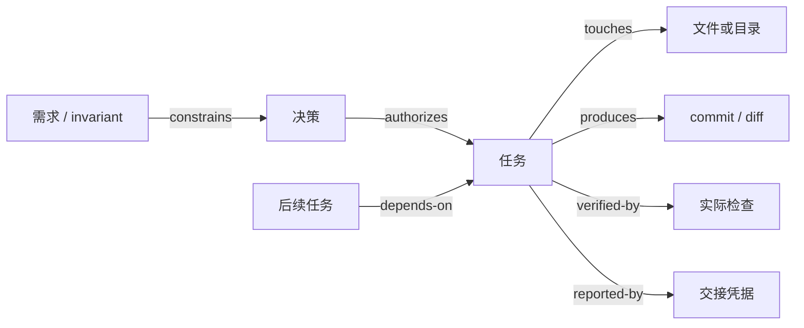

# Logion 多 Agent 上下文账本与本地图索引

## 1. 目标

长任务不能依赖某个模型持续记住完整聊天。Logion 使用一套轻量、可验证、可重放的本地状态层，把需要跨会话保留的信息拆成五类：

- `context.json`：目标、基线、约束、决策、未决问题与参与席位；
- `tasks.jsonl`：只追加的任务生命周期事件；
- `graph.json`：需求、决策、任务、文件、提交、检查和交接之间的关系；
- `handoffs/*.json`：Worker 自己报告的执行命令、检查结果、风险和工作树状态；
- `observations/*.json`：Codex 协调者独立执行或观察的验收证据，绑定完成事件和 handoff 摘要。

首版不引入 Neo4j、向量数据库或额外服务。JSON/JSONL 足以在当前两台 2 核 2 GB 服务器之外完成开发协作，也不会占用线上资源。

## 2. 权威边界

Windows Codex 是协调状态的唯一写入者。Mac 上的 Kimi 与 DeepSeek、Windows 上的 ZCode 只读取自包含任务包并返回交接证据。

权威顺序如下：

1. 用户当前指令与已批准规格；
2. Git 中的代码、合同与适用的 `AGENTS.md`；
3. 实际观察到的 Git、测试、构建和运行结果；
4. Orca 对当前 Run、Task、Dispatch 和消息投递的实时状态；
5. 本地账本的恢复快照；
6. Worker 报告。

账本用于恢复，不覆盖更高层事实。若账本写着“通过”但实际命令失败，必须把事件追加为失败或拒绝，不能修改历史事件掩盖冲突。

## 3. 存储布局

仓库跟踪规则、Schema、合成夹具和校验器：

```text
.agents/coordination/
├── roles.json
├── state.schema.json
├── fixtures/minimal-run/
└── runs/.gitkeep
```

每次真实协调运行保存在本机且默认不进入 Git：

```text
.agents/coordination/current-run.json
.agents/coordination/runs/<run-id>/
├── context.json
├── tasks.jsonl
├── graph.json
├── handoffs/<task-id-or-attempt-id>.json
└── observations/<observation-id>.json
```

`.gitignore` 忽略真实 Run 和当前指针。只有人工脱敏、重新校验后的最终快照，才可作为独立文档或制品进入版本库。
`fixture` 不是任意 Run 都可声明的信任级别。只有位于仓库受信固定真实目录
`.agents/coordination/fixtures/` 下的合成夹具可获得“基线提交不必在当前仓库可达”的豁免；
该根目录及 Run 目录不得是 symlink/junction。位于其他目录的 `fixture`、所有 `active` Run
和所有 `closed` Run 都必须验证其基线提交可达。

所有状态文件必须是严格 UTF-8。JSON/JSONL 禁止重复对象键；不能依赖 `JSON.parse` 的
last-wins 行为掩盖前一个值。handoff、observation、pointer 和事务 manifest 的 SHA-256
均针对文件的原始字节计算，不针对解码后再编码的字符串。状态文件还必须以不跟随链接的
regular-file 方式读取，并比较打开前后的文件身份；检查期间被替换的文件按失败处理。

同一任务若经历 `completed -> rejected -> retried -> completed`，每次完成必须引用不同的
receipt 文件、`handoffId` 和 attempt-specific observation ID，不得覆盖第一次交接证据。
`task.created.acceptanceChecks` 保存稳定的逻辑验收项。receipt check 只表示 Worker 自报结果，
其 `evidenceRoleId` 必须是任务 owner，`acceptanceCheckId` 恒为 `null`，不能授权验收。
协调者 observation 才能引用逻辑验收项；最终 `task.accepted` 同时记录 observation ID 与原始
JSON 的 SHA-256，从而把验收决定绑定到当时的确切证据，而不是可事后改写的文件名。

## 4. 图模型

本地图不是聊天记录，而是一个稳定 ID 索引：



允许的核心节点包括 `run`、`requirement`、`invariant`、`decision`、`question`、`task`、`file`、`commit`、`check`、`handoff` 和 `model`。边只引用节点 ID，不复制大段正文。

图是权威数据的索引，不是第二份可独立改写的事实源。节点的 `label` 只是非权威短标题，
不要求逐字复制 objective、summary、question 或 title；context 中的每一项也不要求都创建图节点。
但只要节点复制了结构化权威数据，就必须一致：

- `run` 节点 ID 必须是 `context.runId`；
- `invariant` 节点 ID 必须存在于 `context.invariants`；
- `decision`/`question` 节点的 status 必须与 `context.json` 中同 ID 项一致；
- `task` 节点的可选 `orcaTaskId` 必须与该任务唯一的 `task.created` 一致；
- `model` 节点的 `roleId`/`modelId` 必须与 `roles.json` 中同一席位一致；
- `file` 必须解析到仓库文件，`commit` 必须是完整 SHA，`handoff` 必须解析到已加载 receipt，
  `check` 必须与它引用的 coordinator observation 一致。

每类边只能使用以下端点类型；仅仅“两个节点都存在”不足以让边合法：

| 边类型        | from                                | to                                                             |
| ------------- | ----------------------------------- | -------------------------------------------------------------- |
| `includes`    | `run`                               | `requirement` / `invariant` / `decision` / `question` / `task` |
| `constrains`  | `requirement` / `invariant`         | `decision` / `task`                                            |
| `authorizes`  | `decision`                          | `task`                                                         |
| `implements`  | `task`                              | `requirement` / `decision`                                     |
| `touches`     | `task`                              | `file`                                                         |
| `produces`    | `run` / `task`                      | `commit`                                                       |
| `verified-by` | `run` / `task`                      | `check`                                                        |
| `reported-by` | `task`                              | `handoff`                                                      |
| `depends-on`  | `task`                              | `task`                                                         |
| `decided-by`  | `requirement` / `question` / `task` | `decision`                                                     |
| `uses-model`  | `task`                              | `model`                                                        |

图中不保存：

- 聊天全文或终端转录；
- API Key、访问令牌、密码、SSH 私钥、Orca dispatch capability；
- Provider 端点、生产 `.env`、数据库凭据；
- 真实用户主目录、开发机 IP、终端 handle；
- 用户数据或生产数据样本。

## 5. 任务事件与重放

`tasks.jsonl` 每行一个 JSON 事件。允许的主要流程为：

```text
created -> assigned -> started -> completed -> accepted
                             \-> blocked -> resumed
                             \-> failed -> retried
completed -> rejected -> retried
```

事件不可原地修改。当前合同不提供通用的事件覆写或任意更正字段；状态变化只能追加 Schema
明确定义的生命周期事件（例如 `rejected`、`retried`）。错误历史仍保留，校验器从
第一行开始重放，并把结果与 `context.json.expectedFinalState` 比较。

所有事件时间、模型证明时间和 observation 时间必须是带 `Z` 或显式数值 offset 的严格
RFC 3339，禁止省略时区、只写日期或依赖运行时自动修正非法日期。事件按绝对时间非递减；
某席位的 `modelEvidence.observedAt` 不得晚于把该席位投入工作的 `task.assigned` 或
`task.retried`，否则不能证明派发时实际使用了声明的模型。

任务创建事件必须包含：

- owner、读写模式、独立 worktree 引用和分支；
- 允许路径与依赖；
- 非空且稳定的 `acceptanceChecks`；
- 与 Run 相同的不可变基线提交。

两个有写权限且执行时间重叠的任务，不得拥有重叠路径、相同分支或相同 worktree。只读审查可以读取写任务路径，但仍不得修改。

## 6. 完成与验收

`task.completed` 只表示 Worker 已交接，不表示 Codex 已接受。完成事件必须引用一个 handoff receipt，receipt 至少记录：

- 结果、基线、工作分支与 changed files；
- 实际执行的命令；
- 已实际运行检查的 `passed` 或 `failed` 状态及观察结果；
- 未运行检查及具体原因；
- 风险、工作树状态和建议下一步。

只有协调者独立审查后才追加 `task.accepted`。`basis` 必须与任务声明的
`acceptanceChecks` 完全一致；每个逻辑验收项必须由一份独立 Codex observation 覆盖。
observation 必须绑定最终 `task.completed`、最终 handoff 路径及其原始字节 SHA-256，并且
观察时间必须位于完成与验收事件之间。`task.accepted.observationDigests` 再绑定 observation
自身的原始字节 SHA-256；图中的 check 节点只做索引，必须与 observation 一致。

Worker receipt 的 `passed` 只是交接声明，不能提升为 Codex 验收结果。写了测试但没运行时，
不得把它放进 Worker receipt 的 `checks`；只能写进 `unrunChecks`，每项使用
`{ name, reason }`。只有 coordinator observation 支持 `not_run`，并且必须填写原因；
无论哪一方都不能把未运行工作记作 `passed`。

## 7. 模型证明

`.agents/coordination/roles.json` 固定当前席位及精确模型 ID。某席位只有在 `context.json` 中带有与角色配置一致的 `modelEvidence` 时，才可标为 `ready`。允许的证据来源包括客户端状态、Provider 模型列表、运行时证明或人工验证。

模型证明必须先于或等于使用该席位的每个 `task.assigned`/`task.retried` 事件时间。晚到的
证明不能追溯证明早先的派发；此时应记录新的证明，再追加新的 retry/assignment 生命周期事件。

CCSwitch 只负责本地 Provider 配置，不是任务账本。账本只记录模型 ID 和验证时间，不记录 Key、账号或中转地址。

## 8. 使用流程

初始化一个本地 Run：

```powershell
pnpm agent:state:init -- `
  --run-id run-next-version `
  --objective "Implement the approved next-version scope"
```

初始化器默认读取当前 Git commit 和分支，在 runs root 中使用独占锁、事务 intent 与文件
摘要 manifest。它先在 staging 目录持久化并完整校验空事件流与 Run 节点，再发布 Run，最后
通过同目录临时文件与独占 hard link 原子发布当前指针。指针发布是有指针初始化的 commit
point：进程在 staging 后或 Run 发布后崩溃会在下一次初始化时回滚；指针发布后崩溃会保留
完整 Run，只清理事务残留。它拒绝覆盖已有 Run 或活动指针，也拒绝符号链接、目录穿越和
敏感内容。初始化在创建事务目录前必须对 objective、branch 和即将持久化的其余输入做完整
preflight 敏感扫描，避免把不合格输入先写入磁盘。

恢复对 manifest 尚未生成的早期崩溃有单独的保守路径：空事务目录可安全回收；已有合法
intent 但无 manifest 时，只能回收由 intent 精确归属、目录布局完整受限的 partial staging。
任何未知文件、额外目录、链接、identity 变化或摘要不符都 fail closed，保留现场等待人工审查。

恢复或交接前验证：

```powershell
pnpm agent:state:validate -- .agents/coordination/runs/run-next-version
```

校验器检查：

- JSON Schema 的必填字段、额外字段禁令、稳定 ID、角色和精确模型证明；
- 基线一致性、事件状态迁移、依赖无环和预期最终状态；
- 并发写路径、分支和 worktree 的单写入者约束；
- completed task 的 Worker handoff 与独立 Codex observation；
- 图节点、边、文件、检查和 receipt 引用；
- handoff 摘要、observation 摘要、验收 basis、观察时间窗与图索引的一致性；
- current pointer 的 schema、敏感字段、真实目录、`runId` 和目标 context 绑定；
- 每个 JSON 对象无重复键、所有文件为 strict UTF-8、摘要基于原始字节，以及 regular-file
  no-follow/file-identity 约束；
- 密钥特征、最多三层编码后的敏感值、敏感键、非白名单外部引用、真实邮箱、用户主目录、
  Windows 设备名（含 `CONIN$`/`CONOUT$`）与 ADS、终端 handle；
- 分段合法 percent 编码（即使相邻存在非法 `%XX`）、字符串内部的 Base64/Base64url token、
  使用反斜杠变体的 credential URL、完整或压缩私网 IPv6、IPv4-mapped 私网 IPv6；
- 编码候选数量、深度或总字节预算超限时 fail closed，而不是跳过剩余扫描。

协调规则、Schema 和夹具的仓库门禁：

```powershell
pnpm agent:state:check
```

## 9. 会话压缩与跨模型交接

在以下时点写入检查点：

- 用户批准或推翻一个跨任务决策；
- Task 被创建、派发、阻塞、完成、拒绝或接受；
- 基线、文件所有权或验收命令发生变化；
- 对话即将压缩、客户端即将关闭或任务准备跨机器恢复。

新会话恢复时只读取：当前指针、`context.json`、重放后的未完成任务、相关图邻居和必要 handoff。不要重新加载全部历史聊天。这样可以控制上下文开销，并避免模型从过期对话推断当前状态。

## 10. 故障处理

- 当前指针缺失：从用户当前目标初始化新 Run，不猜测旧任务已完成。
- 初始化进程异常退出：下一次初始化在独占锁内按事务 intent 与 manifest 恢复；无法证明归属
  或摘要不一致时停止，不自动删除可疑目录；manifest 前的空事务或受限 partial staging 只在
  能证明所有权且没有未知条目时回收。
- 校验失败：停止派发，保留原文件并追加修正事件；不要重写历史。
- Orca 与账本不一致：以 Orca 当前实时生命周期和 Git 事实为准，再更新本地账本。
- Worker 丢失上下文：重新发送完整 task packet，不发送聊天全文。
- 基线不可达、路径冲突或模型证明缺失：席位不得标为 ready，任务不得派发。
- 环境检查未执行：Worker 写入 `unrunChecks{name,reason}`；Codex observation 写入
  `not_run` 与原因，不能勾选通过。
