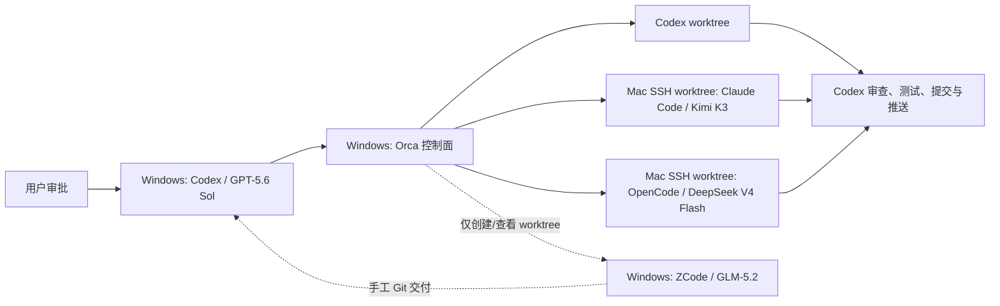

# Logion 多机多客户端协作配置手册

> 核验日期：2026-08-02  
> 适用范围：Windows 主控、Mac 远程开发机、Orca、Codex、ZCode、Claude Code、OpenCode  
> 本文只定义安装与协作方案，不包含真实账号、API Key、SSH 私钥或生产配置。

## 1. 结论

这套配置可以运行，但准确形态是“3 个可监督终端 Worker + 1 个手工桌面 Worker”，不是
Orca 全自动控制四个客户端。

| 机器    | 客户端      | 模型                        | 定位                                         | Orca 能力                                    |
| ------- | ----------- | --------------------------- | -------------------------------------------- | -------------------------------------------- |
| Windows | Codex       | `gpt-5.6-sol`               | 总控、核心开发、审查、验收、合并、提交、推送 | 可监督                                       |
| Windows | ZCode       | `GLM-5.2` / `glm-5.2`       | 边界清晰的模块实现                           | 只能管理其 Git worktree，不能监督 ZCode 对话 |
| Mac     | Claude Code | Kimi K3；日常推荐 `k3-256k` | UI 原型与受限前端实现                        | 可通过已配置终端纳管                         |
| Mac     | OpenCode    | `deepseek-v4-flash`         | 默认只读审查                                 | 可通过已配置终端纳管                         |

ZCode 3.x 是 Electron 桌面 ADE，不是已公开文档化的交互式 CLI。Orca 的自定义 Agent
要求一个终端 CLI 命令，因此不得配置或声称存在 `worker-start --agent zcode`。若以后要求
GLM-5.2 也进入全自动监督流程，应把该席位改成 Windows 上支持 GLM-5.2 的 Claude Code、
OpenCode 或其他 CLI harness；ZCode仍可作为独立桌面工具保留。



## 2. 不可变边界

1. 每台机器独立 clone；不得把 Windows 的 `.git`、worktree 元数据、`.env`、`secrets/`、
   `node_modules/` 或 `.venv/` 复制到 Mac。
2. 每个任务一个独立 worktree、一个分支、一个写入者；不同 Worker 不得同时修改重叠文件。
3. 外部 Worker 默认不能合并或推送。Codex 审查完整 diff、运行门禁后负责接受提交与推送。
4. Git worktree 不是安全沙箱。生产 `.env`、数据库凭据、SSH 主密钥和部署密钥不得出现在
   外部 Worker 可读目录。
5. Orca 首次配置必须将 Agent Permissions 设为 `Manual`，移除 Codex、Claude、Kimi 等
   Agent 的 YOLO、自动批准和权限绕过参数。
6. 初期最多同时运行两个外部 Worker。Mac 只有 8 GB 内存时，Claude Code 与 OpenCode
   优先串行；Mac 日常不运行 Logion 全栈 Docker。
7. CC Switch 只用于切换客户端的本地 Provider 配置，不负责任务拆分、worktree、状态监督、
   审查或合并。

## 3. Logion 工具链基线

两台开发机应尽量使用同一版本：

| 工具           | 项目要求                                     |
| -------------- | -------------------------------------------- |
| Node.js        | `.node-version`：`24.18.0`；最低 `>=24.14.0` |
| pnpm           | `11.9.0`                                     |
| Python         | `>=3.12,<3.13`                               |
| uv             | CI/Docker 当前固定 `0.11.29`                 |
| Docker Compose | v2；完整集成环境最低参考 `2.24.4`            |

Mac 只做前端原型或只读审查时，可以先只安装 Git、Node 和 pnpm。需要运行 Python、API、
worker 或完整门禁时，再补 Python 3.12、uv、PostgreSQL/Redis 或 Docker。8 GB Mac 不建议
同时运行 Docker Desktop、Claude Code 和 OpenCode。

验证项目工具链：

```sh
node --version
corepack enable
corepack prepare pnpm@11.9.0 --activate
pnpm --version
python3.12 --version
uv --version
```

安装项目依赖：

```sh
pnpm install --frozen-lockfile
uv sync --all-packages --group dev --frozen
```

只承担 UI 任务的 Mac 可先只执行第一条。

## 4. 先建立跨机器 Git 基线

### 4.1 Windows 主控检查

```powershell
git status --short --branch
git rev-parse HEAD
git remote -v
git fetch origin --prune
git worktree list
```

选择一个已审查、可由 GitHub 获取的基准提交，并给它建立长期可访问的基线分支。不要从一个
远程已删除的上游分支直接开始跨机器协作。执行任何 push 前，先确认当前未提交文件不属于
其他工作。

基线必须满足：

```powershell
git ls-remote --exit-code origin "refs/heads/<baseline-branch>"
```

### 4.2 Mac 独立 clone

先安装 Xcode Command Line Tools：

```sh
xcode-select --install
```

然后独立 clone，不复制 Windows 工作目录：

```sh
mkdir -p ~/Developer
cd ~/Developer
git clone https://github.com/greatLiverheat605/Logion.git
cd Logion
git fetch origin --prune
git switch --detach <baseline-commit>
git status --short --branch
```

Orca 后续在这个远程仓库基础上创建任务 worktree。开始任务前，Mac 必须能取得与 Windows
完全相同的 `<baseline-commit>`。

## 5. 配置 Windows 主控

### 5.1 Codex + GPT-5.6 Sol

优先在 Codex 的模型选择器中选择 GPT-5.6 Sol。若使用 CLI 用户级配置，配置位于
`~/.codex/config.toml`，不要把 Provider、认证或中转设置写进项目仓库：

```toml
model = "gpt-5.6-sol"
model_reasoning_effort = "high"
approval_policy = "on-request"
sandbox_mode = "workspace-write"
```

核心架构、安全、迁移、契约和最终合并可临时提高推理等级，但不要通过关闭 sandbox 或审批
来换取速度。运行 `/status` 检查当前模型、审批和可写根目录。

Codex 保持官方登录或官方 API 配置。不要为了统一中转而把 Codex 核心席位改到未经验证的
兼容层。

### 5.2 ZCode + GLM-5.2 Lite

从 [ZCode 官方安装页](https://zcode.z.ai/en/docs/install) 下载 Windows 安装器并按向导安装。
截至核验日官网版本为 3.5.3，但本文不固定下载地址，升级时以官网为准。官方没有公布
Winget、Chocolatey、npm、静默安装参数、`zcode` 命令或可依赖的安装路径，不要自行猜测。

若 Lite 套餐购买于中国 BigModel：

1. 启动 ZCode，点击左下角 `Connect`。
2. 选择 `Continue with BigModel` 并完成账号授权。
3. 打开模型选择器的 `Manage Models`。
4. 选择 `BigModel`，连接来源选个人套餐并启用 Provider。
5. 选择 `GLM-5.2`。

国际 Z.ai 账号使用相同流程，但选择 `Continue with Z.ai`。GLM-5.2 对 Lite、Pro、Max
套餐开放；额度与倍率不在本文硬编码，以
[Z.ai 当前模型指南](https://docs.z.ai/devpack/latest-model) 为准。

ZCode 每项任务使用独立 worktree：

```powershell
git -C "<repo>" worktree add "<zcode-worktree>" -b "<zcode-branch>" "<baseline-commit>"
git -C "<repo>" worktree list
```

然后在 ZCode 中点击 `Open Workspace`，明确选择 `<zcode-worktree>`，并核对目录与分支。
ZCode 完成后只留下工作区 diff，不自行合并或推送；Codex接管审查与验收。

### 5.3 Orca

第一阶段只在 Windows 安装 Orca；Mac 通过 SSH worktree 作为远程主机，不需要再运行一套
Orca UI。安装入口：

- [Orca Install](https://www.onorca.dev/docs/install)
- [GitHub Releases](https://github.com/stablyai/orca/releases)

首次启动后：

1. 添加 Logion 主仓库。
2. 打开 `Settings -> Agents -> Agent Permissions`，切换到 `Manual`。
3. 检查所有自定义启动参数，删除 `--dangerously-skip-permissions`、
   `--dangerously-bypass-approvals-and-sandbox`、`--yolo`、`--auto` 等绕过参数。
4. 在 `Settings -> Experimental` 中显式启用 Orchestration。
5. 暂不启用自动提交、自动合并或自动推送策略。
6. 若设置中提供遥测开关，PoC 阶段关闭遥测。

Orchestration 目前仍是 Experimental。每次升级 Orca 后，先读取本机版本的真实命令说明：

```powershell
orca status --json
orca skills get orchestration --full
```

旧的 `orca orchestration run` 已退出实际调度流程；使用 `run-create`、task 和
`worker-start`。

## 6. 把 Mac 接入 Orca

### 6.1 启用 Mac SSH

在 macOS `系统设置 -> 通用 -> 共享` 中启用 `远程登录`，只允许专门的开发账号。Mac 与
Windows 应处于可信局域网或受控 VPN，不把 SSH 22 端口直接暴露到公网。

在 Windows 生成专用密钥，不复用生产服务器 SSH 主密钥：

```powershell
ssh-keygen -t ed25519 -f "$env:USERPROFILE\.ssh\logion_orca_mac" -C "logion-orca-mac"
```

只把 `.pub` 公钥加入 Mac 开发账号的 `~/.ssh/authorized_keys`。Windows 用户级
`~/.ssh/config` 示例：

```sshconfig
Host logion-mac
    HostName <MAC_LAN_OR_VPN_IP>
    User <MAC_DEVELOPMENT_USER>
    IdentityFile ~/.ssh/logion_orca_mac
    IdentitiesOnly yes
```

验证：

```powershell
ssh logion-mac "uname -a && git --version"
ssh logion-mac "command -v node; command -v pnpm; command -v claude; command -v opencode"
```

远程非交互 shell 的 PATH 可能不同于 Terminal.app。上述第二条若找不到命令，先修复用户级
PATH，再添加 Orca SSH target；不要在 Orca 中硬编码一个只在当前交互 shell 生效的临时
PATH。

### 6.2 添加 Orca SSH target

在 Orca 中按 [SSH worktrees](https://www.onorca.dev/docs/ssh) 添加 `logion-mac`，选择 Mac
上的 `~/Developer/Logion`。首次连接允许 Orca 安装自己的远程 relay，但不要授予 sudo 或
生产密钥访问权限。

连接后先创建一个无业务改动的试验 worktree，检查：

- 目录确实位于 Mac；
- 基准提交与 Windows 一致；
- 分支名唯一；
- 终端能找到 Git、Node、Claude Code 和 OpenCode；
- worktree 内没有 `.env`、`secrets/` 或生产数据。

## 7. 配置 Mac 的 Claude Code + Kimi K3

### 7.1 安装 Claude Code

Anthropic 当前推荐 macOS/Linux 原生安装：

```sh
curl -fsSL https://claude.ai/install.sh | bash
```

或使用 Homebrew：

```sh
brew install --cask claude-code
```

`npm install -g @anthropic-ai/claude-code` 已被官方标为 Deprecated。安装细节以
[Claude Code Setup](https://code.claude.com/docs/en/setup) 为准。

### 7.2 首次启用第三方模型

在第一次启动 Claude Code 前，按
[Kimi 官方 Claude Code 指南](https://www.kimi.com/code/docs/en/third-party-tools/claude-code.html)
执行页面当前版本的 `Run Script to Skip Login` Node 脚本。该脚本会设置第三方模型支持并
清理旧模型覆盖项；这些内部字段可能随 Claude Code 版本变化，所以本文不复制一份会过期的
脚本。

当前开发席位允许由 CC Switch 选择已经实测的 Anthropic-compatible 配置；PoC 观察到的精确
模型 ID 为 `kimi-k3`。此时以 Claude Code `/status` 的实际模型与协议验证为准，不要求为了
统一文档而替换一个已工作的 Provider。Provider endpoint、账号和 Key 仍只保存在用户配置
中，不写入仓库、Orca task 或上下文账本。下面的 Kimi 官方配置是官方直连参考路径。

### 7.3 首次人工验证

日常开发推荐 K3-256K，官方说明它在 256K 内与 K3 表现相同，而完整 1M 大约消耗两倍
额度：

```sh
export ANTHROPIC_BASE_URL='https://api.kimi.com/coding/'
read -s "ANTHROPIC_API_KEY?Kimi API key: "; export ANTHROPIC_API_KEY; echo
export ANTHROPIC_MODEL='k3-256k'
export ANTHROPIC_DEFAULT_FABLE_MODEL="$ANTHROPIC_MODEL"
export ANTHROPIC_DEFAULT_OPUS_MODEL="$ANTHROPIC_MODEL"
export ANTHROPIC_DEFAULT_SONNET_MODEL="$ANTHROPIC_MODEL"
export ANTHROPIC_DEFAULT_HAIKU_MODEL="$ANTHROPIC_MODEL"
export CLAUDE_CODE_SUBAGENT_MODEL="$ANTHROPIC_MODEL"
export CLAUDE_CODE_EFFORT_LEVEL='high'
export CLAUDE_CODE_AUTO_COMPACT_WINDOW='262144'
export CLAUDE_CODE_MAX_CONTEXT_TOKENS='262144'
claude
```

只有任务确实需要完整 1M 上下文且套餐支持时，才改为：

```sh
export ANTHROPIC_MODEL='k3[1m]'
export CLAUDE_CODE_AUTO_COMPACT_WINDOW='1048576'
export CLAUDE_CODE_MAX_CONTEXT_TOKENS='1048576'
```

`k3[1m]` 只用于 Claude Code 环境变量；其他 API 和工具仍使用 `k3`。K3 的 effort 使用
`low`、`high` 或 `max`，不要关闭 thinking，否则可能路由到其他模型。

启动后运行 `/status`，确认 Base URL 是 `https://api.kimi.com/coding/`。Kimi 官方说明：
即使界面仍显示 Claude 模型名称，只要 Base URL 正确，请求仍会发送到 Kimi Code API。

验证后立即清理会话密钥：

```sh
unset ANTHROPIC_API_KEY
```

### 7.4 Orca 重复启动

不要把 Kimi Key 写入仓库、`.env`、Skill、Orca task 或 shell history。可将它存入 macOS
Keychain：

```sh
read -s "key?Kimi API key: "; echo
security add-generic-password \
  -U \
  -a "$USER" \
  -s 'logion-kimi-code' \
  -w "$key"
unset key
```

然后在仓库外创建用户专用启动器 `~/bin/logion-claude-kimi`，内容如下：

```sh
#!/bin/zsh
set -euo pipefail

key="$(security find-generic-password \
  -a "$USER" \
  -s 'logion-kimi-code' \
  -w)"

export ANTHROPIC_BASE_URL='https://api.kimi.com/coding/'
export ANTHROPIC_API_KEY="$key"
export ANTHROPIC_MODEL='k3-256k'
export ANTHROPIC_DEFAULT_FABLE_MODEL="$ANTHROPIC_MODEL"
export ANTHROPIC_DEFAULT_OPUS_MODEL="$ANTHROPIC_MODEL"
export ANTHROPIC_DEFAULT_SONNET_MODEL="$ANTHROPIC_MODEL"
export ANTHROPIC_DEFAULT_HAIKU_MODEL="$ANTHROPIC_MODEL"
export CLAUDE_CODE_SUBAGENT_MODEL="$ANTHROPIC_MODEL"
export CLAUDE_CODE_EFFORT_LEVEL='high'
export CLAUDE_CODE_AUTO_COMPACT_WINDOW='262144'
export CLAUDE_CODE_MAX_CONTEXT_TOKENS='262144'

unset key
exec claude "$@"
```

```sh
chmod 0700 ~/bin/logion-claude-kimi
```

第一次从远程终端读取该 Keychain 项时，macOS 可能要求本地授权。先在已登录的 Mac 会话中
完成授权，再交给 Orca；若登录 Keychain 在远程会话中不可用，应使用 CC Switch 自身的安全
凭据存储或人工启动终端，不得退回到仓库明文文件。

在 Orca 中把该启动器作为自定义 CLI 终端启动，再用终端 handle 纳入 Worker。这样模型、
endpoint 与额度配置在启动时已经确定，Orca 无需接触 Key。

如果改走自建中转，中转必须完整实现 Anthropic Messages、streaming 和 tool-use；只有
OpenAI `/v1/chat/completions` 兼容不足以支持 Claude Code。此时 Base URL 与模型映射必须
以中转实测为准，不能继续套用 Kimi 官方值。

## 8. 配置 Mac 的 OpenCode + DeepSeek V4 Flash

### 8.1 安装 OpenCode

```sh
curl -fsSL https://opencode.ai/install | bash
```

或使用官方推荐的快速更新 Homebrew tap：

```sh
brew install anomalyco/tap/opencode
```

### 8.2 当前首选：OpenCode Go

当前 Mac 审查席位使用 OpenCode Go 套餐，精确模型 ID 已通过 PoC 验证为：

```text
opencode-go/deepseek-v4-flash
```

先在 OpenCode 中完成 Go 套餐登录，再运行 `/models` 选择并核对该完整 ID。不要把它缩写为
`deepseek-v4-flash`，也不要假设其他 Provider 使用相同前缀。Go 套餐凭据由 OpenCode 自身
管理，不需要在 Logion 仓库、启动器或 CC Switch profile 中另写 API Key。

### 8.3 配置只读审查 Agent

在仓库外的用户配置目录创建独立 profile，例如 `logion-deepseek-review.json`：

```json
{
  "$schema": "https://opencode.ai/config.json",
  "share": "disabled",
  "agent": {
    "deepseek-review": {
      "description": "Review Logion changes without modifying files",
      "mode": "primary",
      "model": "opencode-go/deepseek-v4-flash",
      "prompt": "Review only. Report findings with file paths and evidence. Do not edit, commit, push, execute shell commands, access secrets, or expand the assigned scope.",
      "permission": {
        "*": "deny",
        "read": {
          "*": "allow",
          "*.env": "deny",
          "*.env.*": "deny",
          "*.env.example": "allow",
          "**/secrets/**": "deny",
          "**/*.pem": "deny",
          "**/*.key": "deny"
        },
        "glob": "allow",
        "grep": "allow",
        "question": "allow",
        "bash": {
          "*": "deny",
          "orca orchestration check *": "allow",
          "orca orchestration send *": "ask",
          "orca orchestration ask *": "ask"
        }
      }
    }
  }
}
```

顶层 deny 保持 edit、write、patch、普通 shell、网络与外部目录访问为拒绝。只有 Orca 生命周期
检查可直接运行；`send` 和 `ask` 仍触发人工确认。出现授权界面时只选 `Allow once`，不得选
`Allow always`。

### 8.4 固定配置启动器

在仓库外创建 `~/bin/logion-opencode-deepseek`：

```sh
#!/bin/zsh
set -euo pipefail

export PATH="/opt/homebrew/bin:$HOME/.opencode/bin:$PATH"
export OPENCODE_CONFIG="$HOME/.config/opencode/logion-deepseek-review.json"
export OPENCODE_DISABLE_PROJECT_CONFIG="1"

exec /opt/homebrew/bin/opencode \
  --pure \
  --agent deepseek-review \
  --model opencode-go/deepseek-v4-flash \
  "$@"
```

```sh
chmod 0700 ~/bin/logion-opencode-deepseek
```

`OPENCODE_DISABLE_PROJECT_CONFIG=1` 防止仓库级配置改变只读 profile。Orca 必须复用由该启动器
创建且已核对模型的终端 handle；不要用未指定 profile 的 `worker-start --agent opencode`。

### 8.5 备选：验证自建中转模型

DeepSeek 官方当前模型 ID 已确认是 `deepseek-v4-flash`，但自建中转可能重命名。用会话变量
读取中转的真实 `/v1/models`：

```sh
export DEEPSEEK_RELAY_BASE_URL='https://RELAY_HOST/v1'
read -s "DEEPSEEK_RELAY_API_KEY?Relay API key: "; export DEEPSEEK_RELAY_API_KEY; echo
curl --fail-with-body --silent --show-error \
  -H "Authorization: Bearer ${DEEPSEEK_RELAY_API_KEY}" \
  -H 'Accept: application/json' \
  "${DEEPSEEK_RELAY_BASE_URL%/}/models"
unset DEEPSEEK_RELAY_API_KEY
```

从响应的 `data[].id` 原样取值。不要使用 `curl -v` 或 `set -x`，它们可能把认证头写入
终端日志。

### 8.6 自建中转配置

Provider 与密钥配置放在 Mac 用户目录的
`~/.config/opencode/opencode.json`，不要放进 Logion 仓库。下面假定中转返回
`deepseek-v4-flash`；如果返回其他 ID，同时替换 `models` 键与 agent 的 `model`：

```json
{
  "$schema": "https://opencode.ai/config.json",
  "share": "disabled",
  "enabled_providers": ["logion-relay"],
  "provider": {
    "logion-relay": {
      "npm": "@ai-sdk/openai-compatible",
      "name": "Logion Relay",
      "options": {
        "baseURL": "{env:DEEPSEEK_RELAY_BASE_URL}",
        "apiKey": "{env:DEEPSEEK_RELAY_API_KEY}"
      },
      "models": {
        "deepseek-v4-flash": {
          "name": "DeepSeek V4 Flash"
        }
      }
    }
  },
  "agent": {
    "deepseek-review": {
      "description": "Review Logion changes without modifying files",
      "mode": "primary",
      "model": "logion-relay/deepseek-v4-flash",
      "prompt": "Review only. Report findings with file paths and evidence. Do not edit, commit, push, or access secrets.",
      "permission": {
        "*": "deny",
        "read": {
          "*": "allow",
          "*.env": "deny",
          "*.env.*": "deny",
          "*.env.example": "allow",
          "**/secrets/**": "deny",
          "**/*.pem": "deny",
          "**/*.key": "deny"
        },
        "glob": "allow",
        "grep": "allow",
        "question": "allow"
      }
    }
  },
  "default_agent": "deepseek-review"
}
```

顶层 `"*": "deny"` 使 edit/write/patch、bash、task、external_directory、webfetch、
websearch 等默认被拒绝。显式 `deny` 不会被 `--auto` 绕过，但本项目仍禁止使用 `--auto`。

首次启动：

```sh
export DEEPSEEK_RELAY_BASE_URL='https://RELAY_HOST/v1'
read -s "DEEPSEEK_RELAY_API_KEY?Relay API key: "; export DEEPSEEK_RELAY_API_KEY; echo
opencode --agent deepseek-review
```

在 OpenCode 中运行 `/models`，确认实际选择 `logion-relay/<relay-model-id>`。给它一个要求
写入测试文件的 PoC，必须观察到编辑被权限层拒绝，并确认工作区没有产生文件。

重复启动同样建议使用 macOS Keychain 与仓库外的 `~/bin/logion-opencode-deepseek` 启动器。
先安全保存中转 Key：

```sh
read -s "key?Relay API key: "; echo
security add-generic-password \
  -U \
  -a "$USER" \
  -s 'logion-deepseek-relay' \
  -w "$key"
unset key
```

`~/bin/logion-opencode-deepseek` 示例：

```sh
#!/bin/zsh
set -euo pipefail

key="$(security find-generic-password \
  -a "$USER" \
  -s 'logion-deepseek-relay' \
  -w)"

export DEEPSEEK_RELAY_BASE_URL='https://RELAY_HOST/v1'
export DEEPSEEK_RELAY_API_KEY="$key"

unset key
exec opencode --agent deepseek-review "$@"
```

```sh
chmod 0700 ~/bin/logion-opencode-deepseek
```

在 Orca 中启动这个已配置终端，再通过 terminal handle 纳管。不要直接使用一个未指定
profile 的全局 `worker-start --agent opencode`，否则 Orca只能取得 OpenCode 当前全局默认
配置，无法证明它正在使用 DeepSeek 或只读权限。

## 9. CC Switch 的角色

CC Switch 可在两台机器上保存和切换客户端配置，但它不是多 Agent 调度器。建议建立四个
逻辑 profile：

| Profile                    | 协议与目标                                            |
| -------------------------- | ----------------------------------------------------- |
| `codex-official`           | Codex 官方登录/官方 Provider；不经过中转              |
| `zcode-bigmodel-lite`      | ZCode 内部 BigModel 账号授权；不写 API Key            |
| `claude-kimi-k3`           | Anthropic-compatible Kimi endpoint 或经实测等价的中转 |
| `opencode-deepseek-review` | OpenCode Go（首选）或已实测中转 + 只读 OpenCode agent |

不要把所有模型仅凭“一个 `/v1` 地址”视为协议兼容。Claude Code 需要 Anthropic 协议；
OpenCode/DeepSeek 使用 OpenAI-compatible Provider。切换 profile 后必须重新运行客户端的
`/status`、`/models` 或等价检查，Orca不会替你验证 CC Switch 当前选中了哪个模型。

## 10. Orca 任务编排

Orca 本地命令说明优先于本文示例。典型流程：

```powershell
orca status --json
orca skills get orchestration --full

orca orchestration run-create `
  --objective "<overall-objective>" `
  --json

orca orchestration task-create `
  --task-title "<task-title>" `
  --spec "<self-contained-task-packet>" `
  --json

orca orchestration worker-start `
  --task <task-id> `
  --terminal <configured-terminal-handle> `
  --json
```

使用 `--terminal` 的原因是：Kimi 和 DeepSeek 的启动器已经锁定 endpoint、model 与权限。
不要期待 `worker-start --agent opencode` 在每次分派时替你选择不同 OpenCode profile。

监控：

```powershell
orca orchestration check `
  --wait `
  --types worker_done,escalation,question `
  --timeout-ms 900000 `
  --json
```

ZCode 不执行 `worker-start`。为其创建专属 worktree、提供相同任务包，人工打开 Workspace，
完成后由 Codex检查 diff。需要记录状态时，可在 Orca task 中手工更新结果，但不得伪造
worker telemetry。

## 11. 标准任务包与合并门禁

每个任务至少包含：

```text
目标：
客户端/模型：
不可变基准提交：
worktree 与分支：
允许修改路径：
禁止修改路径：
必须保持不变的契约：
非目标：
验收命令：
交付格式：changed files / commands run / observed results / risks
遇到何种情况必须停下提问：
```

结构化 handoff 中，Worker 的 `checks` 只记录确实执行过的检查，状态只能是 `passed` 或
`failed`。未执行项必须单独写成 `unrunChecks: [{ name, reason }]`；不得在 Worker check 中
使用 `not_run`。`not_run` 只属于 Codex coordinator observation，并且必须带原因。账本中的
时间均使用带 `Z` 或显式 offset 的严格 RFC 3339，模型证明必须不晚于使用该席位的
`task.assigned`/`task.retried`。

Codex 接受任何 Worker 结果前必须：

1. 检查 `git status`、完整 diff 和未跟踪文件。
2. 确认没有密钥、本机配置、生成缓存或越界文件。
3. 先运行任务级检查，再运行仓库级门禁。
4. API 契约相关变更执行 `pnpm contracts:generate` 并实际检查快照 diff。
5. 产品代码合入前按影响运行 `pnpm ci:fast`。
6. 用户可见流程变化在环境具备时运行 `pnpm test:browser`。
7. 只有 Codex 总控创建/接受提交、合并和推送；不得用“用例已写”替代“用例已通过”。

## 12. 最小 PoC 验收

按顺序执行，前一项未通过时不扩大并行规模：

- [ ] Windows Codex `/status` 显示 `gpt-5.6-sol`，审批与 sandbox 没有被 Orca 绕过。
- [ ] ZCode 登录正确的 BigModel/Z.ai Lite，能在专属 worktree 选择 `GLM-5.2`。
- [ ] Windows 通过专用 SSH key 连接 Mac，Mac 能取得同一基准提交。
- [ ] Mac Claude Code `/status` 显示 Kimi Base URL，并完成一次只读代码解释。
- [ ] Mac OpenCode `/models` 显示中转实际的 DeepSeek V4 Flash ID。
- [ ] `deepseek-review` 尝试编辑时被拒绝，worktree 无新增或修改文件。
- [ ] Orca 能用 terminal handle 向 Claude 或 OpenCode 分派一个无风险试验任务并收到完成状态。
- [ ] 两个任务位于不同 worktree，且无分支或文件所有权冲突。
- [ ] Codex 能读取交付、审查 diff、运行指定检查，并决定接受或退回。
- [ ] 所有日志、diff 与提交均不含 API Key、认证头、`.env` 或 SSH 私钥。

只有实际看到结果后才能勾选。此清单不授权安装、登录、写入密钥、提交或推送。

## 13. 资源与成本建议

- Mac 8 GB：默认只运行一个重型 Agent；前端 UI 任务不启动 Docker。
- Kimi：常规任务用 `k3-256k`；只有跨大量文件或超长上下文才用 `k3[1m]`。
- DeepSeek：默认作为按需审查席，不常驻开发；中转价格、限速和缓存按中转实际账单统计。
- 两台 2C2G 云服务器继续承担应用预发/生产职责，不加入开发 Agent 编排，也不保存开发模型
  Key。
- Windows 保留核心全线门禁；Mac 只运行任务包要求的最小依赖和测试。

## 14. 常见故障

| 现象                              | 处理                                                                                  |
| --------------------------------- | ------------------------------------------------------------------------------------- |
| Orca 找不到 Mac 上的 CLI          | 用非交互 SSH 运行 `command -v`；修复用户级 PATH，不依赖仅在交互 shell 生效的配置      |
| Claude Code 仍要求 Anthropic 登录 | 在首次启动前重新执行 Kimi 官方页面当前的 skip-login 脚本                              |
| Claude UI 显示 Claude 模型名      | 用 `/status` 核对 Base URL；Kimi 官方说明名称可能不变                                 |
| K3 1M 调用失败                    | 检查套餐权限，并确认 Claude Code 中写的是 `k3[1m]`，context 为 `1048576`              |
| OpenCode 找不到 Flash             | 查询中转 `/v1/models`，将返回 ID 原样写入两处配置并执行模型刷新                       |
| OpenCode 能修改文件               | 停止 Worker，检查是否启动了 `deepseek-review`，确认 `permission` 顶层是 `"*": "deny"` |
| Orca 无法启动 ZCode Worker        | 这是设计边界；ZCode 使用手工 Workspace + Git 交付                                     |
| Orca 命令与本文不同               | Orchestration 是 Experimental；以 `orca skills get orchestration --full` 为准         |
| Mac 内存压力明显                  | 关闭 Docker 和浏览器预览，Claude/OpenCode 串行，仅保留一个外部 Worker                 |

## 15. 项目协调 Skill

仓库内提供：

```text
.agents/skills/logion-orca-coordinator/
├── SKILL.md
├── agents/openai.yaml
└── references/coordination-contract.md
```

Codex 从仓库根目录或子目录启动时会扫描 `.agents/skills`。显式调用示例：

```text
Use $logion-orca-coordinator to split this Logion change into isolated workers,
supervise delivery, and apply merge gates.
```

该 Skill 负责分工、任务包、Orca 监督、ZCode 手工交付边界和合并门禁，不负责保存 Provider
账号或密钥。Mac clone 取得该目录后，仍不能假设 Claude Code、ZCode 或 OpenCode 会按 Codex
的发现规则自动加载它；外部 Worker 始终以完整、自包含的 task packet 为准。

Skill 更新后运行：

```powershell
uv run --with pyyaml python `
  "$env:USERPROFILE\.codex\skills\.system\skill-creator\scripts\quick_validate.py" `
  ".agents\skills\logion-orca-coordinator"
```

### 15.1 持久上下文与本地图账本

长任务不能只依赖客户端聊天记录。Windows 协调端使用
[`AGENT_STATE_MODEL.md`](./AGENT_STATE_MODEL.md) 定义的本地账本保存目标、决策、任务事件、
交接证据和关系图；Mac Worker 与 ZCode 不写该账本。

```powershell
pnpm agent:state:init -- `
  --run-id run-next-version `
  --objective "Implement the approved next-version scope"

pnpm agent:state:validate -- .agents/coordination/runs/run-next-version
```

真实 Run 和当前指针默认被 Git 忽略。账本只保存稳定引用和观察结果，不保存聊天全文、终端
输出、主机地址、Provider endpoint、API Key 或 dispatch capability。仓库夹具与负向测试通过
`pnpm agent:state:check` 验证。

只有仓库受信固定真实目录 `.agents/coordination/fixtures/` 下的合成夹具可豁免基线可达性，
该根目录和 Run 不得是 symlink/junction；真实 active 和 closed Run 始终验证基线。所有状态
JSON 必须是 strict UTF-8、无重复键，并以不跟随链接、校验文件 identity 的 regular-file
方式读取；SHA-256 绑定原始字节。初始化在落盘前扫描 objective 与 branch。manifest 前崩溃
只回收可证明归属的空事务或受限 partial staging，出现未知文件、链接、摘要或 identity
不一致时保留现场并 fail closed。

## 16. 官方参考

- [Codex Configuration Reference](https://learn.chatgpt.com/docs/config-file/config-reference#configtoml)
- [Codex local Skills locations](https://learn.chatgpt.com/docs/build-skills#where-codex-loads-local-skills)
- [ZCode](https://zcode.z.ai/en)
- [ZCode Install](https://zcode.z.ai/en/docs/install)
- [ZCode model configuration](https://zcode.z.ai/en/docs/configuration)
- [Z.ai GLM-5.2 model guide](https://docs.z.ai/devpack/latest-model)
- [Claude Code setup](https://code.claude.com/docs/en/setup)
- [Kimi + Claude Code](https://www.kimi.com/code/docs/en/third-party-tools/claude-code.html)
- [Kimi model configuration](https://www.kimi.com/code/docs/en/kimi-code/models.html)
- [OpenCode Providers](https://opencode.ai/docs/providers/)
- [OpenCode Config](https://opencode.ai/docs/config/)
- [OpenCode Permissions](https://opencode.ai/docs/permissions/)
- [OpenCode CLI](https://opencode.ai/docs/cli/)
- [DeepSeek Models & Pricing](https://api-docs.deepseek.com/quick_start/pricing)
- [DeepSeek List Models](https://api-docs.deepseek.com/api/list-models)
- [Orca Install](https://www.onorca.dev/docs/install)
- [Orca SSH worktrees](https://www.onorca.dev/docs/ssh)
- [Orca Supported agents](https://www.onorca.dev/docs/agents/supported)
- [Orca custom CLI](https://www.onorca.dev/docs/agents/custom-cli)
- [Orca GLM-5.2](https://www.onorca.dev/docs/agents/glm-agent)
- [Orca Orchestration](https://www.onorca.dev/docs/cli/orchestration)
