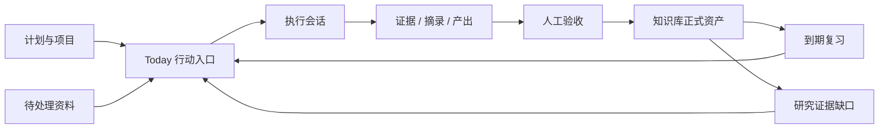

# Logion 产品方向与市场产品分析讨论稿

> 状态：D1～D8 与正式执行计划已获产品 Owner 批准；等待 D0 设计诊断
>
> 日期：2026-08-10（Asia/Shanghai）
>
> 事实基线：`codex/v020-rc6-closeout`，HEAD `769f61f9bd2166b73e7dd45671b4e468ade0eeed`
>
> 上游输入：[`SYSTEM_BLUEPRINT_REVIEW.md`](./SYSTEM_BLUEPRINT_REVIEW.md) 第 17 节的产品 Owner 回答
>
> 本文用途：解释这些回答对产品架构、信息架构、设计语言和开发顺序的影响。正式执行以 [`PRODUCT_REDESIGN_EXECUTION_PLAN.md`](./PRODUCT_REDESIGN_EXECUTION_PLAN.md) 为准；本文不单独授权正式前端施工或启用生产开关。

## 1. 结论先行

第 17 节回答已经足以冻结七个方向：

1. **未来六个月以“学、研”为主**；“考、导”保留为固定工作台，“自定义”作为第五种工作台能力。
2. **Today 是默认行动入口，知识库是长期资产核心**。
3. **允许把 21 个页面重组为更少的任务区域，同时保留原 URL 和后端合同**。
4. **知识图谱不是 Review 的装饰视图，而是知识库的一种主视图**，并服务 Records、Review、Research 等流程。
5. **设计气质采用安静的专业生产力外壳，知识空间局部体现未来感**。
6. **AI 采用上下文触发，不以常驻聊天框占据产品中心**。
7. **先批准新原型，再灰度知识能力**；不能在产品架构未确定时直接大规模修改正式页面。

我的核心判断是：

> **Logion 应成为一个证据驱动的个人学习与研究操作系统。工作台决定用户当前如何工作，知识库保存长期认知资产，Today 把计划、复习、研究缺口和验收任务转化为今天的行动。**

这比“学习管理系统”“笔记软件”或“AI 知识库”更准确。Logion 的差异不应是页面更多，而应是把行动、来源、理解、复习和人工验收连接为一条可信闭环。

## 2. 对产品 Owner 回答的进一步分析

### 2.1 “学、研主导”不等于建设两套独立产品

学习和研究共享大部分底层对象：资料、摘录、主题、笔记、任务、会话、证据、引用和复盘。它们的差别主要是默认工作流和信息权重：

| 维度     | 学习工作台                   | 研究工作台                           |
| -------- | ---------------------------- | ------------------------------------ |
| 起点     | 学习目标、课程、资料         | 研究问题、资料、假设                 |
| 核心活动 | 理解、练习、复习、掌握       | 阅读、摘录、声明、论证、实验         |
| 主要证据 | 答案、作业、会话成果、掌握度 | 引用、页码、摘录、实验结果、声明版本 |
| 主要输出 | 掌握、考试表现、学习成果     | 可追溯结论、论文/报告、实验记录      |
| 时间结构 | Today、计划、复习节奏        | 问题、阶段、里程碑、证据缺口         |

因此建议采用：

- 一套共享领域模型；
- 多个工作台投影；
- 工作台可以改变默认导航、布局、筛选和快捷操作；
- 工作台不能改变权限、正式数据语义或人工验收边界；
- 同一个对象可以在多个工作台中被引用，而不是复制多份数据。

### 2.2 固定工作台与自定义工作台的推荐边界

产品 Owner 已确认采用 **B：受控式自定义**。首版提供五种入口：

1. 学习工作台；
2. 研究工作台；
3. 考试工作台；
4. 导师工作台；
5. 自定义工作台。

但“自定义”首版不等于任意搭建数据库、字段、自动化和权限模型。那会迅速演变成另一个 Notion/Airtable 平台，成本和认知负担都过高。

已确认首版允许自定义：

- 工作台名称、图标和说明；
- 可见模块；
- 模块顺序；
- 默认知识库、Space 和筛选条件；
- Today 中的关注来源；
- 默认视图（列表、表格、时间线、图谱）；
- 快捷创建对象。

同时允许有限的自定义属性：文本、数字、日期、单选/多选、布尔值、URL、评分和对象引用。这些属性只能扩展展示、筛选和工作台组织，不能改变正式对象的权限、同步、验收或 AI 写入语义。

暂不允许自定义：

- 新的服务端对象类型；
- 任意权限规则；
- 任意同步协议；
- 任意自动化脚本；
- 绕过 AI Draft/人工接受的写入路径。

### 2.3 正式对象采用“唯一对象 + 主要归属 + 多处引用”

产品 Owner 已确认：同一个正式对象不因出现在多个工作台而复制数据。工作台保存的是对象引用和局部展示配置，正式字段仍只有一个事实源。

不同对象采用不同的归属规则：

| 对象           | 正式归属和引用规则                                                       |
| -------------- | ------------------------------------------------------------------------ |
| Source/资料    | 一个正式对象，可被多个工作台、Collection 和知识视图引用                  |
| Topic/主题     | 一个正式知识节点，可在多个学习、研究或考试上下文中出现                   |
| Note/笔记      | 一个正式对象，可链接到多个主题、任务和工作台                             |
| Excerpt/摘录   | 归属于一个来源，可支持多个 Topic 或 Claim                                |
| Claim/声明     | 有一个主要研究上下文，其他工作台只建立引用                               |
| Task/任务      | 有一个主要工作台或项目，状态、负责人和截止时间只有一份；其他工作台只引用 |
| Evidence/证据  | 归属于具体任务或验收，可被知识库和研究流程引用                           |
| ReviewSchedule | 归属于用户与 Topic，不随工作台复制                                       |

界面与命令必须区分：

- “从当前工作台移除”：只删除引用；
- “移动主要归属”：改变负责管理该对象的工作台或项目；
- “添加到其他工作台”：建立引用，不创建副本；
- “删除正式对象”：影响所有引用位置，必须显示影响范围并明确确认。

工作台引用不能绕过 `Workspace/Space` 授权。私人对象不能因为被引用到共享工作台就自动向其他成员开放。

### 2.4 “知识库”应是产品中心，但“图谱”只是其中一个视图

知识库不应被定义为一张动态图。它应包含：

- Sources：网页、PDF、书籍、论文、视频、笔记等来源；
- Excerpts：带来源定位的摘录；
- Topics：主题和概念；
- Relations：先修、支持、反驳、相似、引用等关系；
- Claims：研究声明与状态；
- Notes：用户自己的解释和综合；
- Review：复习队列、掌握度、问题和错因；
- Evidence：任务成果、验收结果和审计收据。

同一知识库需要多种等价视图：

| 视图      | 适用任务                             |
| --------- | ------------------------------------ |
| 图谱      | 发现关系、理解结构、追踪来源和依赖   |
| 列表/表格 | 批量筛选、排序、审查状态和管理元数据 |
| 阅读器    | 阅读资料、标注、摘录和引用           |
| 时间线    | 查看证据、版本、决定和研究演化       |
| 复习队列  | 执行主动回忆、错因处理和掌握确认     |
| 白板/画布 | 临时整理问题、卡片和论证结构         |

产品 Owner 已确认：把“知识库”作为用户可见产品语言，**一个知识库直接对应底层一个 `Space`**。首版不增加与 Space 平行的顶层 `KnowledgeBase` 权限实体。

这项决定的具体含义是：

- 一个 `Workspace` 可以包含多个知识库/Space；
- Private Space 在 UI 中表现为私人知识库；
- Shared Space 在 UI 中表现为共享知识库；
- Collection、Tag 和 Saved View 只负责库内分类、筛选与展示，不形成新的权限边界；
- 对象的正式 `space_id` 决定数据范围和服务端授权；
- 跨知识库移动属于跨 Space 操作，必须重新授权、显示影响范围并记录必要审计；
- 工作台引用不能把一个库中的私人对象自动暴露到另一个库；
- 需要跨库协作时必须使用受控共享、移动或明确复制流程，不能依赖前端引用绕过权限。

### 2.5 Today 与知识库的关系

Today 不是知识库的竞争首页。二者关系应是：



Today 只回答三个问题：

1. 现在最值得做什么；
2. 为什么它在今天出现；
3. 完成后需要什么证据或验收。

它不应继续以指标卡片、功能入口和状态汇总填满首屏。

### 2.6 AI 的产品位置

AI 应是对象上的能力，不是独立目的地。推荐入口包括：

- 在资料上：解释、提取候选摘录、生成候选问题；
- 在主题上：解释关系、发现缺口、建议先修；
- 在复习上：生成候选题、解释错因；
- 在研究上：对比来源、提出反例、生成候选声明；
- 在 Today 上：建议排序和拆分，但不能替用户完成验收；
- 在搜索上：基于明确范围回答，并列出来源。

所有 AI 操作都应展示输入范围、Provider/模型、预算、引用、Draft 状态和人工决定。AI 可以加速形成候选，不能静默改变正式知识、掌握度、研究结论或权限。

### 2.7 资料捕获采用双轨推进

产品 Owner 已确认 D4 采用双轨方案，兼顾学习/研究价值与附件安全边界。

**第一轨：轻量捕获先产品化**

1. 手工笔记和粘贴文本；
2. 网页 URL 与基础元数据；
3. Markdown、BibTeX 等现有导入；
4. DOI、ISBN、URL 等来源标识；
5. Zotero 导出文件导入或条目关联；
6. 统一 Inbox、导入预览、重复识别和人工确认。

Zotero 首版使用文件/标识关联，不立即承诺 OAuth、持续双向同步或自动修改 Zotero Library。

**第二轨：PDF 与复杂附件独立通过门禁**

依次完成上传初始化、大小/类型/哈希校验、恶意文件扫描与隔离、重复识别、元数据提取、页码级阅读标注、SourceExcerpt 定位、本地 Worker 断点恢复、残留清理和恢复验证。OCR 后置。

PDF 状态必须区分：

```text
已捕获 → 等待扫描 → 扫描中 → 等待解析 → 可阅读 → 可摘录
```

异常状态至少包括：重复、隔离、解析失败、Worker 离线、格式不支持和需要人工处理。上传成功不能显示成解析成功或可正式引用。

**第三阶段：外部 Connector 后置**

推荐顺序为 Readwise 导出文件、Readwise 单向读取、网页剪藏、用户提供的视频 Transcript，随后再评估 RSS、Newsletter 和其他 Connector。视频自动字幕与摘要不进入第一批。

所有来源统一进入：

```text
捕获 → Inbox → 来源/重复识别 → 导入预览 → 用户确认 → Source
→ 阅读/标注 → 候选 Excerpt → 人工接受 → Topic/Claim/Review/Task
```

“保存链接”不等于形成正式知识；AI 提取只能产生候选；原文、页码、URL、DOI 和文件哈希应尽可能保留。

### 2.8 研究工作台采用共享内核与专业模板

产品 Owner 已确认 D5 选择 C：研究工作台使用一套共享研究内核，不同研究类型通过专业模板改变默认流程、模块、视图和有限属性。

共享研究内核为：

```text
研究问题 → 来源 → 摘录 → 声明/假设 → 支持/反驳/不确定证据
→ 方法/实验 → 发现 → 结论/决定 → 输出成果
```

稳定核心对象包括 Research Project、Research Question、Source、SourceExcerpt、Claim、Evidence Relation、Experiment、Metric、Finding、Output 和 Task。模板不能改变这些对象的正式语义、Space 权限、人工验收、AI Draft、同步或删除规则。

第一批模板：

1. **学术研究**：文献检索、Zotero/PDF、页码摘录、文献矩阵、声明/证据、综述和论文/报告；
2. **技术研究**：技术问题、约束、文档/仓库/论文、候选方案、实验/Benchmark、指标、技术决定、ADR/报告和后续任务。

市场/产品研究首版可基于自定义工作台和有限属性组织，但不承诺访谈对象、录音、Transcript、匿名化、定性编码和专用洞察对象。共享研究内核稳定后，再评估市场/产品研究专用模板。

### 2.9 图谱采用正式关系与探索关系双层模型

产品 Owner 已确认 D6 按推荐执行。

**正式关系**由系统定义，具有固定方向、对象约束和业务含义，可参与先修判断、证据状态、搜索、复习和审计。首版关系控制在少量明确类型：

- Topic → Topic：前置于、属于、相关、对比于；
- Excerpt/Evidence → Claim：支持、反驳、不确定；
- Topic/Claim/Note → Excerpt：来源于；
- Example/Note → Topic：示例；
- Topic → Project/Task：应用于；
- Experiment/Evidence → Claim：验证或挑战。

正式图谱边优先由现有领域对象投影产生，例如 TopicDependency、KnowledgeCitation、Claim/Evidence 和 WorkbenchObjectLink。不能为了渲染图谱再复制一份平行 `GraphEdge` 事实源。

**探索关系**用于白板和知识探索，允许用户自定义名称、说明和局部视觉样式，但不能：

- 自动改变复习顺序或先修关系；
- 改变 Claim 可信度或正式引用；
- 被 AI 当作确认事实；
- 绕过人工接受或 Space 权限；
- 未经确认自动共享给其他成员。

探索关系可以通过“选择正式类型 → 显示影响 → 类型/循环/权限校验 → 人工确认”转换为正式领域关系，并保留转换记录。AI 创建的关系一律先进入候选状态。

视觉上使用实线表示正式确认，虚线表示候选/探索，争议状态使用附加标记；关系类型主要依靠箭头、标签和 Inspector 表达，不使用彩虹颜色替代语义。

### 2.10 桌面端采用单窗口专业工作空间

产品 Owner 已确认 D7 按推荐执行。首版建设稳定应用外壳、受控分栏、Inspector、历史返回/前进、最近对象、固定对象、深链接和命令面板；应用级标签与原生多窗口后置。

首版连续工作能力包括：

- `Ctrl/Cmd + K` 全局搜索和快速切换；
- 面包屑、应用内历史和原对象上下文回跳；
- 当前对象与右侧 Inspector 联动；
- 限定的左右分栏、宽度调整、位置交换和关闭恢复；
- 最近访问和固定对象；
- 恢复上次路由、布局、面板宽度和视图；
- 加载、未保存、离线、锁定和版本冲突持续可见；
- 标准 URL 深链接和浏览器“在新标签打开”。

分栏只组合主对象与相关对象，不允许把两个完整导航页面互相嵌套。首版受控组合包括 Source/PDF + Note/Excerpt/Claim、Topic + Source/Review、Claim + Source/Experiment、Task + Evidence/Note、Graph + Node Detail 和 Today Item + Session/Evidence。

布局恢复只保存对象 ID、路由、分栏、面板宽度、视图和固定状态，不额外保存敏感正文、权限结果或 AI 输入。

应用级标签只有在用户测试证明分栏与快速切换不足、多标签编辑冲突合同明确、状态可可靠恢复，并通过内存、键盘、焦点和读屏验收后才进入开发。原生多窗口还需要解决跨窗口会话、主题、离线队列、通知和崩溃恢复，继续后置。

### 2.11 原型采用产品 Owner 与真实用户两级验收

产品 Owner 已确认 D8 按推荐执行。

第一级由产品 Owner 审批产品定位、术语、信息架构、视觉方向、核心对象、完整状态和高保真原型。未通过第一级，不进入正式前端施工。

第二级在方向批准后，由 3～5 名真实学习/研究用户执行预设任务测试，验证首次理解、Today 下一步、资料捕获、来源回跳、知识图谱、研究证据、复习和系统设置等关键路径。

真实用户反馈可以调整文案、层级、操作顺序、默认值、反馈和可发现性，但不能自行推翻服务端授权、Space 边界、AI Draft/人工接受、正式关系、数据保留、同步、恢复和生产开关等已冻结安全合同。需要改变这些边界时，必须重新进入产品与架构决策。

## 3. 市场产品参考

调研以 2026-08-10 可访问的产品官方页面和帮助文档为准。以下内容只提炼机制，不建议复制品牌视觉或完整功能集。

### 3.1 Obsidian：全局图与局部图的边界清晰

官方图谱说明提供全局图、局部图、跳数深度、过滤、分组、方向、节点尺寸、连线粗细和力参数。[官方资料](https://obsidian.md/help/plugins/graph)

值得吸收：

- 全局图和当前对象局部图分开；
- 局部图明确控制跳数；
- 搜索、过滤和分组直接作用于图；
- 节点可返回原始内容；
- 图谱布局参数可调，但有恢复默认值。

不应照搬：

- 只把链接可视化，不表达来源可信度、人工接受和业务状态；
- 默认展示全库“毛线球”；
- 用大量颜色代替关系语义。

Logion 的提升点：图谱必须区分来源、正式主题、AI 候选、争议关系和证据状态，并能从节点进入阅读、复习、任务或研究流程。

### 3.2 Heptabase：资料、卡片、白板和学习会话处于同一空间

官方页面把 PDF、YouTube、Note、Journal、白板、卡片、双向链接、Readwise、Zotero、PDF 标注和 AI Tutor 放在一条视觉知识工作流中。[官方资料](https://heptabase.com/)

值得吸收：

- 白板是思考工作区，而不是展示组件；
- 资料、笔记、摘录和讨论可以在同一上下文中组织；
- 卡片既可独立阅读，也可进入画布；
- AI 学习会话有课程结构、分段进度和连续上下文。

不应照搬：

- 强迫所有用户先手工摆放白板；
- 把视觉整理当成正式关系和证据；
- 让 AI Tutor 成为唯一主入口。

Logion 的提升点：手工画布负责探索，正式图谱负责已接受关系；二者之间必须有“候选 → 审查 → 接受”的转换。

### 3.3 RemNote：笔记、卡片、复习和考试日期没有上下文断裂

官方页面强调在笔记中直接生成卡片、PDF/幻灯片标注、考试日期调度、间隔重复、掌握跟踪、AI 卡片/测验和离线使用。[官方资料](https://www.remnote.com/)

值得吸收：

- 阅读/记录时即可创建复习对象；
- 卡片与原笔记保持上下文；
- 考试日期会影响每日学习安排；
- 掌握度和复习队列直接服务今天行动；
- 一条学习链路内减少工具切换。

不应照搬：

- 把所有学习都简化为 Flashcard；
- AI 自动生成后直接进入正式复习队列；
- 用“做题数量”替代理解和成果证据。

Logion 的提升点：继续保留显式人工验收，并把任务成果、开放问题、研究证据和非卡片式复习纳入同一闭环。

### 3.4 Readwise Reader：捕获、阅读、标注、回顾和输出形成一条流水线

官方页面把网页、RSS、PDF、YouTube、EPUB、Newsletter 等来源统一到一个阅读入口，强调一级标注、Daily Review、键盘阅读、全文搜索、离线、本地优先、API 和可移植导出。[官方资料](https://readwise.io/read)

值得吸收：

- 多来源统一进入 Inbox，而不是分散入口；
- “保存”之后仍有筛选、阅读和清理流程；
- 标注是一级对象，不是文本装饰；
- Daily Review 让长期资料重新出现；
- 键盘操作、快速搜索和数据导出建立专业工具感。

不应照搬：

- 在附件扫描和本地 Worker 尚未开放时承诺全格式摄取；
- 把所有资料永久堆在收件箱；
- 让 AI 摘要替代用户选择摘录。

Logion 的提升点：建立 `Capture → Triage → Read → Excerpt → Accept → Reuse` 状态链，并明确每一步的来源和正式性。

### 3.5 Zotero：研究对象首先是可引用来源

官方页面围绕一键收集、Collections、Tags、Saved Search、标注、引用、Bibliography、同步、协作和数据控制组织产品。[官方资料](https://www.zotero.org/)

值得吸收：

- 来源元数据和身份稳定；
- Collection、Tag、Saved Search 分别承担不同组织职责；
- 引用可以直接进入输出工具；
- 研究资料可以协作，但用户保有数据控制；
- 先做好来源与引用，再谈 AI 综合。

不应照搬：

- 在 Logion 内重写完整的 9,000+ 引用样式引擎；
- 把研究体验退化成文献表格；
- 复制另一套与现有 Resource/SourceExcerpt 冲突的对象模型。

Logion 的提升点：优先做好 Zotero 导入/关联和来源回跳，复用成熟引用生态，把精力放在声明、证据、任务和验收闭环。

### 3.6 Linear：产品方法先控制范围，再追求速度

Linear Method 把产品方向、有用目标、先解决阻塞项、缩小范围、保持节奏、与用户共同建设和持续发布作为核心方法。[官方资料](https://linear.app/method)

值得吸收：

- 先冻结方向和停止条件，再进入实现；
- 优先解决设计系统、命令状态和对象边界等 enabling work；
- 每批次围绕完整用户结果，不按页面数量报告进度；
- 小批上线、持续验证，而不是一次重写 21 页。

这与 Logion 当前状态高度相关：正式后端能力很多，但若继续逐页换皮，会扩大视觉一致性问题和回归面。

### 3.7 Tana 当前产品：AI 输出必须落成具体结果

Tana 当前官方产品强调 connected knowledge、可配置 Agent/Skill、工具连接、权限控制，以及把对话转化为结构化结果。[官方资料](https://tana.inc/)

值得吸收：

- AI 必须产生可审查的具体对象，而不是只返回聊天文本；
- 结果应进入已有工作上下文；
- 自定义能力围绕明确 Skill 和输出格式；
- 需要来源的结论应被标记。

不应照搬：

- 未经确认直接执行外部写入；
- 把 Agent 活跃度当作用户价值；
- 为了 AI 自动化提前扩大 Provider、MCP 和生产权限范围。

Logion 现有 Draft/Acceptance 边界比“自动执行”更适合学习和研究可信度，应继续保留。

## 4. 市场空位与 Logion 的差异化

这些产品各自做深了一段链路：

| 产品      | 最强环节                 | 相对缺口                 | Logion 可形成的连接         |
| --------- | ------------------------ | ------------------------ | --------------------------- |
| Obsidian  | 本地知识与关系浏览       | 图谱多为描述性           | 关系 + 证据 + 复习 + 验收   |
| Heptabase | 视觉思考与资料组织       | 探索结构和正式结构边界弱 | 白板候选转正式知识          |
| RemNote   | 学习、卡片和间隔复习     | 研究证据链较弱           | 学习与研究共用来源和验收    |
| Readwise  | 多来源捕获和标注回顾     | 项目执行与结论验收弱     | 资料进入任务、主题和声明    |
| Zotero    | 文献来源、引用和研究资料 | 日常执行和复习弱         | 文献证据进入 Today 与知识库 |
| Linear    | 高效执行和产品节奏       | 不是学习/知识系统        | 把知识缺口转成可执行工作    |

Logion 的差异化公式应为：

> **可信来源 + 结构化知识 + 今日行动 + 主动复习 + 人工验收 + 可恢复的数据边界**

不建议把“AI”“图谱”或“离线”单独当作最大卖点。它们是重要能力，但真正难复制的是这些能力在一条闭环里保持一致、可追溯和可恢复。

## 5. 推荐的信息架构修订

### 5.1 一级入口

建议桌面端主导航收敛为：

1. **今天**：当前行动、到期复习、研究缺口、待验收；
2. **工作台**：学习、研究、考试、导师、自定义；
3. **知识库**：资料、主题、图谱、摘录、复习、声明；
4. **协作空间**：成员、邀请、审阅、Rubric、审计；默认折叠或降权；
5. **系统中心**：账户、安全、数据、同步、AI、集成、外观和帮助。

全局搜索、快速创建、通知和最近对象放在应用外壳，不占一级业务页面。

### 5.2 工作台内部

工作台不是新的数据容器，而是对现有对象的任务化投影：

```text
工作台
├─ 概览：当前目标、下一步、风险、近期成果
├─ 计划：目标、阶段、里程碑、依赖
├─ 执行：任务、Today、会话、证据
├─ 内容：相关资料、笔记、主题、声明
├─ 复盘：复习、验收、周期审查、报告
└─ 设置：默认知识库、筛选、模块和成员
```

不同工作台可隐藏或重命名模块，但共享命令状态和对象定义。

### 5.3 知识库内部

```text
知识库
├─ Inbox：新资料和待处理内容
├─ Sources：资料库与阅读器
├─ Topics：主题、关系和掌握状态
├─ Graph：全局图、局部图和证据路径
├─ Review：复习队列、问题和错因
├─ Research：声明、支持/反驳证据和缺口
└─ History：版本、人工接受、审计和恢复
```

图谱默认打开局部或当前筛选图，不默认加载全库。移动端默认提供列表/树和详情 Sheet，图谱仅作为辅助视图。

## 6. 推荐的视觉与交互方向

### 6.1 主方向：Cognitive Operations Workspace

推荐继续采用“认知作业空间”方向，但进行两点修正：

- “知识空间”在产品语言中明确命名为“知识库”；
- “工作台”成为用户模式与任务组织的首要载体。

视觉结构：

- 稳定左侧导航，安静的中性浅灰/深灰外壳；
- 单一品牌强调色，不使用整页蓝紫渐变；
- 主工作区按任务采用不同模板，不再统一套卡片；
- 右侧 Inspector 显示来源、状态、关系、历史和操作；
- 图谱全幅呈现，节点有轻微受控布局动效；
- 表格、列表、阅读器和时间线保持高信息密度；
- Light/Dark 双主题；
- 桌面支持命令面板、键盘导航和多选批处理；
- 移动端围绕捕获、Today、Review 和快速查看，不镜像桌面密度。

### 6.2 页面必须有不同工作性格

| 页面          | 主表面                             | 不应继续采用的布局 |
| ------------- | ---------------------------------- | ------------------ |
| Today         | 按优先级排列的行动流 + 当前会话    | 指标卡片仪表盘     |
| 工作台        | 目标/阶段树 + 当前任务 + 风险/成果 | 所有模块等权卡片   |
| 知识库        | 列表/图谱/阅读器切换 + Inspector   | 图谱缩在小卡片里   |
| Research      | 来源列表 + 阅读/编辑 + 证据检查器  | 多个孤立表单页面   |
| Review        | 单任务复习表面 + 上下文来源        | 统计与题目混在一屏 |
| System Center | 设置列表 + 详情                    | 卡片瀑布流         |

### 6.3 统一命令反馈

用户此前反馈“点击按钮无提示、提示框不全、409 不可理解”。这不是局部修复，而应成为 Design System 的强制合同：

- 点击立即进入可见 pending；
- pending 阶段禁用重复提交；
- 成功、失败、离线、冲突和锁定使用不同状态；
- 错误出现在相关控件附近；
- 409 必须解释发生原因、影响和下一步；
- 保留请求编号；
- 危险操作要求确认；
- 可以撤销时提供撤销，不能撤销时说明后果；
- Toast 只承担短暂确认，不承担完整错误说明。

## 7. 开发顺序讨论稿

以下顺序是用于讨论的建议，不是可直接派发给开发 AI 的最终任务包。

### 阶段 P0：冻结产品语言和边界

输出：

- 工作台、知识库、Space、Workspace、Collection、View 的关系；
- 固定工作台和自定义工作台能力边界；
- 同一对象跨工作台引用规则；
- 知识库的用户可见对象词典；
- 21 个现有路由到新 IA 的映射；
- 不可变权限、同步、AI 和数据主权边界。

停止条件：本文第 8 节问题未确认，不进入高保真原型。

### 阶段 P1：三套方向稿与四个高保真模板

先输出三套明显不同但均符合产品边界的方向稿，再选择一套。随后完成：

1. Today；
2. 学习/研究工作台；
3. 知识库（列表、阅读器、图谱、Inspector）；
4. System Center。

原型必须使用真实中文业务数据，覆盖成功、空、加载、失败、409、离线、权限不足、截断和 AI Draft 状态。

### 阶段 P2：Design System 与应用外壳

先实现：

- Light/Dark tokens；
- 字体、间距、边框、层级和密度；
- Button、IconButton、Input、Select、Toggle、Tabs、Menu、Dialog；
- Toast、Inline Error、Progress、Conflict、Request ID；
- 应用导航、上下文栏、Inspector、Command Palette；
- 响应式和无障碍基线。

不在本阶段迁移全部业务页。

### 阶段 P3：Today 行动闭环

目标：用户进入产品后 5 秒内知道下一步，并完成“执行 → 证据 → 验收”。

优先拆分现有 Today 大模块，复用真实 API，不新增生产开关。

### 阶段 P4：知识库只读与真实图谱

目标：先把现有真实 Topic/Dependency、来源入口、局部图、过滤、搜索、Inspector 和移动列表组织为完整只读体验。

知识 API 和写入开关继续关闭；UI 必须清楚显示能力状态，不能出现永远失败的按钮。

### 阶段 P5：Records/Research 阅读与证据工作台

目标：形成 `Source → Excerpt → Topic/Claim → Citation` 的可见路径，并完成 Zotero/现有导入的产品映射设计。

附件、本地 Worker 和 PDF 页级解析仍按既有门禁处理，不因 UI 完成自动开放。

### 阶段 P6：固定工作台与有限自定义

目标：学习、研究、考试、导师四种模板共享一套对象模型；自定义工作台只配置模块、顺序、视图和默认范围。

### 阶段 P7：System Center 与低频页面收口

合并 Profile、Settings、Security、Sync、Data、Integrations、AI 等入口，保留直接 URL 兼容和权限检查。

### 阶段 P8：受控知识能力灰度

保持既定顺序：

1. 只读查询；
2. Private Space 私有摘录/引用写入；
3. AI Draft 人工接受；
4. 附件；
5. 本地 Worker；
6. Shared Knowledge Write；
7. 删除与保留策略。

每个能力单独通过迁移、授权、恢复、残留清理、真实浏览器、无障碍和回滚门禁，不打包一次开启。

## 8. 仍需产品 Owner 回答的问题

这些问题会直接改变最终开发任务包，建议本轮讨论完成：

| ID  | 问题                                                                                        | 我的推荐                                                 | Owner 决定                                       |
| --- | ------------------------------------------------------------------------------------------- | -------------------------------------------------------- | ------------------------------------------------ |
| D1  | “自定义工作台”首版是只配置模块/顺序/筛选，还是允许用户创建新字段和新对象类型？              | 受控式自定义                                             | **已确认：选择 B，包含有限属性，不开放任意对象** |
| D2  | 是否确认用户界面的“一个知识库”直接对应底层一个 `Space`，库内用 Collection/Saved View 分类？ | 确认，避免新增平行权限实体                               | **已确认：同意**                                 |
| D3  | 同一个 Task、Source、Topic 或 Claim 是否允许同时出现在多个工作台中？                        | 唯一对象 + 主要归属 + 多处引用                           | **已确认：接受**                                 |
| D4  | 首版资料捕获优先级如何排列：手工笔记、网页、PDF、Zotero、Readwise、视频？                   | 双轨：轻量捕获/Zotero 先行，PDF 独立门禁，Connector 后置 | **已确认：按推荐**                               |
| D5  | “研究工作台”首先服务学术论文研究，还是也要覆盖市场、产品和技术研究？                        | 共享研究内核，首个模板以学术/技术研究为主                | **已确认：选择 C，学术/技术模板先行**            |
| D6  | 图谱中的关系是否允许用户自由创建任意关系类型？                                              | 正式关系受控 + 可自定义探索关系                          | **已确认：按推荐**                               |
| D7  | 是否需要桌面多窗口/多标签，还是先做好单窗口内的分栏、历史返回和快速切换？                   | 单窗口专业工作空间，多窗口后置                           | **已确认：按推荐**                               |
| D8  | 新原型的首批验收者只有产品 Owner，还是需要 3～5 名真实学习/研究用户参与任务测试？           | Owner 先定方向，再进行小规模任务测试                     | **已确认：按推荐，两级验收**                     |

## 9. 本轮讨论完成后的正式输出

第 8 节确认后，下一份文档应是可直接交给其他 AI 的开发任务包，至少包含：

1. 已批准产品目标、JTBD 和非目标；
2. 术语、对象、权限和状态合同；
3. 最终信息架构和 21 路由迁移映射；
4. 页面模板、关键交互流程和完整状态矩阵；
5. Design System tokens、组件合同和开源组件评估；
6. 分阶段开发任务、依赖 DAG、每批允许修改的目录；
7. API/数据/迁移边界；
8. 单元、集成、Playwright、视觉、无障碍和安全验收；
9. Feature Flag、灰度、监控和回滚计划；
10. 每阶段停止条件、证据模板和交接格式。

最终任务包形成前，不建议让开发 AI 自行决定产品架构或直接重写正式前端。
