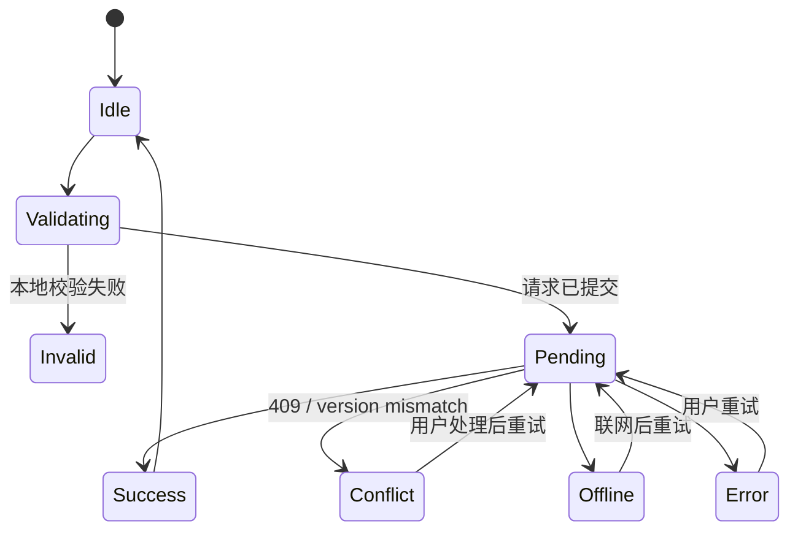
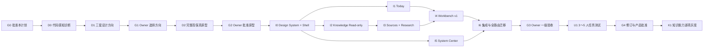

# Logion 产品重构与开发执行计划

> 状态：产品 Owner 已批准；G0 通过，D0 可启动，正式前端施工未授权
>
> 日期：2026-08-10（Asia/Shanghai）
>
> 事实基线：`codex/v020-rc6-closeout`，HEAD `769f61f9bd2166b73e7dd45671b4e468ade0eeed`
>
> 决策来源：[`SYSTEM_BLUEPRINT_REVIEW.md`](./SYSTEM_BLUEPRINT_REVIEW.md) 与 [`PRODUCT_DIRECTION_MARKET_ANALYSIS.md`](./PRODUCT_DIRECTION_MARKET_ANALYSIS.md)
>
> 使用对象：后续主线执行方、设计执行方、代码审查方和产品验收方；不绑定具体模型或厂商。
>
> 审批记录：产品 Owner 于 2026-08-10 明确回复“批准”。

## 0. 使用方式

本文是 D1～D8 全部确认后的完整执行计划。产品 Owner 已批准 G0，当前只授权进入 D0；后续 G1、G2、G3、G4 仍须分别获得明确批准。

正确顺序：

1. 产品 Owner 审批本文；
2. 设计执行方只完成诊断、方向稿和隔离原型；
3. 产品 Owner 批准视觉方向和完整原型；
4. 主线执行方才进入正式 Web 施工；
5. 产品 Owner 完成一级验收；
6. 3～5 名真实学习/研究用户完成任务测试；
7. 敏感知识能力按独立 Feature Flag 和既有安全门禁逐项灰度；
8. 未获得发布授权前，不部署、不切换流量、不打开生产开关。

任何执行方恢复任务时必须重新核对实际 Git、CI、配置和工作区状态。聊天记录不是事实源。

## 1. 权威来源与读取顺序

执行方开始前按以下顺序完整读取：

1. `AGENTS.md`；
2. `docs/development/AGENT_DELIVERY_WORKFLOW.md`；
3. `docs/development/V020_EXECUTION_PLAN.md`；
4. `docs/development/V020_STATUS.md`；
5. `docs/development/V020_V15_PRERELEASE_RC6_EVIDENCE.md`；
6. `docs/product/SYSTEM_BLUEPRINT_REVIEW.md`；
7. `docs/product/PRODUCT_DIRECTION_MARKET_ANALYSIS.md`；
8. 本文；
9. 适用的 ADR、OpenAPI、sync-v1 合同、实际源码和测试。

冲突优先级：

1. 用户当前明确指令；
2. 实际 Git、合同、代码和运行结果；
3. `AGENTS.md` 与适用 ADR；
4. 本计划与状态文档；
5. 交接摘要和聊天记录。

当前 `.agents/coordination` 历史 Run 仍可能因为 encoded-content safe-scan budget 失败。校验失败时不得把账本当作权威事实，也不得伪造修复；记录原因并以 Git、合同、源码和真实命令结果为准。

## 2. 产品目标与非目标

### 2.1 产品定位

Logion 是一个证据驱动的个人学习与研究操作系统：

- 工作台决定用户当前如何工作；
- 知识库保存长期认知资产；
- Today 把计划、复习、研究缺口和验收转为今天的行动；
- AI 产生可审查候选，不替代正式决定；
- 协作是个人系统上的受控附加能力；
- 权限、来源、恢复和失败始终可见。

未来六个月优先服务“学、研”，同时保留“考、导”和受控式自定义工作台。

### 2.2 北极星结果

用户每周完成更多“有来源、有证据、可复查、可恢复”的学习和研究闭环，而不是只积累任务、笔记或 AI 输出。

### 2.3 非目标

本轮不建设：

- 营销式首页或社交社区；
- 通用企业后台；
- 任意对象/字段/权限/脚本的无代码平台；
- 自主执行外部写入的 Agent 平台；
- 与 Space 平行的新 KnowledgeBase 权限实体；
- 完整重写 Zotero 引用样式引擎；
- 首批市场访谈录音、匿名化和定性编码系统；
- 首版应用级无限标签或原生多窗口；
- 未经既有门禁批准的附件、Local Worker、共享知识写入或 AI 正式接受。

## 3. 已批准产品决策

| ID  | 已批准决定                         | 实施含义                                                                                       |
| --- | ---------------------------------- | ---------------------------------------------------------------------------------------------- |
| D1  | 受控式自定义工作台                 | 支持模块、顺序、视图、筛选、流程模板、快捷操作和有限属性；不开放任意对象、权限、脚本或同步规则 |
| D2  | 一个知识库对应一个 Space           | Collection/Tag/Saved View 只负责库内组织；跨库移动和共享继续按跨 Space 授权                    |
| D3  | 唯一正式对象 + 主要归属 + 多处引用 | Source/Topic/Note 可多处引用；Task/Claim 有主要归属；移除引用与删除正式对象必须分开            |
| D4  | 资料捕获双轨推进                   | 轻量捕获/Zotero 元数据先行；PDF 安全与页码链独立建设；Readwise/视频 Connector 后置             |
| D5  | 共享研究内核 + 专业模板            | 第一批学术研究和技术研究；市场/产品研究先用受控自定义承载                                      |
| D6  | 正式关系 + 探索关系双层模型        | 正式关系受控可计算；探索关系可自定义但不参与正式判断；转换必须人工确认                         |
| D7  | 单窗口专业工作空间                 | 受控分栏、Inspector、历史、最近/固定对象和命令切换先行；应用标签和多窗口后置                   |
| D8  | 两级原型验收                       | Owner 先批准方向；随后 3～5 名真实用户完成任务测试，安全边界不能由测试者自行改写               |

## 4. 不可变架构与安全边界

### 4.1 身份与权限

- Browser Cookie Session、CSRF、可信 Origin 和 SessionBoundary 保持不变；
- 每次 Workspace/Space 操作继续由服务端重新授权；
- Persona/Workbench 只改变导航、布局和工作方式，不改变角色或数据权限；
- 前端隐藏入口不等于权限控制；
- 直接 URL 继续经过认证和服务端授权；
- 跨 Space 引用、移动、复制和共享不能通过前端布局绕过权限。

### 4.2 AI

- AI 只产生 Draft/Suggested；
- 用户看到输入范围、Provider/模型、预算、引用和状态；
- 正式写入需要重新授权、版本/哈希校验、人工决定、收据和审计；
- AI 不能直接改变掌握度、研究结论、验收、关系、权限或删除状态；
- Provider 未配置或能力关闭时，UI 显示原因和进入条件，不显示永远失败的主按钮。

### 4.3 离线与同步

- 现有 sync-v1 合同保持冻结；
- 新知识实体首版 online-only；
- UI 区分“可离线编辑并排队”“只读缓存”“必须联网”；
- 不把新对象偷偷加入 sync-v1；
- 任何 sync-v2/能力协商必须单独设计、评审和迁移。

### 4.4 生产开关

以下敏感能力继续使用现有默认关闭策略，计划或原型不得将其伪装为已启用：

- Knowledge Space API 的生产开放；
- Shared Knowledge Write；
- AI Knowledge Acceptance；
- Knowledge Deletion；
- Attachment Ingest 与扫描器；
- Local Knowledge Worker；
- Provider 生产调用；
- 新知识同步扩展。

不得在本轮设计或基础 UI 施工中修改生产环境值、启动本机 Docker、绕过 SessionBoundary 或自动部署。

## 5. 术语与对象合同

### 5.1 用户可见术语

| 用户术语              | 底层含义                               | 规则                               |
| --------------------- | -------------------------------------- | ---------------------------------- |
| Workspace/工作区      | 成员与治理边界                         | 最多 10 人低频协作定位不变         |
| Knowledge Base/知识库 | 一个 Space                             | Private/Shared 由 Space 可见性决定 |
| Collection            | 库内人工分类                           | 不产生权限边界                     |
| Saved View            | 库内筛选和展示                         | 不复制对象，不产生权限边界         |
| Workbench/工作台      | 对正式对象的任务化投影                 | 不改变对象权限和正式语义           |
| Inspector             | 当前对象的来源、关系、状态、历史和操作 | 不作为第二套详情事实源             |
| Canvas/白板           | 探索性卡片和关系空间                   | 不自动等于正式图谱                 |
| Graph/图谱            | 正式领域关系与候选关系的可视投影       | 图谱边不能成为平行事实源           |

### 5.2 工作台合同

固定工作台：学习、研究、考试、导师。另支持受控式自定义工作台。

2026-08-17，产品 Owner 已批准下一阶段基线：主界面逐步使用“工作台”替代“画像”；四个固定工作台各保留一个系统入口；Today 始终统一；自定义工作台支持复制固定模板或空白创建；有限属性属于工作台上下文，不覆盖正式对象；一个工作台可设默认 Knowledge Base 并引用其他已授权 Space。完整定义见 [`WORKBENCH_V1_PRODUCT_SPEC.md`](./WORKBENCH_V1_PRODUCT_SPEC.md)，持久化与权限提案见 [ADR-0030](../adr/0030-workbench-v1.md)。该批准只允许进入合同和隔离原型阶段，不授权正式 Web、迁移或 OpenAPI 施工。

当前代码已有 `PersonaDefinition`、四个 Builtin Persona、自定义 Persona，以及通过 `/api/v1/users/me/settings` 持久化的版本化 `PersonaSetting`。当前能力只覆盖名称、图标、说明和路由列表，不能直接当作完整 `workbench-v1` 合同。

正式施工前必须完成 ADR/合同比较：

1. 在版本化用户设置中新增有严格 Schema、大小限制和冲突合并的 `workbench-v1`；或
2. 当工作台需要共享、对象主要归属、查询、审计或超过设置容量时，新增独立正式实体与 API。

禁止：

- 把任意 JSON 塞入当前 `persona` 设置而不升级 Schema；
- 取消当前 409 合并和长度校验；
- 让工作台设置成为权限事实源；
- 仅用浏览器本地存储保存跨设备所需配置；
- 在未完成 ADR、迁移和合同测试时增加 `workbench_id` 到正式对象。

### 5.3 对象归属与引用

| 对象                | 规则                                                  |
| ------------------- | ----------------------------------------------------- |
| Source、Topic、Note | 一个正式对象，可被多个工作台引用                      |
| Excerpt             | 归属于一个 Source，可支持多个 Topic/Claim             |
| Claim               | 有一个主要研究上下文，其他工作台只引用                |
| Task                | 有一个主要工作台/项目；状态、负责人和截止时间只有一份 |
| Evidence            | 归属于具体任务/验收，可被知识和研究流程引用           |
| ReviewSchedule      | 归属于用户与 Topic，不随工作台复制                    |

命令必须区分“从当前工作台移除”“移动主要归属”“添加到其他工作台”和“删除正式对象”。

### 5.4 研究内核

```text
Research Question → Source → Excerpt → Claim/Hypothesis
→ Support/Contradict/Uncertain Evidence → Method/Experiment
→ Finding → Conclusion/Decision → Output
```

第一批模板：

- 学术研究：Zotero/PDF、文献矩阵、页码摘录、声明/证据、综述和论文/报告；
- 技术研究：文档/仓库/论文、约束、候选方案、实验/Benchmark、指标、技术决定、ADR/报告和后续任务。

### 5.5 图谱关系

- 正式关系由 TopicDependency、KnowledgeCitation、Claim/Evidence、WorkbenchObjectLink 等领域对象投影；
- 探索关系使用独立候选/画布语义，不参与正式计算；
- AI 关系一律先为候选；
- 前置/层级关系必须做方向、重复和循环校验；
- 探索转正式需要影响预览、权限校验和人工确认；
- 正式、候选、争议、拒绝状态可见且可审计。

### 5.6 捕获状态

```text
捕获 → Inbox → 来源/重复识别 → 导入预览 → 用户确认 → Source
→ 阅读/标注 → 候选 Excerpt → 人工接受 → Topic/Claim/Review/Task
```

PDF 独立状态：

```text
已捕获 → 等待扫描 → 扫描中 → 等待解析 → 可阅读 → 可摘录
```

异常状态：重复、隔离、解析失败、Worker 离线、格式不支持、需要人工处理。

## 6. 目标信息架构

### 6.1 一级区域

桌面端产品有五个领域区域，但主导航只突出前三个，协作与系统入口降权：

1. **今天**；
2. **工作台**；
3. **知识库**；
4. **协作空间**；
5. **系统中心**。

全局搜索、快速捕获、通知、最近对象、固定对象和命令面板属于应用外壳，不占新的业务页面。

### 6.2 现有路由迁移映射

保留现有 URL 和服务端合同，改变导航归属和页面模板。`/app/knowledge-prototype` 是历史/验收原型路由，不属于 21 个正式业务页面，不进入正式导航。

| 现有路由             | 新区域          | 新产品角色                              | 迁移要求                                     |
| -------------------- | --------------- | --------------------------------------- | -------------------------------------------- |
| `/app/today`         | 今天            | 行动入口、当前会话、证据与待验收        | 首屏去指标化，突出 Now/Next/Reason/Evidence  |
| `/app/self-study`    | 工作台          | 学习工作台                              | 与 Planning/Records/Review 建立对象回跳      |
| `/app/research`      | 工作台          | 学术/技术研究工作台                     | 三栏来源/编辑/证据 Inspector                 |
| `/app/exam`          | 工作台          | 考试工作台                              | 大纲、模拟、薄弱项进入 Today/Review          |
| `/app/collaboration` | 工作台          | 导师工作台                              | Rubric、审阅和反馈；不主导个人导航           |
| `/app/planning`      | 工作台          | 共享计划模块                            | 目标、阶段、里程碑和依赖；不做独立仪表盘     |
| `/app/templates`     | 工作台          | 工作台/流程模板库                       | 安装为副本，模板不改变权限合同               |
| `/app/records`       | 知识库          | Sources、Notes、阅读器和摘录入口        | 从卡片页改为资料工作台                       |
| `/app/review`        | 知识库          | Review 投影与知识图谱入口               | 复习任务和图谱分为等价视图                   |
| `/app/spaces`        | 知识库          | 知识库管理                              | UI 使用知识库语言，底层保持 Space            |
| `/app/search`        | 应用外壳/知识库 | 全局搜索完整结果页                      | 命令面板可快速搜，完整页支持筛选与上下文回跳 |
| `/app/workspaces`    | 协作空间        | Workspace、成员、邀请、Space 治理       | 409 显示原因、影响和下一步                   |
| `/app/audit`         | 协作空间        | 审阅/权限/关键决定审计                  | 低频、只读优先、清楚范围                     |
| `/app/settings`      | 系统中心        | 外观、偏好和系统中心入口                | 设置列表 + 详情，不使用卡片瀑布流            |
| `/app/profile`       | 系统中心        | 账户与画像/工作台偏好                   | Persona 逐步升级为 Workbench 语言            |
| `/app/security`      | 系统中心        | Passkey、TOTP、设备和近期认证           | 高风险命令单独确认                           |
| `/app/sync`          | 系统中心        | 离线、设备、队列和冲突                  | 显式区分本地/远端/排队/失败                  |
| `/app/data`          | 系统中心        | 导入、导出、恢复和删除                  | 预览、近期认证、影响范围和恢复路径           |
| `/app/integrations`  | 系统中心        | Calendar、开放格式、Connector 状态      | 能力关闭时显示原因，不展示假按钮             |
| `/app/ai`            | 系统中心        | Provider、模型、预算、Run 和 Draft 治理 | AI 不作为主业务首页                          |
| `/app/help`          | 系统中心        | 支持、状态和可操作帮助                  | 不在主工作区堆说明文案                       |

### 6.3 桌面壳

```text
┌──────────────┬────────────────────────────────────┬────────────────┐
│ 主导航       │ 上下文栏 + 主工作区                 │ Inspector      │
│              │                                    │                │
│ 今天         │ 可选受控第二工作面板                 │ 来源           │
│ 工作台       │                                    │ 关系           │
│ 知识库       │                                    │ 状态           │
│              │                                    │ 历史           │
│ 协作空间     │                                    │ 操作           │
│ 系统中心     │                                    │                │
└──────────────┴────────────────────────────────────┴────────────────┘
```

分栏只允许相关对象组合，不允许两个完整页面互相嵌套。

### 6.4 移动端

移动优先任务：快速捕获、Today、Review、对象查看和轻量反馈。

- 使用稳定底部入口或任务抽屉；
- 图谱提供等价列表/树和详情 Sheet；
- 不复制桌面三栏密度；
- 不隐藏冲突、离线、权限或能力关闭状态；
- 320/390px 无横向溢出。

## 7. 设计系统与交互合同

### 7.1 设计方向

方向名称：**Cognitive Operations Workspace / 认知作业空间**。

- 安静、可信的专业生产力外壳；
- 知识图谱和证据路径局部体现未来感；
- Light/Dark 两套独立 tokens；
- 中性表面 + 一个品牌强调色 + 必要语义色；
- 4px 间距网格；
- 组件圆角 4/6/8px，卡片不超过 8px；
- 边框优先，阴影克制；
- Lucide 风格单一线性图标族；
- 页面按任务使用不同模板，不再统一套 `Panel + Metric + Card`；
- 不使用 Hero、玻璃拟态、渐变光球、霓虹赛博、彩虹节点或装饰粒子；
- 不使用 Emoji 代替功能图标；
- 不做卡片套卡片。

### 7.2 页面模板

| 模板           | 主表面                           | Inspector                 | 主要交互               |
| -------------- | -------------------------------- | ------------------------- | ---------------------- |
| Today          | 优先行动流 + 当前会话            | 原因、证据、状态          | 开始、暂停、提交、验收 |
| Workbench      | 目标/阶段树 + 当前任务/风险/成果 | 归属、引用、历史          | 计划、执行、复盘       |
| Knowledge Base | 列表/表格/阅读器/图谱切换        | 来源、关系、复习、AI 候选 | 捕获、筛选、摘录、关联 |
| Research       | 来源列表 + 阅读/编辑             | 引用、声明、证据、实验    | 对比、接受、反驳、输出 |
| Review         | 单任务复习表面                   | 原始来源、错因、掌握历史  | 回忆、回答、确认、安排 |
| System Center  | 设置列表 + 详情                  | 状态、风险、帮助          | 保存、冲突、恢复、确认 |

### 7.3 命令状态机



所有命令必须具备：

- 按下后立即可见的 pending；
- pending 时禁用重复提交；
- 成功确认或克制 Toast；
- 控件附近的错误和恢复动作；
- 409 的原因、影响、最新状态和下一步；
- 请求编号；
- 危险操作确认；
- 必要时的撤销或补偿路径；
- 离线、锁定、权限不足和能力关闭的独立状态。

Toast 不承担完整错误说明。

### 7.4 单窗口连续工作

- `Ctrl/Cmd + K` 全局命令和快速切换；
- 历史返回/前进、面包屑和原上下文回跳；
- 最近对象、固定对象和受控分栏；
- Source/PDF + Note/Excerpt/Claim；
- Topic + Source/Review；
- Claim + Source/Experiment；
- Task + Evidence/Note；
- Graph + Node Detail；
- Today Item + Session/Evidence；
- 布局恢复只保存 ID、路由、视图和尺寸，不保存敏感正文或 AI 输入。

## 8. 开源组件决策门

当前正式 Web 使用 Next.js 16、React 19，尚未引入通用 UI、表格或图谱库。任何新增依赖先输出评估，不得为了原型直接修改根 Manifest 或锁文件。

至少评估：

| 类别             | 候选                                    | 重点                                                |
| ---------------- | --------------------------------------- | --------------------------------------------------- |
| 无障碍 Primitive | Radix UI 或 React Aria                  | 二选一为主，避免混用默认样式                        |
| 图谱             | Cytoscape.js + fCoSE、React Flow/XYFlow | 数据图优先验证 Cytoscape；React Flow 更适合流程编辑 |
| 大列表/表格      | TanStack Table、TanStack Virtual        | SSR、包体、键盘和移动                               |
| 浮层定位         | 候选 Primitive 自带能力或 Floating UI   | 不重复引入                                          |
| 图标             | Lucide React                            | 统一 1.5～2px 线性风格                              |

评估文件必须记录：

- 精确版本；
- License/NOTICE 来源及 MIT 兼容性；
- 维护状态和安全记录；
- Next 16/React 19/SSR 兼容；
- 包体与 Tree Shaking；
- 键盘、读屏、焦点、移动和 reduced-motion；
- 主题封装能力；
- 未选候选及原因；
- 供应链与升级策略。

组件库只提供行为基础，必须封装在 Logion Design System 内，不直接拼装多个库的默认主题。

### 8.1 视觉语义工程化追加冻结（2026-08-17）

产品 Owner 对 Q21～Q27 的决定如下。字母答案以本表中的完整语义为准：

| ID  | 冻结决定                                                                                                                                                                                                                                            |
| --- | --------------------------------------------------------------------------------------------------------------------------------------------------------------------------------------------------------------------------------------------------- |
| Q21 | 保持严格 CSP；Radix Themes 只作为视觉基线，经现有 `Desk*` 适配层吸收。Select、Popover 等浮层只有在真实 CSP 验证通过后才能采用，否则继续使用项目内 CSP-safe 实现或原生控件；不得放宽 `style-src`。                                                   |
| Q22 | “论证边注”只投影具有正式来源数据的 Task、Source、Evidence、Claim 和 AI Draft；必须携带真实对象类型、ID、版本和状态，点击后进入 Inspector。没有授权或正式来源时不显示，AI Draft 永远不能伪装为已应用事实。                                           |
| Q23 | 非生产环境按页面作用域逐批接入新 Token，全部页面完成并通过验收后才切换默认主题。产品 Owner 同时要求旧线上产品完全停止，新设计完工并重新验收后再上线；该生产操作尚未执行，必须使用独立变更、备份、维护告知、回滚和恢复检查，不能由原型审批自动触发。 |
| Q24 | 通知中心只沉淀需要稍后处理的失败、状态不确定和未解决冲突；字段错误、普通成功和当前操作失败留在控件附近。不得保存邮箱正文、Token、密钥或原始后端错误详情。                                                                                           |
| Q25 | 页面区块和 Inspector 允许 180～280ms 的进入/切换与轻微 stagger；按钮、输入、Select 和表格行不得位移。`prefers-reduced-motion` 与产品内减少动态设置都必须关闭非必要动画。                                                                            |
| Q26 | 空状态只说明当前状态、原因和一个下一步动作，不使用长篇产品说明、营销文案或装饰指标。                                                                                                                                                                |
| Q27 | Sources、Audit、History 使用语义表格，移动端转换为等价列表；知识图谱只用于 Knowledge 区域，移动端必须提供可操作的节点等价列表。                                                                                                                     |

上述决定不改变五区、21 条正式 URL、Provider 顺序、Workspace/Space 授权、SessionBoundary、AI Draft/人工接受和生产开关合同。

## 9. 执行 DAG 与审批门



任一 Gate 未通过，后续阶段不得开始。

## 10. 分阶段任务包

### D0：代码感知诊断与基线冻结

目标：把产品决定映射到真实代码，不修改正式 Web。

允许写入：

- `docs/design/logion-redesign-v1/**`；
- `prototype/logion-redesign-v1/**`。

禁止写入：

- `apps/web/src/**`；
- API、Worker、Contracts、Offline、迁移；
- 根 Manifest/lockfile；
- 生产配置。

必须输出：

1. 21 路由的页面 → 组件 → 数据 → 命令 → 状态 → 测试映射；
2. Today、Review、Records、Research 的模块拆分建议；
3. Persona/Workbench 现状与 `workbench-v1` 缺口；
4. 可复用、应重构、应废弃组件清单；
5. 开源依赖候选矩阵；
6. 当前视觉和交互问题证据；
7. 基线截图和响应式/无障碍问题；
8. 无合同支持的设计需求清单。

停止条件：输出完成后等待检查，不进入正式代码。

### D1：三套设计方向

三套方向必须共享已经批准的 IA、对象和安全边界，但在以下方面明显不同：

- 外壳密度与导航呈现；
- Today 的行动组织方式；
- Knowledge Base 的列表/阅读器/图谱权重；
- Inspector 的常驻程度；
- 学习与研究工作台的视觉个性；
- 品牌强调色与图谱局部动态语言。

每套至少提供 Today、Knowledge/Graph、Research、System Center 的 1440 与 390px 关键稿，以及 Light/Dark 样例。

不得只通过换颜色制造三套方案。

完成后进入 G1，由产品 Owner 选择、组合修订或退回。

### D2：完整高保真交互原型

隔离原型覆盖：

- Today；
- 学习与研究工作台；
- Knowledge Base 的 Inbox、Sources、Topics、Graph、Review、History；
- Research 三栏工作台；
- Workspace/Knowledge Base/邀请；
- System Center；
- 全局命令、搜索、最近对象和受控分栏；
- 21 路由统一壳层。

必须使用合成中文数据，不请求生产 API，不包含真实账户、邮件、Token、主机或私有内容。

状态开关至少覆盖：loading、empty、ready、saving、success、error、offline、locked、permission denied、409 conflict、disabled capability、AI Draft、graph truncated、attachment quarantined、Worker offline。

交付：

- 可运行原型；
- 1440/1024/390/320px 走查；
- Light/Dark；
- 键盘和焦点；
- reduced-motion；
- 原型状态矩阵；
- 页面/流程走查清单；
- 开源依赖评估；
- 正式施工映射。

完成后进入 G2。没有产品 Owner 明确批准，不修改正式 Web。

### I0：Design System、命令反馈与应用外壳

前提：G2 通过。

主要范围：

- `apps/web/src/components/app-shell/**`；
- 新的产品 UI primitives 目录；
- 全局 tokens/styles；
- 对应单元测试和 Browser 测试。

实现：

1. 双主题 tokens 与安全持久化；
2. Button/IconButton/Input/Select/Checkbox/Toggle/Segmented Control；
3. Menu/Popover/Dialog/Tabs/Tooltip；
4. Inline Error/Toast/Progress/Skeleton/Request ID/Conflict；
5. 主导航、上下文栏、Inspector、Command Palette；
6. 受控分栏、最近/固定对象和布局恢复；
7. 响应式、键盘、焦点、读屏和 reduced-motion 基线；
8. 旧 Product primitives 的兼容/迁移策略。

验收：

- 组件状态矩阵有单元测试；
- 主题持久值按不可信输入处理；
- 320/390/1024/1440 无壳层溢出；
- 无卡片套卡片和 Emoji 功能图标；
- 所有命令状态可观察、防重复提交；
- 不改变 API/权限合同。

### I1：Today 行动闭环

目标：进入 Today 后 5 秒内明确下一步，并完成执行 → 证据 → 验收。

重构现有大型 `today-center.tsx`，按数据加载、离线/同步、命令、领域模型和展示拆分；不得以一次重写替代增量迁移。

首屏优先：

- Now：当前最重要行动；
- Why：来自计划、到期复习、研究缺口或 Inbox 的原因；
- Evidence：完成需要的证据；
- Next：后续有限队列；
- 当前会话和明确反馈。

保留现有真实任务、会话、证据、Vault 和 sync-v1 语义。

验收：

- 空、加载、离线、锁定、冲突、失败和成功路径；
- 任务与会话不能因为 UI 重构丢失幂等和同步状态；
- 完成计时不等于完成任务；
- 提交证据不等于验收通过；
- Browser 测试覆盖真实认证主路径。

### I2：知识库只读、搜索与真实图谱

目标：先完成可信、可导航的只读知识库，不打开写入开关。

实现：

- Space → Knowledge Base 用户语言映射；
- Inbox/Sources/Topics/Review/History 壳层；
- 真实 Topic/Dependency 适配；
- 全局图与局部图；
- 1/2 跳扩展、过滤、分组、方向和恢复默认；
- 150 节点/400 边截断提示；
- Node Inspector 与 Source/Review/Task/Research 回跳；
- 桌面键盘导航；
- 移动列表/树等价路径；
- 全局搜索到原对象上下文。

图谱技术选择在评估后确定。任何选择都必须封装数据适配、布局和渲染边界，领域代码不直接依赖库内部对象。

验收：

- 输入顺序不影响稳定结果；
- 无全库默认毛线球；
- reduced-motion 关闭非必要动画；
- 图谱为空、失败、截断和无权限状态完整；
- 正式边来自领域对象投影；
- 写入能力关闭时没有假按钮。

### I3：Sources、Records 与 Research 证据工作台

目标：形成 Source → Excerpt → Topic/Claim → Citation 的可见路径。

第一批：

- 手工笔记/粘贴；
- 网页 URL 与基础元数据；
- Markdown/BibTeX 等现有导入；
- DOI/ISBN/URL 来源标识；
- Zotero 导出文件/条目关联设计；
- Inbox、预览、重复识别和确认；
- 学术研究与技术研究模板；
- 来源列表 + 阅读/编辑 + 证据 Inspector。

PDF UI 可以展示真实能力状态，但 Attachment/Worker 未启用前不能伪装可解析。PDF 安全链作为独立后续包。

验收：

- 来源身份稳定；
- 重复项合并/关联，不静默复制；
- 摘录能回到原文/页码/URL；
- AI 提取只产生候选；
- Claim 支持/反驳/不确定状态明确；
- 导入失败有原因、重试和清理。

### I4：Workbench v1 与受控式自定义

前提：`workbench-v1` ADR、Schema、持久化和迁移方案已单独批准。

执行时必须保持 Today 单一行动闭环；四种领域差异进入 Workbench，不得继续把四套 Dashboard 作为 Today 首页，也不得用同一组通用指标卡替代领域对象。

实现：

- 学习、研究、考试、导师四个固定工作台；
- 从固定/空白模板复制自定义工作台；
- 名称、图标、说明；
- 模块显示、顺序和尺寸；
- 默认 Knowledge Base、筛选和视图；
- Saved View 和快捷创建；
- 有限属性：文本、数字、日期、单/多选、布尔、URL、评分、对象引用；
- 一次性迁移/兼容现有 Persona 设置；
- 对象主要归属和多处引用；
- 409 冲突合并与版本化保存。

必须限制配置大小、字段数量、枚举数量、文本长度、递归和对象引用范围。持久配置按不可信输入解析，拒绝未知版本、重复 ID、原型污染键和越权对象引用。

验收：

- 固定工作台不能被删除或破坏必要入口；
- 自定义工作台不能改变权限；
- 同一对象不复制；
- Task/Claim 主要归属清楚；
- 移除引用与正式删除分开；
- 跨 Space 引用失败关闭；
- 多设备 409 不静默覆盖。

### I5：System Center 与协作低频路径

把 Settings/Profile/Security/Sync/Data/Integrations/AI/Help 统一为设置列表 + 详情外壳，同时保留原 URL 和授权。

Workspace/Invite/Audit 使用协作空间语言，默认降权但保持可发现。

重点修复：

- 点击反馈；
- 设置保存状态；
- 邀请 409；
- 近期认证；
- 危险动作；
- Provider/能力关闭；
- 同步冲突；
- 请求编号和恢复动作。

验收：所有现有路由可直接访问；软导航改变不影响权限；低频入口不占据个人主工作区。

### I6：全路由迁移、性能与回归

目标：完成 21 路由统一壳层和旧组件收口。

要求：

- 逐页移除不再需要的 ProductPanel/ProductMetric 等通用套壳；
- 保留仍有明确语义的兼容组件；
- 删除组件前用 `rg` 核对调用方；
- 不在同一提交混入无关重构；
- 建立变更前后 Bundle/渲染/交互基线；
- 核对服务端组件与客户端组件边界；
- 避免大范围 Context 导致整壳重渲染；
- 大列表/图谱按真实规模验证。

完成后进入 G3 产品 Owner 一级验收。

### U1：3～5 名真实用户任务测试

参与者：以学习和研究用户为主，至少覆盖一名重度资料阅读者和一名技术研究用户。

任务：

1. 登录后判断今天下一步；
2. 创建/选择知识库；
3. 捕获一个网页或文献来源并处理重复提示；
4. 从 Topic 回到来源；
5. 完成一次复习并查看掌握历史；
6. 建立研究声明并关联支持/反驳证据；
7. 使用局部图找到两跳关系；
8. 创建受控自定义工作台；
9. 处理一次模拟 409/离线/能力关闭；
10. 在移动视图完成捕获或复习。

记录：完成率、耗时、错误、犹豫点、返回次数、主观信心和观察备注。不采集不必要的个人内容。

用户反馈可调整文案、层级、默认值、操作顺序和反馈；改变权限、AI、数据、同步或正式关系时必须重新评审。

### K1：敏感知识能力逐项灰度

G4 通过后仍不自动启用能力。顺序固定为：

1. 只读查询；
2. Private Space 私有摘录/引用写入；
3. AI Draft 人工接受；
4. Attachment/PDF；
5. Local Worker；
6. Shared Knowledge Write；
7. 删除与保留策略；
8. 后续 sync-v2 提案。

每项独立完成迁移、授权、威胁模型、恢复、残留清理、真实浏览器、无障碍、监控和回滚。任一失败停止，不把多项开关打包开放。

## 11. 测试与验收矩阵

### 11.1 每个正式代码批次

至少执行与范围匹配的：

```text
pnpm exec prettier --check <changed-paths>
pnpm --filter @logion/web lint
pnpm --filter @logion/web typecheck
pnpm --filter @logion/web test
pnpm --filter @logion/web build
git diff --check
```

涉及合同/API 时增加：

```text
pnpm contracts:check
uv run --group dev ruff check <changed-python-paths>
uv run --group dev mypy <changed-python-paths>
uv run --package logion-api pytest <target-tests>
```

阶段集成门运行仓库规定的 `pnpm ci:fast`。不得因为环境命令失败而改写 Manifest/lockfile 规避导入或合同问题。

### 11.2 Browser/视觉

使用现有 `tests/browser/**` 模式扩展：

- 真实认证主路径；
- 1440、1024、390、320px；
- Light/Dark；
- 横向溢出；
- axe；
- 键盘和焦点；
- reduced-motion；
- 主题持久值 XSS 防护；
- 命令 pending/disabled/success/error/409；
- 移动图谱列表；
- 桌面图谱键盘导航；
- 深链接和历史恢复。

关键页面保存批准截图，视觉差异必须人工审查，不能只依赖 Snapshot 数量。

### 11.3 安全负测

- 未认证、CSRF、错误 Origin；
- Workspace/Space 越权；
- 跨库对象引用；
- 恶意工作台持久值；
- 重复/未知/超大自定义属性；
- AI 候选冒充正式关系；
- 能力关闭仍发请求；
- 多设备版本冲突；
- 删除引用误删正式对象；
- 附件隔离/Worker 离线误报成功。

## 12. 成功指标

- 首次用户从登录到首个今日行动不超过 12 个主要步骤；
- 进入 Today 后 5 秒内能指出下一步；
- 80% 高频任务从当前上下文一个主操作开始；
- 任何正式知识最多两步回到来源摘录；
- 搜索结果一键返回对象上下文；
- AI 正式写入可看到候选、人工决定和收据；
- 邀请 409、版本冲突、离线、锁定和能力关闭都有明确下一步；
- 图谱在 150 节点/400 边内稳定并表达截断；
- 320/390/1024/1440px 无横向溢出；
- 键盘、焦点、axe、reduced-motion 和双主题通过；
- 工作台引用不产生重复正式对象；
- 用户测试核心任务达到预先批准的完成标准，失败点有可复现记录。

## 13. Git、提交与交接规则

- 在用户指定的正式工作区和分支执行；
- 不修改其他 Codex/Orca worktree；
- 保留用户已有未跟踪目录和未提交改动；
- 每批次开始前记录 base SHA、branch、允许路径和停止条件；
- 原型批准前不修改正式 Web；
- 提交只包含本批次授权文件；
- 不 amend 锁定 baseline；
- 推送、合并、发布和部署必须分别获得相应授权；
- 发现不属于本批次的变更时不回滚，先隔离并记录；
- 任何检查失败都报告真实结果，不伪造通过。

每次 Handoff 必须列出：

```text
Outcome
Base commit
Working branch
Changed files
Commands actually run
Observed results
Unrun checks and reason
Known risks or assumptions
Working tree status
Suggested next action
```

## 14. 可直接交给执行方的第一阶段提示词

D0 的完整自包含任务合同见 [`D0_TASK_PACKET.md`](../design/logion-redesign-v1/D0_TASK_PACKET.md)。派发时应优先使用该任务包，不得把 D0、D1、D2 合并成一次无审批停点的施工任务。

```text
你是 Logion 产品重构的 D0 设计诊断执行方。当前只执行 D0，不进入 D1、D2 或正式前端施工。

正式工作区由用户指定。开始后先核对并报告绝对路径、Git branch、HEAD、工作区状态和现有用户改动。不得修改其他 worktree。

按顺序完整读取：
1. AGENTS.md
2. docs/development/AGENT_DELIVERY_WORKFLOW.md
3. docs/development/V020_EXECUTION_PLAN.md
4. docs/development/V020_STATUS.md
5. docs/development/V020_V15_PRERELEASE_RC6_EVIDENCE.md
6. docs/product/SYSTEM_BLUEPRINT_REVIEW.md
7. docs/product/PRODUCT_DIRECTION_MARKET_ANALYSIS.md
8. docs/product/PRODUCT_REDESIGN_EXECUTION_PLAN.md
9. 适用 ADR、合同、Web 源码和测试

本阶段唯一允许写入：
- docs/design/logion-redesign-v1/**
- prototype/logion-redesign-v1/**

禁止修改：
- apps/web/src/**
- apps/api/**
- apps/worker/**
- packages/contracts/**
- packages/offline/**
- migrations
- 根 package.json、pnpm-lock.yaml
- 生产配置和 Feature Flag

按 D0 任务包完成：
A. 代码感知产品/UX 诊断和 21 路由映射；
B. Persona/Workbench、Today、Knowledge Base、Research、System Center 的源码/状态/测试映射；
C. 领域对象、命令状态、合同缺口和设计依赖；
D. 开源组件精确版本、许可证、兼容性和供应链评估；
E. 只输出三套设计方向的输入简报，不制作或批准正式方向；
F. 输出结构化 D0 验收报告。

知识库在 UI 中对应 Space；工作台只改变投影，不改变权限；正式对象不复制；正式/探索关系分层；AI 只能先生成候选；敏感能力关闭时不得出现伪可用按钮。

完成后停止并提交结构化 Handoff。不得自行进入 D1/D2，不得 commit、push、merge、deploy，除非用户后续明确授权对应动作。
```

## 15. 正式施工提示词的生成条件

只有以下条件全部满足后，才能生成并使用正式施工提示词：

1. 产品 Owner 明确批准本文；
2. D1 三套方向中有一个方向获得明确选择；
3. D2 完整高保真原型获得明确批准；
4. 开源组件评估完成；
5. 正式施工 base SHA、branch 和允许路径冻结；
6. `workbench-v1` 的 ADR/合同路径明确；
7. 所有生产敏感开关保持关闭；
8. 当前 Git/CI 状态真实可用。

不满足上述条件时，执行方只能继续设计修订、只读审查或环境诊断，不能自行开始正式代码重构。
