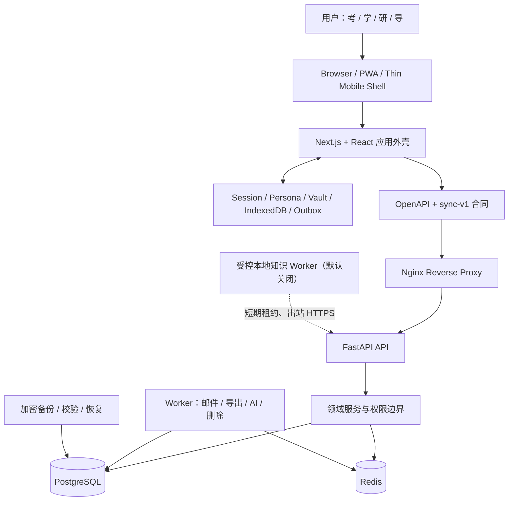
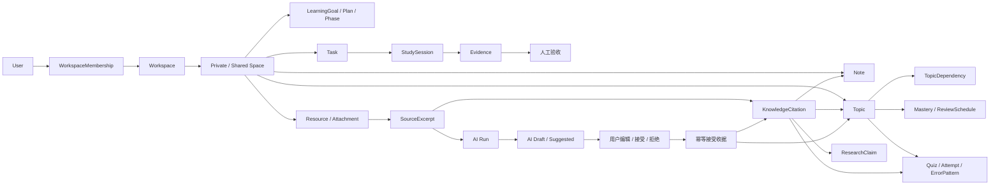
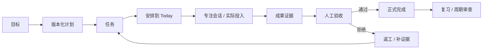
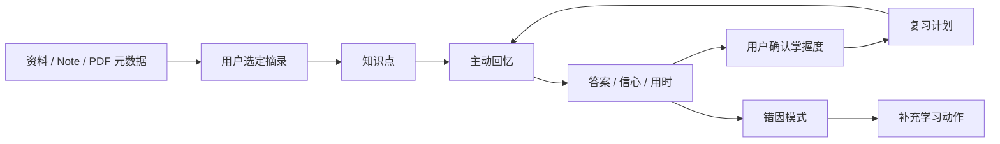
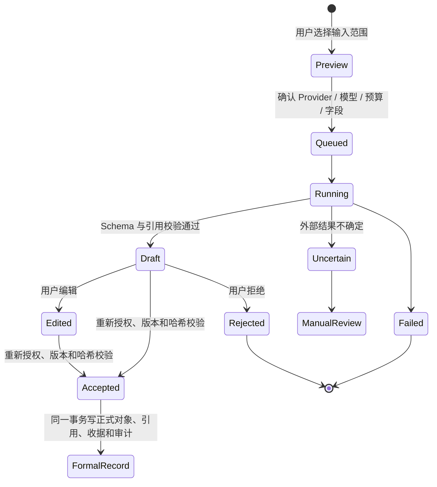
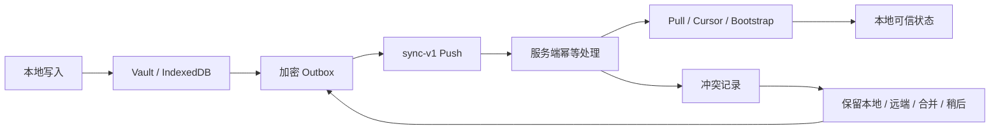
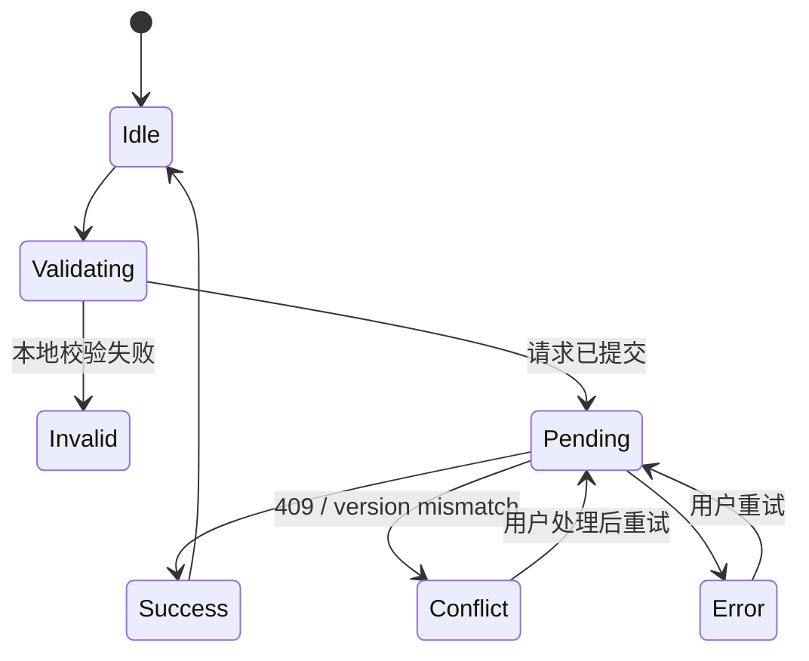

# Logion 整体系统蓝图与产品设计审查稿

> 状态：产品 Owner 已完成审查；D1～D8 与正式执行计划已批准
>
> 日期：2026-08-10（Asia/Shanghai）
>
> 事实基线：`codex/v020-rc6-closeout`，HEAD `769f61f9bd2166b73e7dd45671b4e468ade0eeed`
>
> 文档目的：统一系统目标、技术架构、功能逻辑、当前实现、未来规划和前端设计方向。本文已作为批准执行计划的上游输入，但不单独授权正式前端施工或启用任何生产能力。

## 0. 如何审查本文

建议按以下顺序审查：

1. 先确认第 2～4 节的产品目标、用户优先级和不可变原则；
2. 再确认第 7～9 节对“已实现、默认关闭、未来功能”的划分；
3. 重点审查第 11～15 节提出的新设计方向；
4. 最后回答第 17 节的问题；
5. 问题回答完成后，再进入新一轮完整原型，而不是直接修改正式前端。

本文使用五种状态：

| 状态             | 含义                                                       |
| ---------------- | ---------------------------------------------------------- |
| 已实现           | 代码、合同和真实数据路径存在，且已有对应测试或验收证据     |
| 条件可用         | 已实现，但依赖部署配置、用户上下文或受控开关               |
| 已实现但默认关闭 | 代码与迁移存在，生产开关仍关闭，不应在 UI 中伪装为可用     |
| 预发布           | 源码和构建边界已存在，但签名、设备、分发或生产观察尚未完成 |
| 未来规划         | 尚未形成完整生产路径，必须先设计、评审和验收               |

## 1. 执行摘要

Logion 的底层能力并不简单。正式代码已经形成身份、工作区、空间、计划、执行、内容、复习、考试、研究、协作、AI、同步、数据主权和知识空间等领域模块。当前主要问题不是“功能太少”，而是：

- 功能数量和页面数量增长后，产品层没有形成足够清晰的主次关系；
- 大量页面使用相似的面板、指标、卡片和披露组件，造成“什么都有，但看起来都一样”；
- Today、Review、Records 等核心页面承担数据加载、同步、表单命令和展示，模块过大，难以建立精细交互；
- 系统设置、个人资料、同步、数据、AI、互操作被拆成多个入口，用户难以理解它们的归属；
- 动态知识图谱已经接入真实 Topic/Dependency 数据，但当前主要是只读展示，还没有把来源、摘录、引用、AI 候选和人工接受组织成完整可见闭环；
- 当前方案 B V2 原型完成了导航和交互覆盖，但视觉层级、工作深度和产品个性仍偏简单，不作为正式设计批准稿。

推荐的下一阶段不是继续堆页面，而是把 Logion 重构为：

> **一个安静、可信的学习与研究操作外壳，内部包含高密度任务工作台、可追溯证据链和有生命感但不喧闹的知识空间。**

## 2. 产品定位与目标

### 2.1 一句话定位

Logion 是面向个人和最多 10 人小组的自托管、离线优先、证据驱动学习与研究操作系统。

它不是：

- 普通待办清单；
- 只有对话框的 AI 产品；
- 通用企业管理后台；
- 社交社区；
- 依靠演示数据制造成果感的仪表盘。

### 2.2 北极星目标

用户每周能完成更多“有证据、可复查、可恢复”的学习闭环，同时不增加数据丢失、权限误判、AI 越权或运维失明风险。

### 2.3 目标用户

| 画像          | 主要任务                             | 系统应优先解决的问题                     |
| ------------- | ------------------------------------ | ---------------------------------------- |
| 考：应试学习  | 考试计划、大纲覆盖、模考、错因、复习 | 今天该学什么、薄弱点是什么、如何验证进步 |
| 学：自主学习  | 长期目标、项目、笔记、计划、复习     | 如何把资料转化为行动和可复用知识         |
| 研：学术研究  | 研究问题、论文、声明、证据、实验     | 如何保证结论可追溯、证据不混乱           |
| 导：导师/小组 | 空间、成员、审阅、Rubric、反馈       | 如何在不侵犯私有空间的前提下完成协作验收 |

当前产品试图同时服务四类用户。后续设计必须确定一个首要画像，否则首页、导航密度和默认工作流会持续互相拉扯。第 17 节对此提出明确问题。

## 3. 产品不可变原则

以下原则已经进入代码、ADR 或长期规划，除非产品 Owner 明确推翻，否则后续设计应继续保持：

1. **完成计时不等于完成任务。**
2. **提交证据不等于验收通过。**
3. **AI 只能生成 Draft/Suggested，不能直接修改正式知识、掌握度、研究结论、验收或权限。**
4. **Private Space 默认私有；共享必须是显式操作。**
5. **画像只改变导航和信息权重，不改变 Workspace Role 或 Space 权限。**
6. **浏览器布局不决定授权；服务端对每次 Workspace/Space 操作重新授权。**
7. **现有知识空间继续复用 Space，不新增平行的 KnowledgeBase 顶层概念。**
8. **新增知识实体首版 online-only，不偷偷塞入 sync-v1。**
9. **移动端复用同一 Web/PWA 业务核心，不复制服务端权限和数据模型。**
10. **失败、冲突、离线、锁定和截断必须可见，不能伪装成空状态或成功。**

## 4. 总体系统架构



### 4.1 前端层

- Next.js App Router + React；
- `/app/*` 由 `SessionBoundary`、`PersonaProvider`、`VaultSessionProvider` 和 `AppShell` 统一包裹；
- IndexedDB 保存离线数据，Vault 使用端侧加密，Outbox 记录待同步操作；
- Desktop 使用侧栏与命令面板，移动端使用 4 个画像入口加“更多”；
- 主题、键盘、reduced-motion 和响应式已经有基础合同。

### 4.2 API 与领域层

当前生成的 OpenAPI 合同实际包含：

- **142 条 API 路径**；
- **169 个操作**；
- 主要领域包括 identity、workspace、planning、execution、content、memory、exam、research、collaboration、AI、portability、engagement、knowledge-space 和 local-worker。

README 仍记录 126 条路径和 151 个操作，已经发生文档漂移，后续应由合同生成结果自动更新该数字。

### 4.3 数据与异步层

- PostgreSQL 是正式数据、权限、版本、幂等和审计的权威来源；
- Redis 用于限流、协调和部分后台任务状态；
- Worker 负责邮件、导出、AI 运行和账户删除等异步工作；
- 备份体系覆盖数据库、附件、加密、校验和隔离恢复；
- 本地知识 Worker 已有协议、租约和安全骨架，但生产仍关闭。

### 4.4 合同与安全层

- Cookie Session、CSRF、可信 Origin、刷新令牌复用检测；
- Workspace/Space 服务端授权；
- OpenAPI 合同和生成类型；
- sync-v1 固定协议与兼容向量；
- 审计、请求编号、稳定错误码；
- 默认关闭的敏感能力开关。

## 5. 核心对象模型



关键理解：

- Workspace 是成员与治理边界；
- Space 是业务数据和知识数据的实际范围；
- Persona 是界面偏好，不在这张权限图中；
- Evidence 是任务成果证据，KnowledgeCitation 是知识来源证据，两者不应混为一套对象；
- AI Draft 与正式知识之间必须经过独立的人工接受事务。

## 6. 核心功能逻辑

### 6.1 每日执行闭环



设计要求：Today 的首屏必须明确“下一步动作”，而不是先展示大量统计卡。

### 6.2 知识与复习闭环



设计要求：图谱不是独立装饰页面，而是这条闭环的空间视图。每个节点应能回到来源、复习、任务或研究上下文。

### 6.3 AI 人工接受闭环



设计要求：AI 入口可以明显，但 AI 的权力必须克制。界面要持续告诉用户“当前是建议还是正式结果”。

### 6.4 共享与权限闭环

1. 用户在 Private Space 中创建内容；
2. 共享操作先展示目标 Workspace/Space、对象数量和影响；
3. 服务端重新验证角色、对象范围和目标空间；
4. 共享完成后产生最小审计记录；
5. 权限变化、失权或对象移动后，所有读取与引用重新失败关闭。

### 6.5 离线与同步闭环



新知识实体当前不进入该闭环。离线 UI 必须明确区分：可编辑并排队、只读缓存、完全不可用。

## 7. 当前已实现功能

### 7.1 用户可见与正式数据路径

| 领域              | 当前能力                                                      | 状态     | 主要限制                                                    |
| ----------------- | ------------------------------------------------------------- | -------- | ----------------------------------------------------------- |
| 身份与安全        | 登录、邮箱验证、恢复、设备会话、Passkey、TOTP、恢复码         | 已实现   | 真实邮件依赖部署配置                                        |
| 首次使用          | 画像、Workspace、Space、Vault 口令、模板、今日目标的 7 步引导 | 已实现   | 体验仍需整体重构                                            |
| 画像系统          | 考/学/研/导与自定义画像、路由软守卫、移动导航                 | 已实现   | 四画像优先级尚未重新确认                                    |
| Workspace/Space   | 创建、成员、邀请、角色、Private/Shared Space                  | 已实现   | 协作上限定位为最多 10 人；共享知识写入另有开关              |
| Planning          | 目标、计划、版本、阶段、日期和依赖表达                        | 已实现   | 显式阶段依赖尚未进入现有合同                                |
| Today/Execution   | 任务、安排、会话、实际投入、阻塞、提交和证据                  | 已实现   | 页面模块过大；核心动作被大量信息包围                        |
| Records/Content   | Note、Resource、Markdown 预览、Yjs、离线 Vault                | 已实现   | 受保护页面冷启动和附件生产能力仍有限制                      |
| Review/Memory     | Topic、先修、掌握、复习计划、Quiz、Attempt、错因、周期审查    | 已实现   | 新知识引用链仍未进入正式 UI                                 |
| 动态图谱          | 真实 Topic/Dependency 映射、桌面动态图、移动列表、只读检查    | 条件可用 | 当前是只读关系视图；SourceExcerpt/Citation 未接入用户工作流 |
| Exam              | 考试、科目、大纲、模考、成绩、用时和薄弱项                    | 已实现   | 与 Today/Review 的跨页流仍不够自然                          |
| Self-study        | 学习路线、项目、收件箱、里程碑、成果                          | 已实现   | 与 Planning/Records 职责重叠，页面较重                      |
| Research          | 研究问题、声明、论文记录、实验和指标                          | 已实现   | PDF 本地解析与页码证据链属于 v0.2.1                         |
| Collaboration     | Rubric、审阅请求、反馈和报告快照                              | 已实现   | 低频协作，不应主导个人用户界面                              |
| Search/Engagement | 本地/在线搜索、通知偏好、通知、Calendar Feed                  | 已实现   | 搜索上下文回跳和结果分组仍需加强                            |
| Templates/Share   | 模板包、安装副本、短期只读分享与撤销                          | 已实现   | 不等于模板市场或社交分享平台                                |
| Integrations v1   | Calendar、JSON/Markdown/CSV/BibTeX 导入、加密导出             | 已实现   | OAuth、Webhook、MCP、自动化未开放                           |
| AI Gateway        | Provider、模型发现、路由、预算、Run、Draft、接受/拒绝         | 条件可用 | 需要部署者配置；不能绕过 Draft                              |
| 数据主权          | 预览导入、加密导出、账户删除、备份恢复                        | 已实现   | 高风险动作继续要求近期认证和明确确认                        |
| 移动端            | PWA、Android/iOS 薄壳源码与构建边界                           | 预发布   | 签名、真机、弱网和分发未收口                                |

### 7.2 页面与导航现状

正式前端有 21 个受保护业务页面：

`Today`、`Planning`、`Review`、`Exam`、`Templates`、`Records`、`Research`、`Audit`、`Self-study`、`Collaboration`、`Search`、`Workspaces`、`Security`、`Sync`、`Data`、`Integrations`、`AI`、`Spaces`、`Settings`、`Profile`、`Help`。

其中 12 条属于画像主路由，其余是二级工作台。直接 URL 访问由认证和后端权限保护，画像只决定入口是否显示。

## 8. 已实现但默认关闭或尚未产品化的能力

| 能力                    | 代码状态                                | 当前开关/产品状态                           | 推荐启用顺序                       |
| ----------------------- | --------------------------------------- | ------------------------------------------- | ---------------------------------- |
| Knowledge Space API     | 路由、服务、合同、迁移和测试已存在      | `LOGION_KNOWLEDGE_SPACE_API_ENABLED=false`  | 先只读查询与有界图                 |
| 私有知识写入            | SourceExcerpt/Citation 写路径已存在     | API 开关关闭                                | 只对 Private Space 灰度            |
| Shared Knowledge Write  | 授权与服务边界存在                      | `SHARED_WRITES=false`                       | 最后启用，先完成保留/删除签核      |
| AI Knowledge Acceptance | 幂等接受、收据、审计骨架存在            | `AI_ACCEPTANCE=false`                       | 私有写入稳定后再灰度               |
| Knowledge Deletion      | 删除路径和约束存在                      | `DELETION=false`                            | 恢复、孤儿扫描、保留策略通过后     |
| Attachment Ingest       | init/content/complete/download 路径存在 | `ATTACHMENT_INGEST=false`、scanner 默认关闭 | 扫描、隔离、配额和清理先通过       |
| Local Knowledge Worker  | Job/Lease/Checkpoint/Receipt 存在       | `LOCAL_WORKER=false`                        | 设备加密、恢复密钥、离线安全证明后 |
| sync-v1 生产扩展        | 现有协议成熟                            | 新知识实体不进入 sync-v1                    | 必须设计 sync-v2/能力协商          |

这些能力不能因为“代码已完成”就在 UI 中显示为可使用。正确界面应显示能力状态、原因和进入条件，而不是提供永远失败的按钮。

## 9. 当前尚未实现或未完成的功能

### 9.1 近期必须完成

- 重新确定产品主画像和默认首页；
- 完成新的 UX/IA/视觉/Design System 原型并获得批准；
- 将 Today、Review、Records 等巨型模块拆为数据控制器、命令和展示层；
- 统一按钮的 pending、disabled、防重复、成功、错误、请求编号和恢复动作；
- 完成系统设置中心的信息架构，不再让用户跨多个页面寻找账户、安全、数据、同步和 AI；
- 对现有 21 个路由建立清晰归属和跨页面返回路径；
- 让知识图谱连接来源、摘录、复习、任务和研究，而不是只展示节点关系；
- 继续验证 320/390 px、明暗主题、键盘、axe、reduced-motion 和真实认证流程。

### 9.2 v0.2.0 后续产品化

- 有界知识搜索、截断和安全游标的正式 UI；
- 来源 → 摘录 → Citation → Topic/Quiz/Claim/Note 的可见证据链；
- AI 节点/关系候选的预览、编辑、接受和拒绝；
- 自适应复习建议及其可解释原因；
- 知识空间只读、私有写入、AI 接受、附件、本地 Worker、共享写入的分阶段灰度；
- 新知识离线能力的独立 sync-v2 方案。

### 9.3 v0.2.1：本地解析与论文证据工作台

- DOI、标题和公开 URL 元数据查询；
- 用户合法提供 PDF 后的页码定位、批注、阅读进度和引用摘录；
- PDF 本地文本层提取、可选 OCR、分块、去重和阶段检查点；
- 论文、研究问题、声明与支持/反证/不确定证据连接；
- 带页码来源的 AI 伴读草稿；
- 只有词法检索黄金集低于门槛时，才评估小型 Embedding/pgvector。

### 9.4 v0.3.0：个人移动端候选

- Android TWA 正式签名；
- iOS App-bound WKWebView 真机包；
- HarmonyOS ArkUI Web 薄壳；
- 三端登录、Vault、附件、弱网、冲突、撤销和清站点数据真机验收；
- SBOM、签名、哈希和恶意软件扫描。

### 9.5 v0.4.0：Connector/Automation v2

- 独立 Connector Credential Vault；
- OAuth/第三方账号连接；
- 入站/出站 Webhook；
- MCP/API Token；
- 触发器、条件、执行器、dry-run、人工确认点、运行历史和补偿回滚。

自动化默认关闭。正式验收、掌握度、研究结论、成员权限、分享和外部发送继续要求人工确认。

## 10. 当前前端为什么显得简单

### 10.1 不是单纯的视觉问题

当前前端的主要结构性问题：

1. **一套通用组件覆盖过多业务。** `ProductPanel`、`ProductMetric`、`ProductDisclosure` 和统一卡片网格被广泛复用，页面失去专属工作方式。
2. **核心页面过大。** Today 约 1683 行、Review 约 1715 行、Self-study 约 1587 行、Records 约 1085 行。数据、同步、命令、状态和展示耦合在同一模块。
3. **页面层级趋同。** 大多数页面都是“页头 → 指标 → 面板 → 表单”，用户不能从视觉结构判断当前是在执行、阅读、复习还是配置。
4. **信息密度分配不合理。** 高频动作和低频诊断经常占用相同权重。
5. **对象上下文不连续。** 从任务到证据、从 Topic 到来源、从搜索结果到原上下文，需要跨页面重新定位。
6. **系统操作被分裂。** Settings 当前主要是画像偏好；Profile 仍明确写着“更多字段后续开放”；Security、Sync、Data、Integrations 和 AI 分散为不同工作台。
7. **知识图谱还没有成为工作空间。** 正式 Review 已接入真实图数据，但仍以只读组件嵌在页面中，缺少全屏画布、证据检查器、来源链和多对象操作。
8. **原型解决了覆盖，没有解决个性。** 方案 B V2 的 21 路由、移动端和交互反馈完整，但整体仍是传统侧栏 + 白色面板，信息组织与品牌表达不足。

### 10.2 已完成的 UX 修复不等于设计批准

近期已经补过表单 loading、disabled、防重复、中文错误映射、409 冲突反馈和本地解锁提示。这些是必要的质量修复，但没有解决整体信息架构、页面模板、对象连续性和视觉个性。

## 11. 推荐设计方向

### 11.1 方向名称

**Cognitive Operations Workspace / 认知作业空间**

核心气质：

- 外壳安静、克制、可信；
- 工作区紧凑、连续、面向行动；
- 知识空间动态、现代、有技术感，但所有动效都表达数据或状态；
- 不是营销页、传统后台、卡片瀑布流或霓虹赛博界面。

### 11.2 设计原则

1. **外壳稳定，工作表面按任务变化。** 不再让所有页面共享同一种卡片布局。
2. **行动优先于统计。** Today 首屏先显示下一行动、正在进行、待验收，再显示趋势。
3. **对象优先于页面。** 用户选择一个 Task、Topic、Resource 或 Claim 后，上下文跨视图保持。
4. **证据始终可追溯。** 任何掌握、结论、AI 建议和验收都能回到来源与操作历史。
5. **系统状态持续可见。** 在线/离线、Vault、同步、冲突、权限和 AI 草稿状态有统一位置。
6. **渐进披露。** 新用户只看到下一步；高级用户可展开诊断、审计和批量操作。
7. **动态感来自关系变化。** 图谱动效来自布局收敛、选中路径、候选状态和证据流，不使用装饰粒子。

## 12. 推荐信息架构

### 12.1 保留 URL，重组可见导航

建议保留现有路由地址和后端合同，但把 21 个页面重组为 5 个任务区域：

| 任务区域   | 默认入口              | 包含能力                                              |
| ---------- | --------------------- | ----------------------------------------------------- |
| 今天       | Today                 | 下一行动、专注、快速捕获、待验收                      |
| 学习与项目 | Self-study / Planning | 目标、计划、项目、Exam、Research、Templates           |
| 知识与复习 | Records / Review      | 笔记、资料、Topic、Quiz、图谱、Search                 |
| 协作与空间 | Workspaces            | Spaces、Collaboration、成员、邀请、Audit              |
| 系统中心   | Settings              | Profile、Security、Sync、Data、Integrations、AI、Help |

这些区域是导航分组，不要求立刻新增 URL。Persona 决定默认顺序和首页模块，不再决定用户能否理解系统的完整结构。

### 12.2 桌面外壳

推荐使用可伸缩的三层结构：

```text
L0 顶部状态条：Workspace / Space、全局搜索、同步/Vault、通知、账户
L1 左侧主导航：5 个任务区域，图标 + 短标签
L2 上下文栏：当前区域的列表、过滤、收藏、最近访问
L3 主工作区：任务、编辑器、图谱、表格或设置详情
L4 检查器：选中对象的来源、状态、关系、历史和操作
```

L2 和 L4 按任务出现，不强制所有页面同时显示。图谱和编辑器可占满 L3，不放进装饰卡片。

### 12.3 移动端

- 底部只保留 Today、当前画像高频入口、Knowledge/Review 和 More；
- 页面内采用堆叠视图，检查器使用全高 sheet；
- 图谱默认提供分组列表/树，允许切换到可缩放画布；
- 主操作固定在安全区域上方，但不得覆盖正文；
- 高风险操作不放在手势唯一入口。

## 13. 五类页面模板

### 13.1 Today：行动驾驶舱

- 左侧/主区：下一行动与今日序列；
- 右侧：待验收、阻塞和快速捕获；
- 趋势、诊断和历史默认折叠；
- 会话进行中时进入稳定的专注状态，不改变整体布局。

### 13.2 Knowledge/Review：全幅知识工作区

- 画布或列表是主表面，不置于卡片内部；
- 顶部工具条负责搜索、过滤、跳数、布局和视图切换；
- 右侧检查器展示来源、摘录、掌握、复习、关系和 AI 候选；
- 底部时间线展示证据和决策历史；
- 节点操作可回到 Records、Review、Task 或 Research。

### 13.3 Records/Research：三栏资料工作台

- 资料/集合列表；
- 阅读或编辑区；
- 证据与引用检查器；
- 引用、摘录和研究声明在同一上下文完成，不靠多次页面跳转。

### 13.4 Planning/Exam/Self-study：项目工作台

- 目标与阶段树；
- 当前阶段的任务、时间和证据；
- 风险、依赖和里程碑作为可扫描列表；
- 统计用于决策，不作为装饰首页。

### 13.5 System Center：设置列表 + 详情

- 左侧分组：账户、外观、安全、数据与同步、AI、互操作、工作区管理；
- 右侧使用设置行：图标、标题、说明、右侧控件；
- 保存状态、冲突和需要重新认证的操作就地显示；
- 删除、清除本地数据、撤销会话等危险操作独立成危险区；
- 不把每个设置项包装为独立卡片。

## 14. 知识图谱设计方向

### 14.1 视觉与动效

- 中性浅灰/深灰画布，单一钴蓝品牌强调色；
- confirmed、suggested、contested、rejected 使用受控语义色，不形成彩虹节点；
- 初次进入执行 300～600ms 的受控布局收敛；
- 只有选中路径、证据链或 AI 候选显示局部动效；
- `prefers-reduced-motion` 下关闭非必要动画；
- 不使用无限漂浮、霓虹光晕、背景粒子或纯装饰连线。

### 14.2 交互

- 单击选择，双击进入对象，Enter/Space 等价；
- 搜索后聚焦并保留返回路径；
- 1～2 跳扩展，明确显示 150 节点/400 边截断；
- 可切换“主题、来源、复习、研究、任务”投影视图；
- 证据链高亮从 Resource/Excerpt 到正式对象；
- AI 候选使用虚线或半透明边，接受前不与正式边混淆；
- 桌面支持缩放、平移、框选、适配、重置、迷你图和键盘导航；
- 移动端提供同等能力的列表/树和详情 sheet。

### 14.3 技术建议

正式施工前评估：

- **Cytoscape.js + fCoSE**：适合有界动态图和关系分析；
- **React Flow**：适合可编辑节点工作流，但复杂图布局需要额外引擎；
- **TanStack Virtual/Table**：用于大列表和审计表格；
- **Radix UI 或 React Aria**：用于对话框、菜单、Popover、Tabs 和焦点管理；
- **shadcn/ui**：仅作为可审计组件配方，不直接使用默认主题拼装产品。

最终选择必须核对许可证、版本、维护状态、SSR、包体、键盘、读屏、移动和供应链风险。

## 15. Design System 建议

### 15.1 视觉基础

- Light/Dark 两套独立 tokens；
- 中性表面 + 一个品牌主色 + 必要语义色；
- 4px 间距网格；
- 组件圆角 4/6/8px，模态框可 8px；
- 边框优先，阴影克制；
- 中文使用系统可读字体栈，数字与代码使用稳定等宽字体；
- 图标统一使用 Lucide 风格 1.5～2px 线性图标。

### 15.2 组件层级

1. Primitive：Button、IconButton、Input、Select、Checkbox、Toggle、Segmented Control；
2. Feedback：Inline Error、Toast、Progress、Skeleton、Request ID、Conflict Resolver；
3. Navigation：Rail、Context Sidebar、Breadcrumb、Tabs、Command Palette；
4. Object：Task Row、Topic Row、Evidence Row、Resource Row、Member Row；
5. Workspace：Editor、Graph Canvas、Inspector、Timeline、Settings List；
6. Flow：Confirm Dialog、Recent Auth、Import Preview、AI Send Preview、Draft Review。

不再把 `Panel + Metric + Card` 当作所有页面的主要语言。组件应围绕对象和任务，而不是围绕视觉容器命名。

### 15.3 统一命令状态



所有命令必须具备：

- 立即可见的按下/加载反馈；
- pending 时禁用重复提交；
- 成功结果或克制 toast；
- 控件附近的错误和恢复动作；
- 409 的原因、影响和下一步；
- 请求编号；
- 危险操作确认；
- 必要时的撤销或补偿路径。

## 16. 推荐实施顺序与验收指标

### 16.1 实施顺序

1. 产品 Owner 回答第 17 节问题；
2. 冻结新的产品架构、对象语言和信息架构；
3. 先做 3 个明显不同的视觉/布局方向，不立即实现 21 页；
4. 选择一个方向后，完成 Today、Knowledge/Review、Records/Research、System Center 四个高保真模板；
5. 用户批准完整原型；
6. 正式施工先建设 tokens、primitive、命令状态和应用外壳；
7. 再改 Today、Review、Records 三条高频路径；
8. 然后改 System Center、Workspace/Space/Invite；
9. 最后迁移其余页面和低频能力；
10. UI 稳定后按只读 → 私有写入 → AI 接受 → 附件 → 本地 Worker → 共享写入的顺序启用知识能力。

### 16.2 产品指标

- 首次用户从登录到创建首个今日目标不超过 12 个主要步骤；
- 80% 高频任务可从当前页面一个主操作开始；
- 用户进入 Today 后 5 秒内能指出下一步；
- 搜索结果可一键返回原对象上下文；
- 任何知识结论最多两步回到来源摘录；
- 任何 AI 正式写入都能看到候选、人工决定和收据；
- 邀请 409、版本冲突、离线和锁定都有明确下一步；
- 320/390/1024/1440 px 无横向溢出；
- 键盘、焦点、axe、reduced-motion、明暗主题全绿；
- 图谱在 150 节点/400 边边界内交互稳定，并清楚表达截断。

## 17. 需要产品 Owner 回答的问题

请直接在“用户回答”列填写。推荐默认值只是为了推动讨论，不代表已批准。

| ID  | 问题                                                                                                 | 为什么重要                      | 推荐默认值                                | 用户回答                                                               |
| --- | ---------------------------------------------------------------------------------------------------- | ------------------------------- | ----------------------------------------- | ---------------------------------------------------------------------- |
| Q1  | 未来 6 个月最优先服务哪一类用户：考、学、研、导？                                                    | 决定首页、导航和默认对象        | **学**为主，考/研为专业模式，导为低频协作 | 学、研主导，这四个可以理解为是固定工作台对象，但也可自定义自己的工作台 |
| Q2  | 默认首页应该以“今天行动”还是“知识空间”为中心？                                                       | 决定产品第一心智                | Today 为入口，Knowledge 为核心资产        | 按推荐                                                                 |
| Q3  | 是否允许把 21 个页面重组为 5 个可见任务区域，同时保留原 URL？                                        | 决定 IA 是否能真正降负担        | 允许                                      | 允许                                                                   |
| Q4  | 知识图谱应是 Review 的一个视图，还是跨 Records/Review/Research 的共享主工作区？                      | 决定图谱产品地位                | 共享主工作区，Review 只是一个投影         | 这里应该算一个知识库，按推荐，然后你再进行分析                         |
| Q5  | 你希望界面整体更接近哪种气质：学术研究工具、专业生产力工具、未来感知识引擎？                         | 决定视觉系统                    | 安静生产力外壳 + 局部未来感知识引擎       | 按推荐                                                                 |
| Q6  | 默认信息密度希望低、中、高？是否需要密度切换？                                                       | 决定组件尺寸和页面布局          | 中高密度，提供舒适/紧凑两档               | 按推荐                                                                 |
| Q7  | AI 应常驻在主界面，还是只在明确动作时出现？                                                          | 决定 AI 权重与信任感            | 上下文触发，不常驻占据主视图              | 按推荐                                                                 |
| Q8  | 协作是核心卖点还是个人系统的附加能力？                                                               | 决定 Workspace/Audit 的导航权重 | 个人为主，协作为附加能力                  | 按推荐                                                                 |
| Q9  | 离线是否必须覆盖所有核心写入，还是允许知识空间首版 online-only？                                     | 决定 sync-v2 优先级             | 保持已批准的 online-only，先保证清晰提示  | 按推荐                                                                 |
| Q10 | System Center 是否可以取代当前 Settings/Profile/Security 等分散入口？                                | 决定系统操作体验                | 可以，保留直接 URL 兼容                   | 按推荐                                                                 |
| Q11 | 是否接受删除或合并低价值页面入口，而不是所有功能永久占一个页面？                                     | 决定能否减少导航复杂度          | 接受合并入口，不删除底层能力              | 按推荐                                                                 |
| Q12 | 移动端近期目标是“随时捕获与复习”，还是桌面完整功能镜像？                                             | 决定移动信息架构                | 捕获、Today、Review 优先，不复制桌面密度  | 按推荐                                                                 |
| Q13 | 是否接受 Cytoscape.js/React Flow/Radix/TanStack 等成熟开源组件，经许可证与供应链审查后用于正式前端？ | 决定实现成本与图谱能力          | 接受，经固定版本和封装后使用              | 按推荐                                                                 |
| Q14 | 品牌主色、Logo 和中文产品名称是否继续使用当前方案？                                                  | 决定 Design System 是否可冻结   | 暂时保留 Logo，重新确认主色和字体         | 按推荐                                                                 |
| Q15 | 下一个可交付里程碑应优先是“新原型批准”还是“v0.2 知识开关灰度”？                                      | 决定资源顺序                    | 先批准新原型，再灰度知识能力              | 按推荐                                                                 |

## 18. 本轮审查后的输出

收到第 17 节回答后，下一份设计任务应输出：

1. 最终产品优先级和 JTBD；
2. 批准后的信息架构树；
3. 关键对象与跨页面路径；
4. 三个明显不同的视觉/布局方向；
5. 选择后的 Design System；
6. Today、Knowledge/Review、Records/Research、System Center 的高保真交互原型；
7. 21 个路由的迁移映射；
8. 正式施工批次、可写路径、测试和回滚计划。

在这些内容获得明确批准前，不修改正式前端，不启用默认关闭能力，不提交发布候选。

## 19. 事实来源与证据边界

本文基于：

- 正式 Web、API、Worker、Contracts、Offline 与 Mobile 源码；
- `docs/product/PROJECT_FUNCTION_MAP.md`；
- `docs/product/NEXT_VERSION_ROADMAP.md`；
- `docs/development/V020_EXECUTION_PLAN.md` 与 `V020_STATUS.md`；
- ADR-0029 及相关身份、权限、同步、AI、数据主权 ADR；
- 当前生成的 OpenAPI 合同；
- 方案 B V2 原型及人工验收结果；
- 用户对当前正式页面和方案 B V2“设计过于简单、不符合预期”的最新反馈。

当前 `.agents/coordination` 历史 Run 校验仍因 `graph.json` 和 `tasks.jsonl` 的 encoded-content safe-scan budget 超限失败，因此本文不把该本地账本作为权威事实源，也没有基于它继续派发任务。Git、合同、代码和实际检查结果优先。
